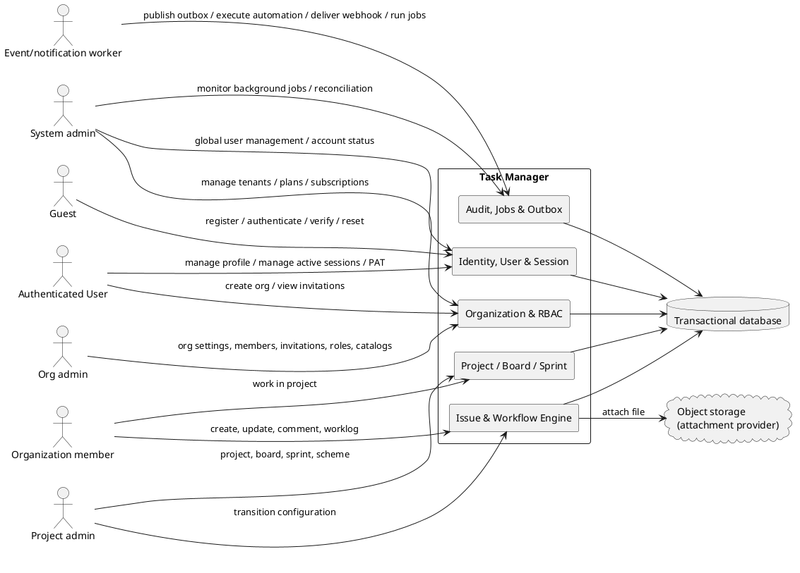
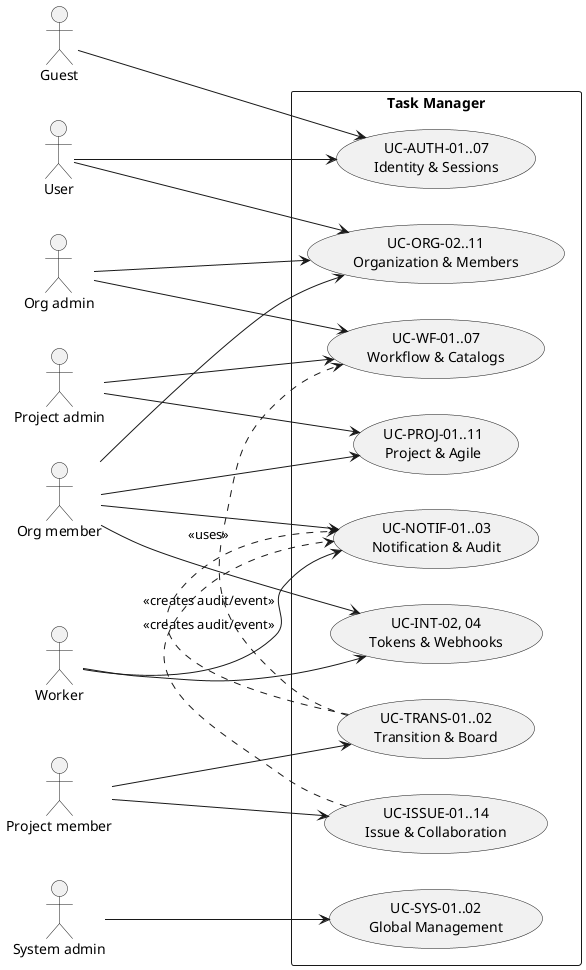
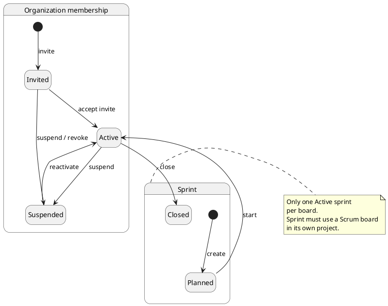
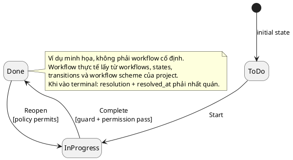
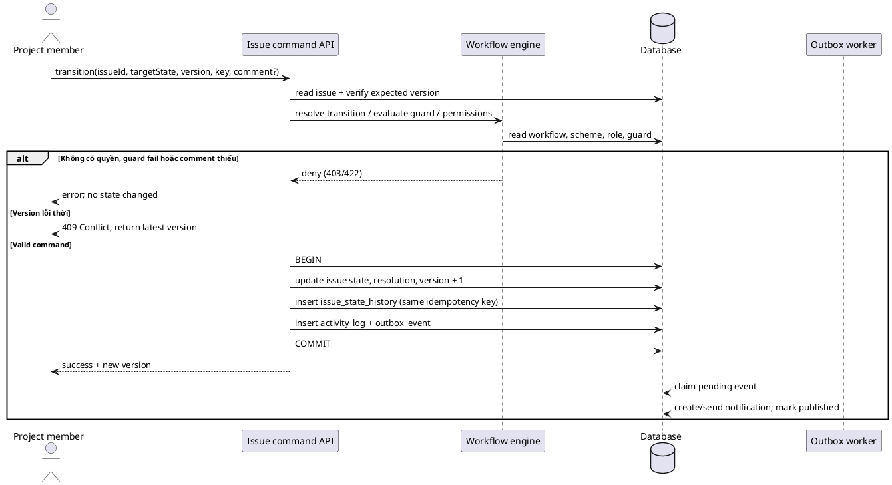
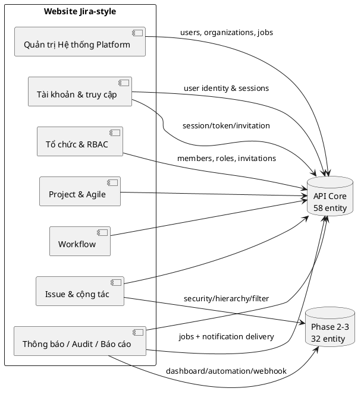
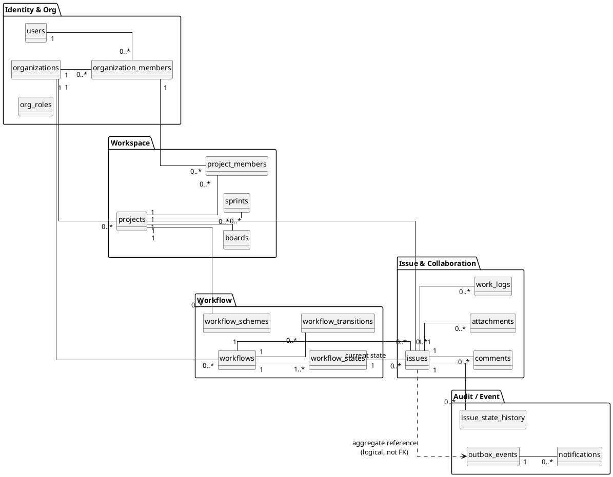
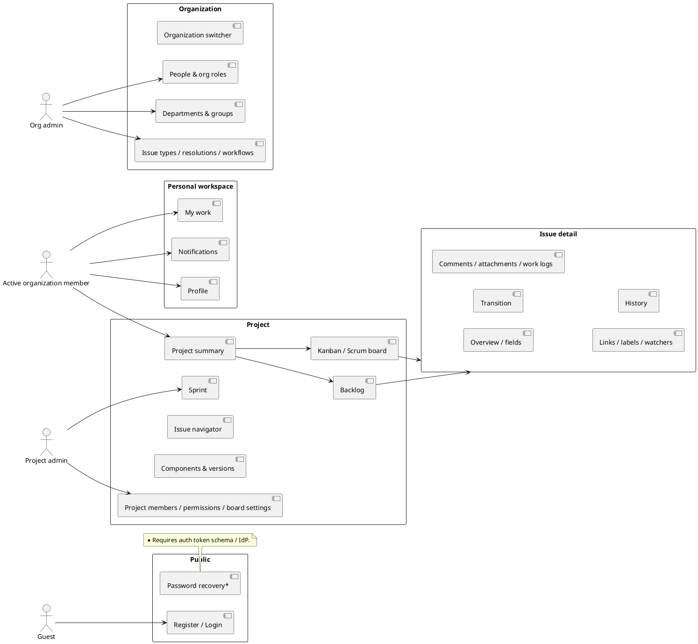
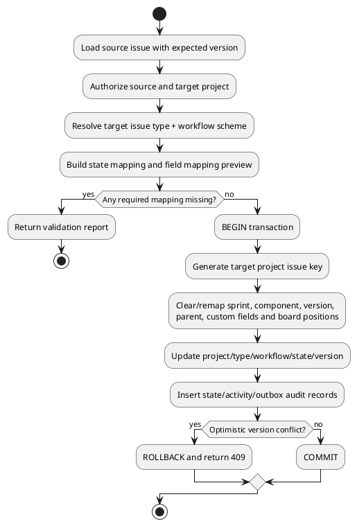

# SRS — Task Manager (Jira-like)

| Thuộc tính | Giá trị |
|---|---|
| Phiên bản | 1.7 — Jira-style configuration, user/session management, invitation lifecycle, personal PAT & comprehensive RBAC matrix |
| Ngày lập | 2026-09-11 |
| Trạng thái | Hoàn thiện đặc tả nghiệp vụ, phân quyền theo vai trò (Role), quản lý người dùng và QA Traceability |
| Phạm vi mô hình dữ liệu | [`TASK_MANAGER_ERD.puml`](TASK_MANAGER_ERD.puml) — 90 thực thể: 58 API Core + 32 extension phase 2–3 |
| Mục đích | Là nguồn yêu cầu có thể truy vết để thiết kế, triển khai, kiểm thử và đánh giá nghiệm thu. |

> **Quy ước quan trọng:** Đây là SRS theo ERD hiện có, không phải bản mô tả một UI/API đã triển khai. Mọi câu có “phải” là yêu cầu kiểm thử được. Những điểm chưa được ERD quyết định được đặt trong mục **Q-OPEN**; QA không được tự giả định kết quả cho đến khi chúng được chốt.

## 1. Mục đích, phạm vi và cách dùng tài liệu

### 1.1. Mục đích

Hệ thống Task Manager hỗ trợ nhiều tổ chức (tenant) quản lý project theo kiểu Jira: thành viên, quyền, workflow có trạng thái, board Kanban/Scrum, sprint, issue, cộng tác, trường tùy biến, lịch sử và thông báo.

Tài liệu này chuyển ERD thành các yêu cầu có thể quan sát được:

- **BA/PO** xác nhận phạm vi và quy tắc nghiệp vụ.
- **Dev** xác định transaction, constraint, dữ liệu seed và điểm tích hợp.
- **QA** thiết kế test theo Requirement ID, Business Rule ID và Test ID.
- **Reviewer** đánh giá được yêu cầu nào đã có bằng chứng test, yêu cầu nào còn mở.

### 1.2. Phân tích `mẫu srs.txt` và nguyên tắc áp dụng

`mẫu srs.txt` tổ chức tài liệu theo: tổng quan → biểu đồ → phân quyền → use case; mỗi use case có actor, trigger, tiền/hậu điều kiện, luồng cơ bản/thay thế/ngoại lệ, business rule, NFR và mô tả trường giao diện. SRS này giữ cấu trúc đó, nhưng bổ sung các phần còn cần cho một hệ thống có ERD phức tạp:

1. Requirement ID và Business Rule ID ổn định để truy vết.
2. Danh mục dữ liệu đầy đủ theo `TASK_MANAGER_ERD.puml`.
3. Ràng buộc liên tenant/liên project, concurrency và idempotency.
4. Ma trận requirement → test, test dữ liệu và tiêu chí exit cho QA.
5. Quyết định mở để không biến khoảng trống trong ERD thành “yêu cầu ngầm”.

Mọi biểu đồ trong tài liệu này đều dùng mã **PlantUML**. Có thể render bằng `plantuml.jar` có sẵn trong thư mục dự án hoặc PlantUML extension/CI.

### 1.3. Phạm vi trong baseline

| Trong phạm vi mô hình/SRS | Ngoài API Core hoặc chỉ triển khai ở phase sau |
|---|---|
| User, local authentication/session, email verification/password reset, organization invitation, department/group và RBAC | SSO/OAuth/MFA, enterprise directory provisioning |
| Project, role, permission/workflow/configuration schemes, board Kanban/Scrum, sprint | Capacity, time-off, retrospective chuyên biệt |
| Workflow/FSM, guard, transition permission, board-state mapping; automation schema phase 3 | SLA, escalation và service-management workflow |
| Issue, configurable hierarchy, issue security, link, label, watcher, comment, attachment, work log | Wiki/knowledge base, customer portal, approval workflow |
| Custom field context, field scheme, screen/screen scheme, issue-type/priority scheme | Advanced roadmap/capacity planning vẫn chỉ partial |
| Search/query, saved filter/share/subscription; dashboard/widget persistence | Full JQL compatibility và toàn bộ gadget ecosystem |
| Audit, outbox, jobs, notification scheme/preference/delivery; API token/webhook schema | Push/chat provider, OAuth app marketplace và external secret vault implementation |

### 1.4. Nguồn chuẩn và thứ tự ưu tiên

| Thứ tự | Nguồn | Vai trò |
|---:|---|---|
| 1 | `TASK_MANAGER_ERD.puml` | Chuẩn cho entity, field, PK/FK/UQ và các comment `C-xx`/invariant. |
| 2 | Tài liệu SRS này | Chuẩn cho hành vi, acceptance criteria, test traceability và các quyết định được phê duyệt. |
| 3 | `NGHIEP_VU_TASK_MANAGER_DAY_DU.md`, `TASK_MANAGER_ERD_BUSINESS_GUIDE.md` | Tài liệu giải thích nghiệp vụ tham khảo. |
| 4 | `mẫu srs.txt` | Mẫu cấu trúc và mức độ đặc tả; không phải nguồn nghiệp vụ Task Manager. |

Nếu hai nguồn mâu thuẫn, phải mở change request; không tự sửa ngầm schema hoặc test expectation.

### 1.5. Thuật ngữ và quy ước

| Thuật ngữ | Nghĩa |
|---|---|
| User | Danh tính đăng nhập toàn cục (`users`). |
| Organization member / Member | User trong một organization (`organization_members`); là danh tính nghiệp vụ dùng để gán quyền. |
| Tenant | Một organization và toàn bộ dữ liệu thuộc organization đó. |
| Project member | Member đã được thêm vào một project; có thể có nhiều project role. |
| Issue | Công việc/bug/story trung tâm; có issue type, workflow và current state. |
| Workflow | Máy trạng thái có version ở cấp organization. |
| Workflow scheme | Cấu hình tại project, map issue type tới workflow và quyền transition. |
| Terminal state | Trạng thái kết thúc (`is_terminal=true`), gắn với resolution và `resolved_at`. |
| Board | Góc nhìn Kanban hoặc Scrum; **không** phải workflow. |
| Outbox | Event được ghi cùng transaction nghiệp vụ, sau đó worker publish bất đồng bộ. |
| UQ / FK / PK | Unique constraint / foreign key / primary key. |
| MUST / Phải | Tiêu chí bắt buộc để pass acceptance. |

## 2. Bối cảnh và actor

### 2.1. System context



### 2.2. Actor và trách nhiệm

| Actor | Điều kiện nhận diện | Quyền/trách nhiệm trong phạm vi SRS |
|---|---|---|
| Guest | Chưa xác thực | Đăng ký user, đăng nhập, quên mật khẩu, kích hoạt email, chấp nhận lời mời qua link token. |
| User | Có `users` hợp lệ | Quản lý profile cá nhân, quản lý phiên đăng nhập/thiết bị (`auth_sessions`), tạo/join organization, xem danh sách lời mời nhận được. |
| Organization Member | `organization_members.status=active` | Thao tác trong organization theo org role và project membership; quản lý My Work, Notifications, Personal Access Tokens (`api_tokens`), tự rời tổ chức (Leave Org). |
| Org Admin | Member có org permission phù hợp (`MANAGE_ORG`, `MANAGE_USERS`) | Quản trị toàn diện organization: thành viên, vòng đời lời mời (`organization_invitations`), org role, department, group, global catalogs (issue types, resolutions, link types, workflows, configuration schemes). |
| Project Admin | Project member có project permission phù hợp (`MANAGE_PROJECT`) | Quản lý project, thành viên dự án & vai trò (`project_roles`, `project_group_roles`), board Kanban/Scrum, sprint, chọn/đổi schemes (workflow, field, screen, security, notification). |
| Project Member | Project member active, có permission (`CREATE_ISSUE`, `BROWSE_PROJECT`...) | Tạo/sửa issue, chuyển trạng thái (transition), kéo thả sắp xếp board, bình luận, đính kèm tệp, ghi log thời gian (work log), liên kết issue, gắn nhãn. |
| System Admin (Platform Admin) | User có quyền quản trị toàn hệ thống | Quản trị danh bạ người dùng toàn cầu (`users`), khóa/kích hoạt user, xem các session, quản trị các Organization và gói dịch vụ (`organizations.plan/status`), giám sát Jobs/Reconciliation. |
| Worker | Tác nhân kỹ thuật tin cậy | Publish `outbox_events`, tạo/gửi `notifications` (in-app & email delivery), thực thi automation rules, gửi webhook có ký số, chạy background jobs. |

### 2.3. Mô hình use case mức cao



### 2.4. Phân quyền ba tầng (Three-Tier Authorization Model)

1. **Cấp Nền tảng / Hệ thống (Platform/System Level):** Quản trị danh tính toàn cầu `users`, kiểm soát tài khoản active/suspended, quản lý danh bạ `organizations`, gói cước `plan`, giám sát hệ thống nền `background_jobs`, `reconciliation`.
2. **Cấp Organization (Tenant Level):** `org_roles` → `org_role_permission_entries` → `org_member_roles`. Quản lý thành viên `organization_members`, lời mời `organization_invitations`, cơ cấu phòng ban `departments`, nhóm `groups`, catalog toàn org (workflows, issue types, resolutions, link types, configuration schemes).
3. **Cấp Project (Workspace Level):** `project_roles` được gán trực tiếp (`project_member_roles`) hoặc qua group (`project_group_roles`); permission nằm trong `permission_scheme_entries`. Member thừa hưởng role group chỉ khi đồng thời là **project member active** và thuộc group hợp lệ cùng organization.
4. **Lớp bảo vệ đặc thù:**
   - Quyền Transition: `workflow_scheme_transition_permissions`. Khi rule allow và deny đồng thời khớp, **deny thắng allow**.
   - Bảo mật từng Issue: `issue_security_schemes` → `issue_security_levels` → `issue_security_grants`. Người dùng phải vừa có `BROWSE_PROJECT` vừa thỏa mãn security grant của issue mới được xem/tìm kiếm/nhận thông báo về issue.
5. Danh mục permission key chuẩn hóa được định nghĩa tại **Q-OPEN-03**.

## 3. Trạng thái, quy tắc thời gian và luồng lõi

### 3.1. State machine membership và sprint



`organization_members.status` chỉ nhận `invited | active | suspended`; `sprints.state` chỉ nhận `planned | active | closed`. Không cho phép bỏ qua lifecycle trừ khi change request định nghĩa migration/admin override.

### 3.2. Workflow issue có thể cấu hình



### 3.3. Luồng transition chuẩn (transactional)



### 3.4. Phân tích lại ERD và catalog đầy đủ chức năng website Jira-style

**Kết luận phân tích DB.** ERD có 90 entity: 58 entity API Core và 32 entity phase 2–3 cho configuration schemes, issue security, notification policy, query/filter, hierarchy, automation, dashboard, API token và webhook. Catalog hoàn thiện gồm **80 chức năng** (bao gồm quản trị người dùng & phiên toàn cục, vòng đời lời mời 2 chiều, Personal Access Tokens và quản trị tổ chức hệ thống). Các extension đã có schema/ownership để thiết kế tiếp nhưng không trở thành dependency bắt buộc của API Core; full JQL, advanced roadmap, report engine và external provider vẫn cần contract chuyên biệt.

| Ký hiệu | Nghĩa |
|---|---|
| **E** | ERD đã có entity/field chính; cần service/UI/API và test. |
| **P** | ERD có dữ liệu lõi nhưng thiếu policy/contract hoặc read model; cần chốt Q-OPEN. |
| **X** | Chức năng nên có nhưng cần thêm entity/schema trước khi implement nghiệm thu. |



#### 3.4.1. Catalog chức năng đầy đủ

| Mã | Chức năng website nên có | Status | Use case đặc tả | Cơ sở dữ liệu / khoảng trống |
|---|---|---:|---|---|
| F-AUTH-01 | Đăng ký và xác minh email | E | UC-AUTH-01 | `users`, `email_verification_tokens`. |
| F-AUTH-02 | Đăng nhập và khởi tạo session | E | UC-AUTH-02 | `users`, `auth_sessions`; lockout/rate-limit là security policy. |
| F-AUTH-03 | Đăng xuất phiên hiện tại/tất cả phiên | E | UC-AUTH-03 | `auth_sessions.status/revoked_at`. |
| F-AUTH-04 | Quên/đặt lại/đổi mật khẩu | E | UC-AUTH-04 | `password_reset_tokens`, session revocation và audit. |
| F-AUTH-05 | Hồ sơ cá nhân, avatar và trạng thái user | E | UC-AUTH-05 | `users`; preference chi tiết cần schema mới. |
| F-AUTH-06 | Vô hiệu hóa/kích hoạt lại tài khoản user | E/P | UC-AUTH-06 | Có `users.status`; cần enum, re-authentication và session revocation policy. |
| F-AUTH-07 | Quản lý phiên đăng nhập và thiết bị bảo mật cá nhân | E | UC-AUTH-07 | `auth_sessions` (`ip_address`, `user_agent`, `last_seen_at`, `status`, `revoked_at`); xem và thu hồi phiên cụ thể. |
| F-ORG-01 | Tạo/cập nhật organization | E/P | UC-ORG-02, UC-ORG-06 | `organizations`; lifecycle policy cần chốt. |
| F-ORG-02 | Mời, chấp nhận, revoke, suspend/reactivate member | E/P | UC-ORG-03, UC-ORG-04 | `organization_invitations` xử lý email trước khi có user; membership giữ invited/active/suspended. |
| F-ORG-03 | Quản lý org role và permission | E | UC-ORG-07 | `org_roles`, role member, permission entries. |
| F-ORG-04 | Quản lý department | E | UC-ORG-08 | `departments`, `department_members`. |
| F-ORG-05 | Quản lý group | E | UC-ORG-09 | `groups`, `group_members`. |
| F-ORG-06 | Quản lý vòng đời lời mời (pending, resend, revoke, decline) | E | UC-ORG-10 | `organization_invitations` (`status`, `expires_at`, `token_hash`); admin gửi lại/hủy, invitee từ chối. |
| F-ORG-07 | Thành viên tự rời khỏi tổ chức (Leave organization) | E/P | UC-ORG-11 | `organization_members.status`; bảo vệ org admin duy nhất, ghi audit. |
| F-PROJ-01 | Tạo project và bootstrap | E | UC-PROJ-01 | `projects`, member/role, board, schemes. |
| F-PROJ-02 | Xem, cập nhật, archive/restore project | E/P | UC-PROJ-05 | `projects.archived_at`; restore policy cần chốt. |
| F-PROJ-03 | Project member, direct role và group role | E | UC-PROJ-02, UC-PROJ-06 | `project_members`, role mapping. |
| F-PROJ-04 | Permission scheme của project | E | UC-PROJ-07 | scheme/entries và selected scheme. |
| F-PROJ-05 | Component và release version | E | UC-PROJ-08 | Component có `archived_at`; version có lifecycle/released timestamp. |
| F-PROJ-06 | Tạo/cấu hình board & column | E | UC-PROJ-03 | board, column, state map, position. |
| F-PROJ-07 | Backlog/board view, filter và reorder | E/P | UC-PROJ-09, UC-TRANS-02 | Issue/sprint/position có sẵn; saved filter cần schema. |
| F-PROJ-08 | Sprint planning/lifecycle | E | UC-PROJ-04 | `sprints`, `issue_sprint_history`. |
| F-PROJ-09 | Định nghĩa project role và xem quyền hiệu lực | E | UC-PROJ-10 | `project_roles`, direct/group role và hai permission scheme. |
| F-PROJ-10 | Kiểm soát project visibility và quyền browse | E/P | UC-PROJ-11 | Có `projects.visibility`; ý nghĩa `public` cần Q-OPEN-18. |
| F-WF-01 | Issue type và resolution catalog | E | UC-WF-04 | Type/resolution có `archived_at`; hard delete vẫn restricted khi được tham chiếu. |
| F-WF-02 | Tạo/version/activate workflow | E | UC-WF-01 | `workflows`, states/transitions/guards. |
| F-WF-03 | Cấu hình state, transition và guard | E | UC-WF-05 | `workflow_states`, transitions, guards. |
| F-WF-04 | Gán workflow theo type cho project | E | UC-WF-02 | scheme/mapping. |
| F-WF-05 | Cấu hình quyền transition | E | UC-WF-03 | scheme transition permissions. |
| F-WF-06 | Migration workflow/state cho issue hiện hữu | E/P | UC-WF-06 | Có workflow stable key, issue history và `background_jobs`; mapping policy vẫn cần cấu hình request. |
| F-WF-07 | Quản lý catalog loại liên kết issue | E/P | UC-WF-07 | `issue_link_types` là catalog cấp organization; create/update/delete-unreferenced có thể triển khai, retire type đang dùng cần lifecycle field/policy. |
| F-ISS-01 | Browse/search/filter issue | P | UC-ISSUE-06 | `issues` query được; saved filter/full-text contract chưa có. |
| F-ISS-02 | Tạo issue | E | UC-ISSUE-01 | `issues`, workflow mapping, audit/outbox. |
| F-ISS-03 | Xem chi tiết/sửa field/clone issue | E/P | UC-ISSUE-02, UC-ISSUE-07 | `issues`; clone policy cần chốt. |
| F-ISS-04 | Assignee/reporter, parent, component/version, due/estimate | E | UC-ISSUE-03 | Fields trực tiếp trên `issues`. |
| F-ISS-05 | Label và watcher | E | UC-ISSUE-10 | labels, issue labels/watchers. |
| F-ISS-06 | Link issue directed/symmetric | E | UC-ISSUE-04 | link types/links. |
| F-ISS-07 | Comment/reply/edit/delete comment | E/P | UC-ISSUE-05A | `comments.deleted_at`; edit/delete visibility policy cần chốt. |
| F-ISS-08 | Upload/download/delete attachment | E/P | UC-ISSUE-05B | attachment metadata; storage/virus/retention policy thiếu. |
| F-ISS-09 | Log/sửa/xóa work log và time tracking | E/P | UC-ISSUE-05C | `work_logs`, time cache; edit/delete policy thiếu. |
| F-ISS-10 | Custom field/context/options/value | E | UC-CF-01 | 4 bảng custom field. |
| F-ISS-11 | Bulk update/move/archive/delete/restore | E/P | UC-ISSUE-11 | `background_jobs` hỗ trợ execution; restore/audit policy vẫn áp dụng. |
| F-ISS-12 | Move issue giữa project hoặc đổi issue type | P | UC-ISSUE-12 | Có field project/type/workflow/key; cần remap toàn bộ reference và custom values. |
| F-ISS-13 | Quản lý estimate và remaining estimate | E/P | UC-ISSUE-13 | Có original/remaining/time-spent và work logs; cần calculation policy. |
| F-ISS-14 | Archive/delete/restore một issue | E/P | UC-ISSUE-14 | Có `archived_at`/`deleted_at`; retention và visibility theo Q-OPEN-09. |
| F-EXEC-01 | Chuyển state/reopen/resolve issue | E/P | UC-TRANS-01 | FSM/history; resolution/reopen policy cần chốt. |
| F-EXEC-02 | Kéo-thả/reorder trên board | E | UC-TRANS-02 | `board_issue_positions.rank`. |
| F-NOTIF-01 | In-app notification, read/unread | E | UC-NOTIF-01 | `notifications`, outbox. |
| F-NOTIF-02 | Notification preference/kênh in-app/email | E/P | UC-NOTIF-03 | Có preference/delivery; push cần device endpoint extension. |
| F-NOTIF-03 | Notification scheme và event-recipient rule | E/P | UC-CONF-01 | `notification_schemes`, entries; recipient vẫn phải qua browse + issue security. |
| F-AUD-01 | Issue history/activity audit | E | UC-NOTIF-02 | state history/activity log. |
| F-AUD-02 | Org/project audit search/export | E/P | UC-AUD-03 | Activity/history và background job có sẵn; retention/file policy cần chốt. |
| F-REPORT-01 | Dashboard cá nhân/project | E/P | UC-DASH-01 | Có dashboard/share/widget và filter data source; metric/as-of vẫn cần chốt. |
| F-REPORT-02 | Sprint/release/worklog report | P/X | UC-REPORT-02 | Có dữ liệu gốc; definition/snapshot/export cần chốt. |
| F-ADMIN-01 | Global settings, observability và outbox retry | E/P | UC-ADMIN-01 | organizations/outbox có lõi; quyền vận hành/SLO cần chốt. |
| F-ADMIN-02 | Kiểm tra và sửa lệch dữ liệu cache/quan hệ | E | UC-ADMIN-02 | `background_jobs` chạy reconciliation cho sprint/time/board/workflow/outbox. |
| F-SYS-01 | Quản trị danh sách người dùng và tài khoản toàn hệ thống | E/P | UC-SYS-01 | `users`, `auth_sessions`; tìm kiếm user, khóa/mở khóa tài khoản, xem các phiên hoạt động. |
| F-SYS-02 | Quản lý và giám sát tổ chức toàn hệ thống | E/P | UC-SYS-02 | `organizations.status/plan`; danh sách tenant, đình chỉ/khôi phục, phân bổ gói dịch vụ. |
| F-INT-01 | Import/export và import mapping | P/X | UC-INT-01 | Job envelope có sẵn; row-error/mapping artifact vẫn cần schema chi tiết. |
| F-CONF-01 | Priority catalog và priority scheme | E/P | UC-CONF-01 | Priority subset/default theo project; đổi scheme cần impact mapping. |
| F-CONF-02 | Issue type scheme | E/P | UC-CONF-01 | Chọn type/default/order cho project, độc lập workflow mapping. |
| F-CONF-03 | Field scheme và behavior theo issue type | E/P | UC-CONF-01 | Required/optional/hidden, system/custom field registry. |
| F-CONF-04 | Screen và field layout | E/P | UC-CONF-01 | Screen chứa ordered field; không thay thế server validation. |
| F-CONF-05 | Screen scheme theo create/view/edit | E/P | UC-CONF-01 | Operation fallback về default screen. |
| F-CONF-06 | Issue-type screen scheme | E/P | UC-CONF-01 | Map issue type → screen scheme, có default mapping. |
| F-CONF-07 | Chọn và migrate configuration scheme của project | E/P | UC-CONF-02 | Dry-run và mapping bắt buộc khi dữ liệu hiện hữu không còn hợp lệ. |
| F-SEC-01 | Issue security scheme và security level | E/P | UC-SEC-01 | Browse project chưa đủ; từng issue có thể hạn chế theo member/group/role/reporter/assignee. |
| F-SEARCH-01 | Advanced query language | P | UC-SEARCH-01 | Parser/AST/compiler/permission-aware execution là application contract. |
| F-SEARCH-02 | Saved filter và share | E/P | UC-SEARCH-02 | `saved_filters`, typed shares, optimistic version/lifecycle. |
| F-SEARCH-03 | Filter subscription | E/P | UC-SEARCH-02 | Schedule/timezone và quyền được recheck lúc chạy. |
| F-AUTO-01 | Automation rule builder | E/P | UC-AUTO-01 | Trigger → condition/branch → action bằng versioned component tree. |
| F-AUTO-02 | Automation execution/audit/retry | E/P | UC-AUTO-01 | Execution idempotent từ outbox; loop/rate/depth guard cần policy. |
| F-DASH-01 | Dashboard CRUD và chia sẻ | E/P | UC-DASH-01 | Ownership/typed share/lifecycle rõ. |
| F-DASH-02 | Widget/gadget dùng filter/data source | E/P | UC-DASH-01 | Versioned config, layout coordinates, permission-aware query. |
| F-PLAN-01 | Cấu hình issue hierarchy | E/P | UC-PLAN-01 | Level/type mapping; parent chỉ nối level được phép và không cycle. |
| F-PLAN-02 | Timeline/dependency planning | P | UC-PLAN-02 | Dùng hierarchy, issue link, due/version; capacity/baseline snapshot chưa có. |
| F-INT-02 | API token có scope và revoke (hệ thống) | E/P | UC-INT-02 | Token hash-only, expiry/scopes, member/org ownership. |
| F-INT-03 | Webhook subscription và delivery | E/P | UC-INT-02 | Filter/event scope, signing, SSRF guard, idempotent retry. |
| F-INT-04 | Quản lý Personal Access Tokens (PAT) cá nhân | E | UC-INT-04 | `api_tokens`; cá nhân tạo token, chọn scope, expiry, copy token một lần duy nhất, thu hồi token. |
| F-ADMIN-03 | Quản trị extension schema và migration impact | E/P | UC-CONF-02 | Không đổi scheme/hierarchy đang dùng mà không preview/mapping/audit. |

#### 3.4.2. Nhóm trang/màn hình tối thiểu

| Nhóm màn hình | Chức năng chính | Test UI tối thiểu |
|---|---|---|
| Public/Auth | Register, login, reset password, logout, accept invitation | Validation, anti-enumeration, session redirect. |
| Personal | My work, assigned/reported/watched issues, notifications, profile, active sessions, PAT | Scope user, unread/read, pagination, session revoke confirmation. |
| Organization admin | Org settings, people, invitations (pending/resend/revoke), roles, departments, groups, workflow & scheme catalog | RBAC, tenant isolation, destructive confirmation, invite lifecycle. |
| Project | Summary, backlog, board, sprint, issues, versions/components, members/settings | Selected project scope, role-gated navigation, archived state. |
| Issue detail | Fields, activity, comment, attachment, worklog, link, watcher, transition | Optimistic conflict, inline validation, audit visibility. |
| Reports/Admin ops | Dashboards, reports, audit, outbox/worker health | Read scope, export authorization, retry observability. |
| System Admin (Platform) | Global user directory, tenant/organization management, system jobs, reconciliation console | Super-admin RBAC, system-wide search, audit log không lộ mật khẩu. |

## 4. Yêu cầu chức năng có thể kiểm thử

### 4.1. Danh mục use case và truy vết cấp cao

| Use case | Actor chính | Yêu cầu | Dữ liệu chính |
|---|---|---|---|
| UC-ORG-01 Đăng ký user | Guest | FR-ID-01 | `users` |
| UC-ORG-02 Tạo organization | User | FR-ORG-01 | organization, member, org role, seed catalog |
| UC-ORG-03 Mời thành viên | Org Admin | FR-ORG-02 | member, outbox, notification |
| UC-ORG-04 Chấp nhận lời mời | Invited User | FR-ORG-03 | organization member |
| UC-ORG-05 Quản lý department/group | Org Admin | FR-ORG-04 | departments, groups và membership |
| UC-PROJ-01 Tạo project | Org Member | FR-PROJ-01 | project, member, role, board, scheme |
| UC-PROJ-02 Quản lý project member/role | Project Admin | FR-PROJ-02 | project members/roles/group roles |
| UC-PROJ-03 Cấu hình board | Project Admin | FR-PROJ-03 | board, column, state mapping, positions |
| UC-PROJ-04 Quản lý sprint | Project Admin | FR-PROJ-04 | sprint, issue sprint history |
| UC-WF-01 Định nghĩa workflow | Org Admin | FR-WF-01 | workflow, state, transition, guard |
| UC-WF-02 Gán workflow theo issue type | Project Admin | FR-WF-02 | workflow scheme/mapping |
| UC-WF-03 Quyền transition | Project Admin | FR-WF-03 | scheme transition permission |
| UC-WF-07 Quản lý loại liên kết issue | Org Admin | FR-WF-04 | issue link type/catalog |
| UC-ISSUE-01 Tạo issue | Project Member | FR-ISS-01 | issue, custom values, log/event |
| UC-ISSUE-02 Sửa issue | Project Member | FR-ISS-02 | issue, custom values, log/event |
| UC-ISSUE-03 Assignment/label/watcher | Project Member | FR-ISS-03 | issue, label, watcher, sprint history |
| UC-ISSUE-04 Link issue | Project Member | FR-ISS-04 | issue link/type |
| UC-ISSUE-05 Comment/attachment/worklog | Project Member | FR-ISS-05 | comment, attachment, work log |
| UC-TRANS-01 Transition issue | Project Member | FR-TRANS-01 | issue, state history, event |
| UC-TRANS-02 Sắp xếp board | Project Member | FR-TRANS-02 | board issue position |
| UC-NOTIF-01 Thông báo | Worker / Org Member | FR-AUD-01 | outbox event, notification |
| UC-NOTIF-02 Tra cứu audit | Org Admin / PM | FR-AUD-02 | activity log, state history |
| UC-CONF-01 Quản lý configuration schemes | Org Admin | FR-CONF-01/02 | priority/type/field/screen/notification schemes |
| UC-CONF-02 Đổi scheme của project | Org/Project Admin | FR-CONF-01 | project selected schemes, migration job |
| UC-SEC-01 Bảo mật từng issue | Project Admin / Member | FR-SEC-01 | security scheme/level/grant |
| UC-SEARCH-01 Advanced query | Org Member | FR-SEARCH-01 | query parser/AST, issue read model |
| UC-SEARCH-02 Saved filter/share/subscription | Org Member | FR-SEARCH-02 | filters/shares/subscriptions |
| UC-AUTO-01 Automation rule/execution | Org/Project Admin / Worker | FR-AUTO-01 | rules/components/executions/outbox |
| UC-DASH-01 Dashboard/widget | Org Member | FR-DASH-01 | dashboard/share/widget/filter |
| UC-PLAN-01 Cấu hình hierarchy | Org Admin | FR-PLAN-01 | hierarchy level/type mapping |
| UC-INT-02 API token và webhook | Org Member/Admin / Worker | FR-INT-02 | api token/webhook delivery |
| UC-AUTH-07 Quản lý phiên và thiết bị | User | FR-AUTH-07 | `auth_sessions` |
| UC-ORG-10 Vòng đời lời mời | Org Admin / Invitee | FR-ORG-06 | `organization_invitations` |
| UC-ORG-11 Rời tổ chức | Org Member | FR-ORG-07 | `organization_members` |
| UC-INT-04 Quản lý Personal Access Tokens | Org Member | FR-INT-04 | `api_tokens` |
| UC-SYS-01 Quản trị người dùng toàn hệ thống | System Admin | FR-SYS-01 | `users`, `auth_sessions` |
| UC-SYS-02 Quản trị tổ chức toàn hệ thống | System Admin | FR-SYS-02 | `organizations` |

### 4.2. Functional requirements

| ID | Yêu cầu bắt buộc | Acceptance criteria quan sát được |
|---|---|---|
| FR-ID-01 | Hệ thống phải tạo user với email duy nhất toàn cục, thông tin mật khẩu chỉ lưu dạng hash. | Email trùng bị từ chối; không có mật khẩu thô trong DB/log/response. |
| FR-ORG-01 | User active phải tạo được organization và được bootstrap thành org member active có role quản trị, catalog issue type/workflow mặc định. | Transaction tạo đủ bản ghi; lỗi ở bất kỳ bước seed nào rollback toàn bộ. |
| FR-ORG-02 | Org Admin phải mời member không trùng trong org; lời mời tạo event/notification. | Member mới ở `invited`, lưu inviter; invite cùng `(org,user)` bị chặn. |
| FR-ORG-03 | Invitee phải chấp nhận lời mời để thành `active`; suspended member không được thao tác như active. | State chuyển hợp lệ, `joined_at` được ghi; state không hợp lệ bị từ chối. |
| FR-ORG-04 | Org Admin phải quản lý department cây và group; chỉ member cùng org mới được gán. | Không tạo self-cycle/foreign-tenant relation; UQ tên theo org được giữ. |
| FR-PROJ-01 | Member active có quyền phải tạo project riêng trong org và bootstrap project member/role, board, scheme cần thiết trước activation. | `project.key` duy nhất trong org; creator là project member active/admin; project chưa sẵn sàng không được tạo issue. |
| FR-PROJ-02 | Project Admin phải thêm/xóa project member và gán role trực tiếp/qua group đúng tenant. | Member ngoài org, removed member hoặc group khác org không nhận permission. |
| FR-PROJ-03 | Project Admin phải cấu hình board, column, WIP limit và map workflow state vào column. | Column position duy nhất trong board; một state không thuộc hơn một column của cùng board. |
| FR-PROJ-04 | Project Admin phải tạo/start/close sprint chỉ trên Scrum board; quản lý issue vào sprint có lịch sử. | Sprint và issue cùng project; tối đa một sprint active/board; current sprint cache khớp history active. |
| FR-WF-01 | Org Admin phải định nghĩa version workflow gồm state, transition và guard. | Mỗi workflow có đúng một initial state; state/transition key unique trong workflow; transition không nối state khác workflow. |
| FR-WF-02 | Project Admin phải map từng issue type dùng trong project tới workflow thuộc cùng organization. | Mapping unique theo `(scheme, issue type)`; issue type/workflow sai tenant bị từ chối. |
| FR-WF-03 | Project Admin phải cấu hình allow/deny theo project role cho transition đang được scheme sử dụng. | Role cùng project, transition có trong workflow được map; deny ưu tiên allow. |
| FR-WF-04 | Org Admin phải quản lý catalog `issue_link_types` trong organization và không được làm hỏng link hiện hữu. | `key` unique theo org; directionality chỉ `directed/symmetric`; type đang được tham chiếu không được hard-delete hoặc đổi directionality nếu làm thay đổi ngữ nghĩa link cũ. |
| FR-ISS-01 | Project Member có quyền phải tạo issue với issue type, workflow và initial state được resolve từ project scheme. | Key unique trong project; reporter valid; issue lưu `version` ban đầu; mọi FK project/tenant hợp lệ. |
| FR-ISS-02 | Cập nhật field issue phải validate schema, custom-field context và optimistic version. | Value sai kiểu/context bị từ chối; update version cũ trả conflict, không mất dữ liệu update trước. |
| FR-ISS-03 | Hệ thống phải gán assignee, component, version, sprint, label, watcher theo đúng project/tenant. | Không gán member inactive/khác project hoặc reference khác project; quan hệ many-to-many không trùng. |
| FR-ISS-04 | Project Member phải tạo issue link đúng link type và hướng. | Không tự link; symmetric link được lưu theo canonical order; duplicate bị chặn. |
| FR-ISS-05 | Project Member phải comment, reply, upload attachment và log work trên issue được phép. | Parent comment cùng issue, không cycle; attachment-comment cùng issue; worklog dương và author hợp lệ. |
| FR-TRANS-01 | Transition phải kiểm tra permission, guard, bắt buộc comment, optimistic lock; sau commit tạo state history, audit và outbox. | Invalid transition không ghi side effect; success tăng version đúng 1, history/event nhất quán và idempotent. |
| FR-TRANS-02 | Thứ tự issue trên board phải lưu theo `board_issue_positions`, độc lập giữa các board. | Rank unique trong một board; issue/state/project có map column hợp lệ; không dùng `issues.rank`. |
| FR-CF-01 | Admin phải định nghĩa custom field/context/options; issue chỉ có value hợp ngữ cảnh và đúng kiểu. | Required field được kiểm tra khi cần; select dùng option hợp lệ; JSON không đúng type bị từ chối. |
| FR-AUD-01 | Command thay đổi nghiệp vụ phải ghi event outbox idempotent; worker tạo notification không trùng. | Retry không tạo notification duplicate; lỗi publish có thể retry và lưu lỗi/trạng thái. |
| FR-AUD-02 | Người có quyền phải tra cứu lịch sử state và activity theo tenant/project/issue mà không lộ dữ liệu tenant khác. | History có actor/time/version trước-sau; filter scope và phân trang không vượt quyền. |
| FR-CONF-01 | Project active phải chọn các issue-type, priority, field, screen, security và notification scheme cùng organization; thay scheme có dữ liệu hiện hữu phải qua preview/mapping. | Scheme cross-tenant hoặc làm invalid issue hiện hữu bị reject; migration success có audit và không mất dữ liệu ngầm. |
| FR-CONF-02 | Hệ thống phải resolve field theo thứ tự issue-type scheme → field scheme → operation screen, trong đó required/hidden là validation server-side chứ không chỉ UI. | Field hidden không nhận input thường; required field thiếu bị 422; create/view/edit render đúng screen mapping/default. |
| FR-SEC-01 | Mọi read/search/export/notification/download của issue phải thỏa cả `BROWSE_PROJECT` và security level của issue. | Actor browse project nhưng không thuộc security level không thấy issue, count, history, attachment hoặc notification content. |
| FR-SEARCH-01 | Advanced query phải parse/validate bằng grammar versioned, bind parameter an toàn và áp tenant/project/issue-security predicate trước pagination/aggregation. | Query invalid trả lỗi vị trí ổn định; query cross-tenant không leak count/ID/timing đáng kể; sort/page deterministic. |
| FR-SEARCH-02 | Member phải lưu, chia sẻ và subscribe filter theo typed permission; quyền dữ liệu được đánh giá lại mỗi lần chạy. | Share cross-org bị reject; revoke browse/security làm kết quả và subscription loại dữ liệu ngay, không dùng quyền snapshot cũ. |
| FR-AUTO-01 | Automation rule phải là component tree versioned có đúng một trigger; execution từ outbox idempotent và mọi action dùng command service với actor/scope rõ. | Config invalid/cycle/secret bị reject; retry không nhân side effect; loop/depth/rate guard dừng recursion và ghi execution audit. |
| FR-DASH-01 | Dashboard/widget/share phải đúng tenant; widget chỉ truy vấn filter/data source mà viewer được phép tại thời điểm xem. | Share không cấp thêm quyền issue; widget không lộ hidden issue/count; layout/config update có version hoặc conflict protection. |
| FR-PLAN-01 | Parent-child issue phải tuân hierarchy level/type mapping, cùng project trong baseline, không self/cycle; đổi hierarchy phải có impact preview. | Parent sai level/cross-project/cycle bị 422; migration không tự phá quan hệ mà không xác nhận/mapping. |
| FR-INT-02 | API token chỉ lưu hash, có scope/expiry/revoke; webhook phải ký payload, chống SSRF và deduplicate delivery theo subscription/event. | Raw token chỉ hiển thị một lần; revoked/expired/out-of-scope token bị từ chối; retry webhook không tạo logical delivery trùng. |
| FR-AUTH-07 | Người dùng phải xem được danh sách các phiên đăng nhập đang hoạt động của mình với địa chỉ IP, User Agent, thời gian hoạt động cuối; và có quyền thu hồi (revoke) từng phiên cụ thể hoặc toàn bộ các phiên khác. | Phiên bị thu hồi lập tức mất hiệu lực, không dùng được refresh token hoặc gọi API; phiên hiện tại không bị ảnh hưởng nếu chỉ revoke phiên khác. |
| FR-ORG-06 | Org Admin phải xem được danh sách lời mời đang chờ (`pending`), gửi lại email mời (refresh token/expiry), thu hồi (`revoke`) lời mời; và Invitee có quyền từ chối (`decline`) lời mời. | Lời mời bị thu hồi hoặc từ chối không thể dùng để kích hoạt membership; gửi lại sinh token hash mới và cập nhật expiry; không duplicate bản ghi invitation. |
| FR-ORG-07 | Thành viên active phải tự rời được khỏi organization; hệ thống phải ngăn chặn nếu thành viên là Org Admin duy nhất còn lại của tổ chức. | Thành viên rời tổ chức chuyển trạng thái sang `suspended` (hoặc left); Org Admin cuối cùng bị chặn rời/hủy vai trò trừ khi đã bàn giao quyền cho member khác; toàn bộ audit/history được bảo toàn. |
| FR-INT-04 | Thành viên active phải tự tạo, đặt tên, chọn scope, đặt thời hạn và thu hồi Personal Access Tokens (PAT); hệ thống chỉ hiển thị raw token duy nhất một lần khi tạo và chỉ lưu hash trong cơ sở dữ liệu. | Raw token không thể phục hồi sau khi đóng modal; token hết hạn hoặc bị revoke bị từ chối truy cập ngay lập tức; quyền của PAT bị giới hạn bởi cả scope của token và quyền thực tế của member. |
| FR-SYS-01 | System Admin phải xem, tìm kiếm, lọc danh bạ toàn bộ User trong hệ thống theo trạng thái (`active`, `suspended`, `unverified`), thời gian đăng nhập; có quyền khóa/mở khóa tài khoản, kích hoạt thủ công và cưỡng chế đăng xuất tất cả phiên. | User bị khóa không thể đăng nhập hoặc làm mới token; toàn bộ session của user bị revoke; audit ghi rõ System Admin thực hiện; không lộ mật khẩu. |
| FR-SYS-02 | System Admin phải xem và quản lý toàn bộ Organization trong hệ thống, cập nhật trạng thái tenant (`active`, `suspended`, `closed`) và gói dịch vụ (`plan`). | Tổ chức bị suspended chặn toàn bộ thao tác ghi của mọi member; đổi gói dịch vụ ghi audit nguồn command và áp dụng quota tương ứng. |

## 5. Đặc tả use case trọng yếu

Mỗi use case chi tiết dưới đây dùng đúng khuôn của `mẫu srs.txt`: trigger, tiền/hậu điều kiện, luồng, thay thế/ngoại lệ, business rule, dữ liệu và NFR. Các use case còn lại được bao phủ bởi FR và test matrix ở phần 10.

### 5.1. UC-ORG-02 — Tạo organization

| Thuộc tính | Đặc tả |
|---|---|
| Priority | P0 |
| Actor | User đã xác thực |
| Trigger | Chọn “Create organization”. |
| Tiền điều kiện | `users` tồn tại; user không bị vô hiệu hóa; request hợp lệ. |
| Hậu điều kiện thành công | Organization active, creator là member active và có org admin role; catalog seed tối thiểu sẵn sàng. |
| Dữ liệu bị ghi | `organizations`, `organization_members`, `org_roles`, `org_member_roles`, `issue_types`, `workflows`, `workflow_states`, `workflow_transitions`. |

**Luồng cơ bản**

1. Actor nhập `organization.key`, tên và plan hợp lệ.
2. Hệ thống kiểm tra `organizations.key` unique.
3. Trong một transaction, tạo organization và member active cho creator.
4. Tạo/gán role org admin cho creator; seed role member, permission entries, issue type và workflow tối thiểu.
5. Commit; ghi activity/outbox nếu chính sách audit được bật.
6. Trả về organization đã tạo, không trả thông tin nhạy cảm.

**Thay thế/ngoại lệ:** key trùng → 409; actor invalid/suspended → 403; seed hoặc ghi DB lỗi → rollback, không có organization “nửa tạo”; request format sai → 400/422.

**Business rules:** BR-01, BR-02, BR-03, BR-04, BR-05. **NFR:** NFR-REL-01, NFR-SEC-01, NFR-OBS-01.

### 5.2. UC-PROJ-01 — Tạo và kích hoạt project

| Thuộc tính | Đặc tả |
|---|---|
| Priority | P0 |
| Actor | Organization Member active có `CREATE_PROJECT` hoặc permission tương đương |
| Trigger | Chọn “Create project”. |
| Tiền điều kiện | Organization active; actor thuộc organization; project key chưa tồn tại trong organization. |
| Hậu điều kiện | Project đủ member/role/board/scheme để nhận issue; creator là project admin. |
| Dữ liệu bị ghi | `projects`, `project_members`, `project_roles`, `project_member_roles`, `boards`, `board_columns`, `board_column_states`, `workflow_schemes`, `workflow_scheme_mappings`, `workflow_scheme_transition_permissions`. |

**Luồng cơ bản**

1. Actor nhập key, name, visibility và loại board.
2. Hệ thống kiểm tra permission và UQ `(org_id, key)`.
3. Tạo project cùng `created_by_member_id` của actor; scheme tham chiếu bởi project phải cùng project.
4. Tạo project membership active, role mặc định và gán creator role admin.
5. Tạo board; nếu Scrum thì cho phép sprint sau khi board active.
6. Tạo columns, map states từ workflow được scheme sử dụng; mỗi state chỉ một column trong board.
7. Tạo workflow scheme và mapping issue type → workflow thuộc cùng org; cấu hình quyền transition.
8. Chỉ khi toàn bộ ràng buộc pass mới set các selected scheme/cho project activation và commit.

**Thay thế/ngoại lệ:** actor không có quyền → 403; key trùng → 409; mapping state/workflow không tương thích → 422; lỗi bootstrap → rollback.

**Business rules:** BR-06 đến BR-15. **NFR:** NFR-REL-01, NFR-PERF-01, NFR-OBS-01.

### 5.3. UC-ISSUE-01 — Tạo issue

| Thuộc tính | Đặc tả |
|---|---|
| Priority | P0 |
| Actor | Project Member active có `CREATE_ISSUE` |
| Trigger | Gửi biểu mẫu “Create issue” hoặc command tương đương. |
| Tiền điều kiện | Project chưa archive; actor browse/create được project; selected issue type được map trong selected workflow scheme. |
| Hậu điều kiện | Issue ở initial state; workflow cố định cho instance; event/audit được tạo theo policy. |
| Dữ liệu bị ghi | `issues`, có thể `issue_custom_field_values`, `activity_logs`, `outbox_events`. |

**Luồng cơ bản**

1. Resolve selected project, issue type và `projects.workflow_scheme_id`.
2. Lấy mapping type → workflow, rồi lấy duy nhất state `is_initial=true` của workflow.
3. Validate summary, priority, parent/component/version/sprint/assignee và custom-field context trong cùng project/tenant.
4. Sinh `issues.key` duy nhất trong project theo quy tắc key đã chốt.
5. Insert issue với `org_id`, workflow/state resolved, reporter=actor, `version` khởi tạo; không gán `resolution`/`resolved_at` nếu initial state không terminal.
6. Ghi custom values, activity log và outbox event trong transaction.
7. Commit và trả issue/version.

**Thay thế/ngoại lệ:** issue type không được map → 422; assignee/reporter không active project member (trừ admin override được phê duyệt) → 403/422; parent cross-project hoặc tạo cycle → 422; project archived → 409/403; key collision sau concurrent request → retry có kiểm soát hoặc trả 409.

**Business rules:** BR-10, BR-12, BR-16 đến BR-25. **NFR:** NFR-REL-01, NFR-SEC-02, NFR-OBS-01.

### 5.4. UC-TRANS-01 — Chuyển trạng thái issue

| Thuộc tính | Đặc tả |
|---|---|
| Priority | P0 |
| Actor | Project Member có quyền transition đang xét |
| Trigger | Command chọn transition/target state, kèm expected `version`, idempotency key và comment nếu có. |
| Tiền điều kiện | Issue tồn tại/chưa bị archive-delete; actor có quyền browse project; request gửi version hiện tại. |
| Hậu điều kiện | Hoặc toàn bộ state/history/audit/event cùng commit, hoặc không có thay đổi nào. |
| Dữ liệu bị ghi | `issues`, `comments` (nếu có), `issue_state_history`, `activity_logs`, `outbox_events`; sau đó `notifications`. |

**Luồng cơ bản**

1. Đọc issue và so khớp expected version; khóa/conditional update theo chiến lược optimistic concurrency.
2. Tìm `workflow_transitions` có `from_state_id=issue.state_id` và target hợp lệ trong đúng `issue.workflow_id`.
3. Evaluate transition guard; resolve role trực tiếp và group role của actor; áp dụng deny-overrides-allow.
4. Nếu `require_comment=true`, validate và tạo/nhận comment thuộc chính issue.
5. Nếu target terminal, validate resolution theo **Q-OPEN-06**, set `resolved_at`; nếu reopen, xử lý clear/retain resolution theo chính sách được chốt.
6. Conditional update issue state/version; insert state history gồm state trước-sau, transition, actor, idempotency key, version trước-sau.
7. Insert activity log và outbox event trong cùng transaction; commit.
8. Worker xử lý outbox theo retry/idempotency để tạo notification.

**Thay thế/ngoại lệ:** transition không tồn tại → 422; permission/guard fail → 403/422; comment bắt buộc thiếu → 422; version stale → 409 và không ghi history/event; idempotency key đã thành công → trả kết quả cùng command, không tạo history/event duplicate; DB failure → rollback.

**Business rules:** BR-11 đến BR-15, BR-23, BR-26 đến BR-32. **NFR:** NFR-REL-01, NFR-REL-02, NFR-SEC-01, NFR-OBS-01.

### 5.5. UC-PROJ-04 — Quản lý sprint và gán issue

| Thuộc tính | Đặc tả |
|---|---|
| Priority | P1 |
| Actor | Project Admin hoặc role có planning permission |
| Trigger | Tạo/start/close sprint; thêm hoặc gỡ issue. |
| Tiền điều kiện | Board là `scrum`; actor có quyền; sprint và issue ở cùng project. |
| Hậu điều kiện | Lifecycle sprint hợp lệ; cache `issues.sprint_id` khớp active row của `issue_sprint_history`. |

**Luồng cơ bản:** tạo sprint `planned` → start thành `active` (chỉ một active/board) → add/remove issue trong transaction cập nhật issue cache + history → close thành `closed`, ghi `closed_at`.

**Ngoại lệ:** Kanban board → 422; sprint khác project → 422; start sprint thứ hai active → 409; add issue đã có active assignment → chuyển/gỡ theo chính sách **Q-OPEN-07**, tuyệt đối không để hai active history row.

**Business rules:** BR-08, BR-18, BR-19, BR-20. **NFR:** NFR-REL-01, NFR-OBS-01.

### 5.6. UC-ISSUE-05 — Comment, attachment và work log

| Thuộc tính | Đặc tả |
|---|---|
| Priority | P1 |
| Actor | Project Member có quyền tương ứng |
| Tiền điều kiện | Issue thuộc project actor được phép truy cập; attachment provider khả dụng nếu upload file. |
| Hậu điều kiện | Nội dung/hành động được lưu cùng scope; reference không tạo cross-issue/cycle. |

**Luồng cơ bản:** actor tạo comment markdown/plain hoặc reply; optionally upload attachment gắn issue và comment; ghi work log với thời lượng dương; tạo activity/event nếu policy yêu cầu.

**Ngoại lệ:** parent comment khác issue/self/cycle → 422; comment đã soft-delete → không cho reply trừ Q-OPEN; attachment `comment_id` khác `issue_id` → 422; MIME/size/checksum không đạt policy → 422; work log ≤0 → 422; author không active/authorized → 403.

**Business rules:** BR-17, BR-21, BR-27, BR-28. **NFR:** NFR-SEC-03, NFR-REL-01, NFR-PERF-02.

## 6. Mô hình dữ liệu và hợp đồng dữ liệu

### 6.1. Sơ đồ domain rút gọn

Sơ đồ sau chỉ thể hiện đường đi nghiệp vụ chính. Sơ đồ ERD đầy đủ, bao gồm toàn bộ field và cardinality, nằm trong [`TASK_MANAGER_ERD.puml`](TASK_MANAGER_ERD.puml).



### 6.2. Quy ước kiểu dữ liệu và ownership

| Quy ước | Yêu cầu |
|---|---|
| ID | UUID; không suy diễn tenant từ ID nếu chưa kiểm tra ownership. |
| Time | `TIMESTAMP`; dùng một chuẩn timezone ở tầng ứng dụng/DB (**Q-OPEN-08**). |
| Soft delete/archive | Field `deleted_at`/`archived_at` khác `NULL` nghĩa là không còn thao tác bình thường; query mặc định phải loại trừ theo policy. |
| JSON | `config_json`, `value_json`, `metadata_json`, `payload_json`, `data_json` phải có schema/version ở application layer. |
| Tenant | Mọi dữ liệu org-scoped bắt buộc lọc theo `org_id`; FK hợp lệ chưa đủ để chống cross-tenant khi entity có quan hệ gián tiếp. |
| Cache có chủ ý | `issues.sprint_id`, `issues.time_spent_seconds`, `board_issue_positions.rank` là dữ liệu phải đồng bộ với nguồn liên quan theo rule mô tả bên dưới. |

### 6.3. Data dictionary — Identity, Organization & Security (14 entity)

| Entity | Field nghiệp vụ | Khóa/ràng buộc chính | Mục đích và test trọng tâm |
|---|---|---|---|
| `organizations` | `id`, `key`, `name`, `plan`, `status`, timestamps | PK `id`; UQ `key` | Tenant boundary; test key unique và lifecycle status. |
| `users` | `id`, `email`, `password_hash`, `full_name`, `avatar_url`, `status`, `email_verified_at`, `last_login_at`, timestamps | PK; UQ `email` | Identity toàn cục; verification và trạng thái account tách khỏi membership. |
| `organization_members` | `id`, `org_id`, `user_id`, `status`, `title`, `joined_at`, `invited_by_member_id`, timestamps | UQ `(org_id,user_id)`; FK org/user/self inviter | Danh tính nghiệp vụ theo tenant; state invited/active/suspended. |
| `organization_invitations` | org, email, inviter, optional role, hashed token, status/expiry/acceptance/timestamps | UQ pending `(org,email)`; UQ token hash | Mời email trước khi có user; accept mới tạo/activate membership. |
| `org_roles` | `id`, `org_id`, `key`, `name`, `description`, `created_at` | UQ `(org_id,key)` | Role template tại organization. |
| `org_member_roles` | `org_member_id`, `role_id`, `granted_at`, `granted_by_member_id` | Composite PK `(org_member_id,role_id)` | Gán role org, phải cùng tenant. |
| `org_role_permission_entries` | `role_id`, `permission_key`, `created_at` | Composite PK `(role_id,permission_key)` | Permission key của role org. |
| `departments` | `id`, `org_id`, `name`, `description`, `parent_department_id`, `lead_member_id`, timestamps | UQ `(org_id,name)`; self FK parent; FK lead_member | Cây phòng ban; không được self/cycle; lead là member active trong org; sở hữu và phân cấp các project trực thuộc. |
| `department_members` | `department_id`, `org_member_id`, `role_in_department`, `joined_at` | Composite PK `(department_id,org_member_id)` | Gán member cùng org vào department với vai trò cụ thể (LEAD/MEMBER/COORDINATOR). |
| `groups` | `id`, `org_id`, `name`, `description`, timestamps | UQ `(org_id,name)` | Nhóm linh hoạt, dùng kế thừa role project. |
| `group_members` | `group_id`, `org_member_id`, `added_at`, `added_by_member_id` | Composite PK `(group_id,org_member_id)` | Thành viên group, tất cả phải cùng tenant. |
| `auth_sessions` | user, refresh-token hash, status, IP/user-agent, expiry/last-seen/revoked/timestamps | PK; UQ token hash | Session/refresh lifecycle; chỉ lưu hash, hỗ trợ logout một/tất cả phiên. |
| `password_reset_tokens` | user, token hash, expiry, used-at, created-at | PK; UQ token hash | Token reset một lần, hết hạn và revoke session sau đổi password. |
| `email_verification_tokens` | user, email snapshot, token hash, expiry, used-at, created-at | PK; UQ token hash | Xác minh đúng email đang yêu cầu, token một lần. |

### 6.4. Data dictionary — Workspace (13 entity)

| Entity | Field nghiệp vụ | Khóa/ràng buộc chính | Mục đích và test trọng tâm |
|---|---|---|---|
| `projects` | `id`, org/key/name/visibility, `department_id`, selected core + configuration schemes, creator, `next_issue_number`, timestamps, `archived_at` | UQ `(org_id,key)`; counter ≥1; optional FK `department_id`; core schemes cùng project, extension schemes cùng org | Đơn vị làm việc trực thuộc phòng ban hoặc tổ chức; allocate issue number atomically, không dùng `MAX(key)+1`; selected scheme là aggregate configuration. |
| `project_roles` | `id`, `project_id`, `key`, `name`, `description`, `created_at` | UQ `(project_id,key)` | Role tại project. |
| `project_members` | `id`, `project_id`, `org_member_id`, `status`, `joined_at`, `created_at` | UQ `(project_id,org_member_id)` | Member project; org của member phải bằng org của project. |
| `project_member_roles` | `project_member_id`, `project_role_id`, `granted_at`, `granted_by_member_id` | Composite PK `(project_member_id,project_role_id)` | Gán role trực tiếp cho project member. |
| `project_group_roles` | `group_id`, `project_role_id`, `granted_at`, `granted_by_member_id` | Composite PK `(group_id,project_role_id)` | Gán role qua group; group cùng org, chỉ active project member mới thừa hưởng. |
| `boards` | `id`, `project_id`, `board_type`, `name`, `description`, optional `saved_filter_id`, timestamps | `board_type` = kanban/scrum; filter phải cùng org và share được với project | Board là góc nhìn project; Sprint chỉ dùng Scrum board; filter là query source, không cấp thêm quyền. |
| `board_columns` | `id`, `board_id`, `name`, `position`, `wip_limit`, timestamps | UQ `(board_id,position)` | Column có thứ tự/WIP. |
| `board_issue_positions` | `board_id`, `issue_id`, `rank`, `updated_at` | Composite PK `(board_id,issue_id)`; UQ `(board_id,rank)` | Thứ tự theo **từng board**, không nằm ở `issues`. |
| `sprints` | `id`, `project_id`, `board_id`, `name`, `goal`, `state`, `start_at`, `end_at`, `closed_at`, `created_at` | `board.project_id=project_id`; 1 active/board | Lifecycle planned/active/closed. |
| `project_components` | project/name/description/lead, timestamps, `archived_at` | FK project/lead | Component lifecycle có archive; lead phải active trong project hoặc authorized admin. |
| `project_versions` | project/name/description/release date/status, created/updated/released timestamps | status unreleased/released/archived | Version phát hành có thời điểm release riêng. |
| `permission_schemes` | `id`, `project_id`, `name`, `description`, `created_at` | FK project | Nguồn permission của project. |
| `permission_scheme_entries` | `id`, `scheme_id`, `permission_key`, `project_role_id` | UQ `(scheme_id,permission_key,project_role_id)`; role cùng project | Map permission key tới role project. |

### 6.5. Data dictionary — Workflow/FSM (8 entity)

| Entity | Field nghiệp vụ | Khóa/ràng buộc chính | Mục đích và test trọng tâm |
|---|---|---|---|
| `workflows` | `id`, `org_id`, stable `key`, name/description/version/is_active/timestamps | UQ `(org,key,version)`; partial UQ active `(org,key)` | `key` nhận diện logical workflow xuyên suốt rename/version. |
| `workflow_states` | `id`, `workflow_id`, `key`, `name`, `category`, `is_initial`, `is_terminal`, `position`, `created_at` | UQ `(workflow_id,key)`; đúng 1 initial/workflow | Các trạng thái todo/in_progress/done tùy cấu hình. |
| `workflow_transitions` | `id`, `workflow_id`, `key`, `name`, `from_state_id`, `to_state_id`, `require_comment`, `sort_order`, `created_at` | UQ `(workflow_id,key)`; hai state cùng workflow | Cạnh transition hợp lệ. |
| `workflow_transition_guards` | `id`, `transition_id`, `guard_type`, `config_json`, `created_at` | FK transition | Guard loại `dsl/json_logic/requires_fields/custom`. |
| `workflow_schemes` | `id`, `project_id`, `name`, `description`, timestamps | FK project | Scheme được project chọn. |
| `workflow_scheme_mappings` | `workflow_scheme_id`, `issue_type_id`, `workflow_id` | PK `(scheme,issue_type)`; type/workflow cùng org của project | Chọn workflow theo issue type. |
| `workflow_scheme_transition_permissions` | `workflow_scheme_id`, `transition_id`, `project_role_id`, `effect` | PK `(scheme,transition,role)`; effect allow/deny | Permission riêng cho transition, role/transition phải tương thích scheme. |
| `board_column_states` | `board_column_id`, `workflow_state_id` | Composite PK; state tối đa 1 column/board | Map state sang column; hỗ trợ nhiều workflow trên một board. |

### 6.6. Data dictionary — Issues & collaboration (12 entity)

| Entity | Field nghiệp vụ | Khóa/ràng buộc chính | Mục đích và test trọng tâm |
|---|---|---|---|
| `issue_types` | org/key/name/description/timestamps/`archived_at` | UQ `(org_id,key)` | Type cấp org; archive ngăn dùng mới nhưng giữ reference cũ. |
| `resolutions` | org/name/description/timestamps/`archived_at` | FK org | Resolution có lifecycle archive, giữ lịch sử issue cũ. |
| `issues` | `id`, `org_id`, `project_id`, `issue_type_id`, `workflow_id`, `state_id`, `resolution_id`, optional `security_level_id`, `priority_id`, `key`, `summary`, `description`, reporter/assignee, parent/sprint/component/version, due/estimate/time, `version`, timestamps, archive/delete | UQ `(project_id,key)`; composite FK `(workflow_id,state_id)`; priority/security level thuộc selected project schemes | Aggregate trung tâm; scope, lifecycle, concurrency, issue security và soft delete phải test sâu. |
| `work_logs` | issue/author/time/start/comment, created/updated/`deleted_at` | CHECK time >0 | Edit/delete mềm được hỗ trợ; issue cache chỉ tổng worklog chưa delete. |
| `issue_sprint_history` | `id`, `issue_id`, `sprint_id`, add/remove actor/time | UQ active row `(issue_id) WHERE removed_at IS NULL` | Lịch sử assignment; phải khớp `issues.sprint_id`. |
| `issue_link_types` | `id`, `org_id`, `key`, outward/inward label, `directionality`, timestamps, `archived_at` | UQ `(org_id,key)` | Định nghĩa directed/symmetric link; archive chặn link mới và giữ link cũ. |
| `issue_links` | `id`, `org_id`, `issue_id`, `linked_issue_id`, `link_type_id`, creator, `created_at` | UQ `(issue,linked,type)`; no self; canonical symmetric | Link giữa issue cùng org. |
| `labels` | `id`, `org_id`, `name`, timestamps, `archived_at` | UQ `(org_id,name)` | Nhãn dùng chung tenant; archive chặn gán mới nhưng giữ issue label lịch sử. |
| `issue_labels` | `issue_id`, `label_id`, `added_by_member_id`, `added_at` | Composite PK `(issue_id,label_id)` | Tag issue; label cùng org. |
| `issue_watchers` | `issue_id`, `org_member_id`, `added_at` | Composite PK `(issue_id,org_member_id)` | Người theo dõi issue; phải có quyền browse. |
| `comments` | `id`, `org_id`, `issue_id`, `author_member_id`, `parent_comment_id`, `body`, `body_format`, timestamps, `deleted_at` | parent same issue, no self/cycle | Thread comment; soft delete policy cần chốt. |
| `attachments` | `id`, `org_id`, `issue_id` (NOT NULL), `comment_id`, uploader, file metadata, `storage_provider`, `storage_key`, `storage_url`, checksum, timestamps, `deleted_at` | `storage_provider ∈ {local,s3,gcs,azure_blob}`; comment optional nhưng nếu có phải cùng issue/org | Metadata file; byte content ở storage provider. |

### 6.7. Data dictionary — Custom fields, Audit/Event & Jobs (11 entity)

| Entity | Field nghiệp vụ | Khóa/ràng buộc chính | Mục đích và test trọng tâm |
|---|---|---|---|
| `custom_fields` | `id`, `org_id`, `key`, `name`, `field_type`, timestamps | UQ `(org_id,key)` | Định nghĩa text/number/date/select/user/json. |
| `custom_field_contexts` | `id`, `custom_field_id`, `project_id`, `issue_type_id`, `is_required`, `position` | UQ `(field,project,type)`; cùng org | Field được áp dụng vào project + type. |
| `custom_field_options` | `id`, `custom_field_id`, `value`, `label`, `position`, `created_at` | FK field | Option cho select; policy uniqueness/order là Q-OPEN. |
| `issue_custom_field_values` | `issue_id`, `custom_field_context_id`, `value_json`, `updated_at` | Composite PK `(issue,context)` | Value phải đúng context/type/option. |
| `issue_state_history` | `id`, org/issue, from/to/transition/comment, actor, idempotency/reason/metadata, version before/after, `occurred_at` | UQ `(issue_id,idempotency_key)` | Bằng chứng immutable của transition. |
| `activity_logs` | org, actor type/optional member, project/issue, event/payload/time | index `(org_id,created_at)` | Member actor phải cùng org; system actor không giả mạo member ID. |
| `outbox_events` | `id`, `org_id`, aggregate, event/payload, status, idempotency, occurred/published, retry/error | UQ `(org_id,idempotency_key)` | Reliable asynchronous delivery. |
| `notifications` | `id`, `org_id`, recipient, outbox event, type/title/body/data, sent/read/created | UQ `(outbox_event,recipient,type)` | Thông báo deduplicate và đúng tenant. |
| `notification_preferences` | member/org/type/channel/enabled/timestamps | PK `(member,type,channel)` | Preference in-app/email; member phải cùng org. |
| `notification_deliveries` | notification/external channel/destination/status/attempt/error/retry/timestamps | UQ `(notification,channel)` | `notifications` là in-app master; delivery theo dõi email và kênh ngoài sau này. Destination chỉ là snapshot, không chứa secret. |
| `background_jobs` | org/requester type/optional member/job type/scope/status/idempotency/input/result/progress/attempt/next retry/lease/cancel/error/timestamps | UQ `(org,idempotency_key)`; index status/next retry/lease/time | User-requested và scheduled system jobs được phân biệt; worker có dữ liệu claim/retry/cancel an toàn. |

### 6.8. Data dictionary — Jira-style extensions phase 2–3 (32 entity)

| Nhóm/entity | Field nghiệp vụ và ràng buộc chính | Mục đích/test trọng tâm |
|---|---|---|
| `priorities` | org/key/name/rank/color/lifecycle; UQ org-key/rank | Catalog priority có thứ tự, giữ reference lịch sử sau archive. |
| `priority_schemes`, `priority_scheme_entries` | scheme org/default; entry priority/position; cùng org, default phải nằm trong entries | Project chỉ dùng subset/default priority đã chọn; đổi scheme cần map priority cũ. |
| `issue_type_schemes`, `issue_type_scheme_entries` | scheme org/default; entry type/position; cùng org | Tách “type được phép trong project” khỏi workflow mapping. |
| `field_schemes`, `field_scheme_entries` | scheme org; per optional issue type + field key/custom field, required/hidden/description | System/custom field resolve qua registry; không cho required đồng thời hidden. |
| `screens`, `screen_fields` | screen org; ordered field key/custom field | Chọn field và thứ tự hiển thị; field custom phải cùng org. |
| `screen_schemes`, `screen_scheme_operations` | default screen; operation `create/view/edit` unique | Resolve screen theo operation, fallback default. |
| `issue_type_screen_schemes`, `issue_type_screen_scheme_entries` | default screen scheme; map issue type → screen scheme | Một project dùng screen khác nhau theo issue type mà không duplicate cấu hình. |
| `issue_security_schemes`, `issue_security_levels`, `issue_security_grants` | scheme org/default level; level order; typed grant member/group/project-role/reporter/assignee | Security từng issue; typed target đúng org và đúng một loại. |
| `notification_schemes`, `notification_scheme_entries` | scheme org; event type → typed recipient rule | Derive recipient theo project policy trước preference/delivery; luôn recheck access. |
| `saved_filters` | org/owner/name/query language/text/version/lifecycle | Query first-class, optimistic edit và archive. |
| `filter_shares`, `filter_subscriptions` | typed share target; subscriber/cron/timezone/run timestamps | Share không cấp quyền issue; schedule recheck quyền lúc chạy. |
| `issue_hierarchy_levels`, `issue_type_hierarchy_mappings` | org/name/rank; type → level | Validate parent-child theo level/type và migration impact. |
| `automation_rules`, `automation_rule_components`, `automation_executions` | scoped/versioned rule; ordered acyclic trigger/condition/branch/action tree; idempotent execution | Exactly one trigger, config schema allowlist, outbox-driven retry/loop guard/audit. |
| `dashboards`, `dashboard_shares`, `dashboard_widgets` | owner/layout/lifecycle; typed share; widget/filter/layout/versioned config | Dashboard persistence không bypass filter/issue security. |
| `api_tokens` | org/member/name/hash/scopes/expiry/use/revoke | Raw token one-time; hash-only, scope và lifecycle. |
| `webhook_subscriptions`, `webhook_deliveries` | org/project/creator/URL/secret hash/events/filter/status; event delivery attempt/result | SSRF/signature/retry/idempotency; không lưu/log raw secret. |

### 6.9. Quy tắc toàn vẹn và test oracle

Các nhãn `C-xx` trong ERD được chuyển thành Business Rule ID duy nhất bên dưới. ERD dùng lại nhãn `C-11` cho hai ý nghĩa khác nhau, do đó SRS tách chúng thành BR-12 và BR-28 để test không mơ hồ. C-35..C-48 bao phủ extension phase 2–3.

| ID | Quy tắc bắt buộc | Cách kiểm thử/oracle |
|---|---|---|
| BR-01 | `organizations.key` và `users.email` unique toàn cục. | Tạo trùng → conflict; record ban đầu không đổi. |
| BR-02 | Member unique theo `(org_id,user_id)`; inviter cùng organization. | Insert/invite trùng hoặc inviter cross-tenant → reject. |
| BR-03 | Department/group và member của chúng cùng organization; department parent không self/cycle. | Dữ liệu cross-tenant/self/cycle bị từ chối. |
| BR-04 | Org role/member-role/permission entry phải cùng tenant, không duplicate composite key. | Gán role khác org hoặc duplicate → reject. |
| BR-05 | Organization/project/member status chỉ dùng enum lifecycle và inactive member không được cấp quyền thao tác. | Test từng state và quyền sau suspend/remove. |
| BR-06 | `projects.key` unique trong organization; creator là member cùng org. | Key duplicate trong cùng org fail, ở org khác pass; creator cross-org fail. |
| BR-07 | Selected permission/workflow scheme của project phải chính project đó; chỉ nullable lúc setup. | Select scheme cross-project → reject; active project không có scheme → reject. |
| BR-08 | Project member cùng org với project; UQ `(project,org_member)`; group role cùng org và chỉ active project member được kế thừa. | Cross-org/removed/group-only member không được permission. |
| BR-09 | Project role trong permission entry, member-role và transition permission phải thuộc cùng project. | Tất cả cross-project reference bị reject. |
| BR-10 | Board column position unique/board; board issue position có issue cùng project, rank unique/board và state được map vào column. | Move issue cross-board project hoặc duplicate rank/unmapped state → reject. |
| BR-11 | Sprint cùng project với board, chỉ Scrum, tối đa một active/board; lifecycle hợp lệ. | Start sprint thứ 2/board hoặc dùng Kanban → reject. |
| BR-12 | Workflow scheme mapping: issue type và workflow cùng org với project; mapping unique `(scheme,type)`. | Mapping cross-tenant hoặc duplicate → reject. |
| BR-13 | Transition permission chỉ áp dụng transition thuộc workflow đang được scheme map; deny vượt allow. | Transition unrelated → reject; role có cả deny/allow → deny. |
| BR-14 | Workflow version unique `(org,key,version)`; `key` là định danh logic ổn định và mỗi logical workflow chỉ có một active version. | Đổi tên không tạo logical workflow mới; tạo active version thứ hai → reject hoặc deactivate atomically. |
| BR-15 | State key/transition key unique trong workflow; đúng một initial state; from/to state cùng workflow. | Hai initial, missing initial, edge cross-workflow → reject. |
| BR-16 | Issue `org_id` bằng project org; `(workflow_id,state_id)` hợp composite FK; type/workflow phải map trong selected scheme. | Chèn issue with mismatched scope/state/mapping → reject. |
| BR-17 | Reporter/assignee/worklog author/comment author/watcher phải có membership và quyền project phù hợp. | Inactive, removed hoặc foreign actor → 403/422. |
| BR-18 | Parent issue, component, fix version, sprint và board position của issue phải cùng project. Parent không self/cycle. | Mỗi biến thể cross-project/self/cycle → reject. |
| BR-19 | Nếu `resolution` hoặc `resolved_at` được set, issue phải ở terminal state; reopen xử lý theo policy. ERD chưa khẳng định mọi terminal state bắt buộc có resolution. | Nonterminal có resolution/resolved_at → reject. Terminal thiếu resolution chỉ reject khi state/transition policy sau này đánh dấu `resolution_required=true`. |
| BR-20 | Một issue chỉ một active `issue_sprint_history`; cache `issues.sprint_id` phải khớp. | Add/reassign/remove compare history và cache trong/after transaction. |
| BR-21 | Issue link không self, các issue/link type cùng org; symmetric lưu canonical ID order. | Reversed symmetric duplicate, cross-org, self-link → reject. |
| BR-22 | Label/custom field/issue link type dùng trong issue phải cùng tenant. | Gắn label/type/field foreign tenant → reject. |
| BR-23 | Comment cùng org với issue; parent comment cùng issue, không self/cycle; attachment-comment cùng issue/org. | Test cross issue/org và recursive tree. |
| BR-24 | `time_spent_seconds > 0`; issue time cache được cập nhật atomically từ work log theo policy. | 0/negative reject; concurrent worklogs không sai aggregate. |
| BR-25 | Custom field context gồm field/project/type cùng org; issue khớp context. | Context/issue mismatch → reject. |
| BR-26 | `value_json` khớp `field_type`; select dùng option thuộc field/context hợp lệ. | Sai JSON type/foreign option → reject. |
| BR-27 | State history state/transition cùng workflow của issue; transition comment cùng issue. | History forged/mismatch → reject. |
| BR-28 | Khi `require_comment=true`, `transition_comment_id` bắt buộc. | Transition thiếu comment → 422, zero side effects. |
| BR-29 | Activity actor type là member/system; member actor phải cùng org, system actor có member ID null; nếu có cả project/issue thì `issue.project_id=project_id`. | Actor type/ID không khớp hoặc cross-scope audit input → reject. |
| BR-30 | Outbox idempotency unique theo org, command-originated event phải có key; retry không nhân event. | Repeat command/retry → exact-once logical result. |
| BR-31 | Notification recipient và outbox event cùng org; UQ `(event,recipient,type)`. | Retry/cross-tenant recipient → no duplicate/reject. |
| BR-32 | Soft-deleted/archived entity không được xuất hiện trong thao tác thường hoặc được sửa, trừ policy quản trị đã chốt. | Default list/read/write behavior kiểm tra theo Q-OPEN-09. |
| BR-33 | Invitation chỉ lưu token hash, có expiry, chỉ dùng một lần; inviter/role/organization cùng scope và email accept phải khớp invitation sau chuẩn hóa. | Token raw không tồn tại trong DB/log; expired/revoked/accepted token → reject; retry accept không tạo membership trùng. |
| BR-34 | Session/reset/verification token chỉ lưu hash, có expiry/revoke/consume rõ ràng; vô hiệu hóa user hoặc đổi mật khẩu phải thu hồi session theo policy. | Token hết hạn/đã dùng/đã revoke → reject; rotation/retry không tạo nhiều session hợp lệ ngoài policy. |
| BR-35 | Component, version, issue type và resolution đã archive không được chọn cho dữ liệu mới; tham chiếu lịch sử vẫn được giữ. | Create/update gán catalog archived → 422; read lịch sử vẫn resolve được tên/ID. |
| BR-36 | `issues.time_spent_seconds` bằng tổng work log chưa soft-delete; create/update/delete/restore work log cập nhật cache atomically. | Fault/concurrency/retry không làm lệch cache; reconciliation dùng work log làm source-of-truth. |
| BR-37 | Notification preference thuộc đúng recipient/org; delivery thuộc đúng notification/recipient/channel và mỗi logical delivery chỉ được enqueue một lần. | Cross-tenant preference/delivery → reject; retry provider cập nhật attempt/status, không nhân nội dung notification. |
| BR-38 | Background job phải có scope/owner/type/schema payload xác định; member requester cùng org hoặc requester type là system; claim/retry/cancel tuân theo idempotency và lease policy. | Worker không được nhận job cross-scope, chạy đồng thời cùng lease hoặc dùng payload không đúng schema. |
| BR-39 | Với mỗi `issue_sprint_history`, `added_by_member_id` và `removed_by_member_id` (nếu có) phải là member cùng organization với issue; actor phải active và có quyền quản lý sprint/issue tại thời điểm command. Đây là diễn giải đúng của C-32; chữ “label” trong comment ERD là lỗi mô tả. | Actor cross-tenant/inactive/không quyền → reject và không đổi history/cache; system repair phải dùng actor type/system audit riêng, không giả member. |
| BR-40 | `issue_watchers.org_member_id` phải thuộc organization của issue, đang active và có `BROWSE_PROJECT` hiệu lực; khi mất quyền browse, watcher không được nhận nội dung notification mới. | Add watcher cross-tenant/no-browse → 403/422; revoke browse rồi phát event → suppress/neutralize delivery, không lộ dữ liệu. |
| BR-41 | `project_components.lead_member_id` (nếu có) phải là active project member hoặc active org member có quyền quản trị project ở cấp organization. | Lead removed/inactive/cross-tenant/không có quyền tương ứng → 422; thu hồi quyền phải được xử lý theo lifecycle policy, không để lead mới invalid. |
| BR-42 | Mọi configuration scheme được project chọn phải cùng organization; project active phải có bộ scheme bắt buộc hoặc default được seed. | Chọn scheme cross-tenant/missing default → reject; bootstrap failure rollback. |
| BR-43 | Priority/type scheme entry và default cùng org với scheme; default phải thuộc entry; issue chỉ dùng priority/type nằm trong selected scheme. | Entry/default cross-org hoặc create issue với catalog ngoài scheme → 422; đổi scheme cần mapping. |
| BR-44 | Field/screen resolution dùng field registry allowlist; custom field/type/screen cùng org; required và hidden không đồng thời; operation chỉ `create/view/edit`. | Invalid field key, cross-org custom field, duplicate position/operation hoặc required+hidden → reject. |
| BR-45 | Issue security level phải thuộc selected security scheme của project; read/search/count/export/history/file/notification đều yêu cầu browse project **và** matching grant. | User browse project nhưng không có level grant nhận 403/404 và không thấy count/content ở mọi read path. |
| BR-46 | Notification scheme entry và typed target cùng org; recipient được derive theo event rồi recheck active membership, browse và issue security trước tạo notification/delivery. | Target cross-org hoặc mất quyền sau event → reject/suppress, không leak nội dung. |
| BR-47 | Filter owner/share/subscriber cùng org; typed share đúng một target; query execution luôn inject tenant/access predicate và không dùng quyền snapshot. | Share cross-org/ambiguous target fail; revoke access làm kết quả/subscription cập nhật ngay. |
| BR-48 | Issue type map đúng một hierarchy level cùng org; parent phải ở level được phép ngay phía trên, cùng project trong baseline và không cycle. | Parent same/wrong level/cross-project/cycle → 422; hierarchy change có impact preview. |
| BR-49 | Automation component là cây có đúng một root trigger, không cycle, config đúng schema; execution unique theo `(rule,idempotency_key)` và action không bypass command authorization. | Invalid tree/config/secret → reject; retry/loop không nhân side effect và có audit. |
| BR-50 | Dashboard/share/widget cùng org; widget chỉ dùng filter actor có quyền và config không chứa secret. | Foreign filter/share hoặc viewer thiếu issue security → reject/redact, không lộ aggregate count. |
| BR-51 | API token hash-only, scoped, expirable/revocable; webhook URL qua SSRF policy, payload được ký và delivery unique `(subscription,event)`. | Raw token/secret không persist/log; expired/revoked token fail; duplicate event không nhân delivery. |
| BR-52 | `issue_link_types` và `labels` archived không được gán mới nhưng vẫn resolve cho issue/link lịch sử; rename/archive phải audit. | Gán catalog archived → 422; read lịch sử vẫn có label/type; hard-delete referenced → restrict. |

## 7. Yêu cầu phi chức năng và hợp đồng hành vi

Các ngưỡng có hậu tố **[Đề xuất]** là baseline để lập test plan; PO/Tech Lead phải chốt bằng Q-OPEN-13 trước UAT/performance sign-off. Những yêu cầu về toàn vẹn và security không được coi là “đề xuất”.

| ID | Yêu cầu | Tiêu chí chấp nhận / cách đo |
|---|---|---|
| NFR-SEC-01 | Authorization phải kiểm tra server-side cho mọi command/read có scope organization/project/issue. | Test actor A không đọc/sửa/chuyển/xóa được object tenant B, kể cả biết UUID; nhận 403 hoặc 404 theo policy chống enumeration. |
| NFR-SEC-02 | Không lộ secret/credential/PII không cần thiết trong API response, log, event hay notification. | Scan fixture/log/response: không có password hash, raw token, storage credential; attachment URL theo policy ký hạn. |
| NFR-SEC-03 | Upload file phải validate authorization, MIME/type/size/checksum và không tin `file_name` do client gửi. | File bị cấm/mismatch/oversize bị reject, object orphan được dọn theo policy. Ngưỡng cụ thể: Q-OPEN-11. |
| NFR-REL-01 | Command đa bảng phải nguyên tử: hoặc commit toàn bộ aggregate/audit/outbox, hoặc rollback toàn bộ. | Fault injection tại từng bước của UC-ORG-02, UC-PROJ-01, UC-ISSUE-01, UC-TRANS-01; không có state dang dở. |
| NFR-REL-02 | Command có idempotency key phải an toàn khi retry theo physical profile §12.2. | Với command bắt buộc key: gửi lại cùng key sau timeout/500 trả cùng logical result; không duplicate history/event/notification. Không tuyên bố exactly-once nếu key nullable hoặc worker chưa có cơ chế claim. |
| NFR-REL-03 | Concurrency phải bảo vệ update issue bằng `version` optimistic. | Hai update từ cùng version: tối đa một success; request còn lại 409 và không ghi side effect. |
| NFR-PERF-01 | API command đọc/ghi issue thường phải đạt p95 ≤ 500 ms ở tải baseline đã chốt. **[Đề xuất]** | Đo server-side không tính thời gian upload/publish async; tải, dataset, hạ tầng theo Q-OPEN-13. |
| NFR-PERF-02 | List board/issue có pagination/filter/sort phải đạt p95 ≤ 1 s ở tải baseline đã chốt. **[Đề xuất]** | Explain plan và load test với data nhiều project/issue; không N+1 hoặc query cross-tenant. |
| NFR-OBS-01 | Mọi command P0 phải có correlation/request ID và audit event đủ actor, target, time, outcome. | Từ request ID truy được log/app audit/outbox hoặc lỗi rollback; không log secret. |
| NFR-OBS-02 | Worker phải quan sát được pending/failed/retry của outbox, notification delivery và background job. | Có metric/dashboard/query cho status, retry_count/attempt, lease, last_error; cảnh báo threshold: Q-OPEN-13. |
| NFR-UX-01 | UI (nếu có) phải chặn lỗi nhập cơ bản nhưng server vẫn là source validation. | Client validation không thay thế test bypass API; lỗi map field/rule rõ ràng và giữ input an toàn. |
| NFR-ACC-01 | UI (nếu có) hỗ trợ bàn phím, focus, label và thông báo lỗi theo WCAG 2.1 AA. **[Đề xuất]** | Automated accessibility + manual keyboard smoke; phạm vi screen theo backlog UI. |
| NFR-COMP-01 | Time, enum và JSON contract phải ổn định, backward-compatible hoặc versioned. | Consumer contract test; thêm enum/field không phá client; migration có rollback plan. |
| NFR-MAINT-01 | Mỗi BR và FR P0 phải có automated test độc lập, không chỉ E2E. | CI report liên kết Requirement/Test ID, test deterministic; review traceability trước release. |

### 7.1. Hợp đồng command logic (không khóa vào REST/UI)

Tên command là cách mô tả testable; implementation có thể là REST, GraphQL, queue hoặc UI service miễn giữ nguyên precondition/postcondition.

| Command nhóm | Input bắt buộc tối thiểu | Success | Error chuẩn cần test |
|---|---|---|---|
| Create/Update organization, project, board, workflow | Scope ID, payload hợp lệ, actor | 201/200 + resource/version | 400/422 invalid, 403 permission, 409 UQ/concurrency |
| Invite/activate/suspend member | org/member, target user, actor | 200/201 + state mới | 403, 404 policy, 409 duplicate/state conflict |
| Create/Update issue | project/issue, type/field payload, expected `version` khi update | 201/200 + version | 403, 409 stale version, 422 scope/schema/rule |
| Transition issue | issue ID, target/transition, expected version, idempotency key, comment nếu cần | 200 + state/version/history reference | 403 permission, 409 stale, 422 transition/guard/comment |
| Board reorder | board/issue/rank or relative position, expected version/policy | 200 + final rank | 403, 409 rank collision, 422 cross-project/unmapped state |
| Sprint assignment | sprint/issue/action, actor | 200 + cache/history | 403, 409 active assignment/sprint, 422 scope/board type |
| Comment/attachment/worklog | issue, content/file/time, actor | 201 + resource | 403, 413 size, 415 MIME, 422 relation/value |
| Worker publish | outbox event ID/claim token | status published + notifications | Retryable failure giữ failed/pending reason; duplicate không tạo thêm notification |

**Quy ước lỗi:** Không dùng 200 cho command bị từ chối. Response lỗi cần chứa mã nghiệp vụ ổn định (ví dụ `STALE_VERSION`, `CROSS_TENANT_REFERENCE`, `COMMENT_REQUIRED`) nhưng không lộ dữ liệu object không có quyền. Danh mục error-code cụ thể là **Q-OPEN-14**.

### 7.2. Dữ liệu vào và validation UI/API

Do ERD không khai báo độ dài, regex, MIME whitelist hoặc giới hạn WIP/file, test hiện tại phải kiểm tra **có validation server-side** và chuyển các giá trị cụ thể sang Q-OPEN thay vì bịa ngưỡng.

| Nhóm field | Điều kiện validation bắt buộc | Tình huống biên tối thiểu |
|---|---|---|
| `key`, `name`, `summary`, `email` | Required theo command; key/email unique theo scope; normalize policy phải thống nhất. | empty/space-only, duplicate, khác hoa-thường, Unicode, chuỗi cực dài. |
| Enum/catalog (`status`, `visibility`, `board_type`, `state`, `effect`, priority catalog, `field_type`) | Enum chỉ nhận giá trị được đặc tả; catalog ID phải active và thuộc selected scheme. | unknown enum, null, catalog archived/ngoài scheme. |
| UUID/FK | Parse UUID và ownership/scope cùng transaction. | malformed, không tồn tại, deleted, foreign tenant/project. |
| Time/estimate/worklog | Timestamp parse chuẩn; estimate và worklog không âm, worklog > 0. | timezone edge, DST (nếu dùng), 0, negative, overflow. |
| JSON/config/custom value | JSON valid; schema phù hợp guard/field type/version. | malformed JSON, unknown property, wrong scalar/array/object, large payload. |
| File | Authorization trước storage; validate metadata/content và checksum. | path traversal filename, mismatch MIME, duplicate checksum, upload retry, partial failure. |

## 8. Phân tích sai khác nguồn và quyết định mở

### 8.1. Sai khác đã phát hiện và cách SRS xử lý

| ID | Quan sát | Quyết định trong SRS / tác động test |
|---|---|---|
| GAP-01 | `NGHIEP_VU_TASK_MANAGER_DAY_DU.md` từng mô tả rank ở `issues.rank`; ERD hiện tại đặt rank tại `board_issue_positions.rank`. | SRS theo ERD: FR-TRANS-02/BR-10. Test không được kỳ vọng column `issues.rank`. |
| GAP-02 | Tài liệu tham khảo nói `workflow_schemes.is_default=true`; ERD không có field này, còn `projects.workflow_scheme_id` là selected scheme. | SRS resolve workflow qua selected scheme của project; không test/write `is_default` trước khi schema được bổ sung. |
| GAP-03 | Nhãn `C-11` trong ERD được dùng cho mapping scope và require-comment. | SRS tách BR-12 và BR-28, giúp testcase và bug report không mơ hồ. |
| GAP-04 | **Đã xử lý v1.4:** ERD bổ sung session, reset/verification token, organization invitation và notification delivery. | Auth/invite/in-app/email delivery thuộc API Core; push/OAuth/MFA vẫn là extension. |
| GAP-05 | `custom_field_options` gắn với field, không gắn context. | Không giả định option khác nhau theo project/type; cần Q-OPEN-12 nếu nghiệp vụ cần scope option. |

### 8.2. Danh sách quyết định cần chốt trước khi đánh giá cuối

| ID | Câu hỏi cần chốt | Owner đề xuất | Tác động khi chưa chốt |
|---|---|---|---|
| Q-OPEN-01 | **RESOLVED v1.4:** baseline dùng local auth với hashed session/reset/verification tokens và organization invitations. OAuth/MFA là phase sau. | PO + Security + Architect | API auth core có thể thiết kế; vẫn cần rate-limit/cookie/token TTL security configuration. |
| Q-OPEN-02 | **PARTIAL RESOLVED v1.4:** dùng `projects.next_issue_number` increment atomically để sinh key. Có reuse key sau soft delete không? | PO + DB Lead | Mặc định không reuse; cần PO xác nhận retention/reuse cuối cùng. |
| Q-OPEN-03 | Danh mục permission key, role mặc định và permission matrix chính thức? | PO + Security | RBAC chỉ test được theo fixture, không thể sign-off quyền nghiệp vụ. |
| Q-OPEN-04 | Seed nào là bắt buộc lúc tạo organization/project? Làm sao chọn workflow/permission scheme ban đầu? | PO + Tech Lead | UC-ORG-02/UC-PROJ-01 chưa có expected seed chính xác. |
| Q-OPEN-05 | Project activation/archival policy: selected scheme nullable đến thời điểm nào, ai được archive/restore? | PO | Chưa chốt lifecycle project và query default. |
| Q-OPEN-06 | Terminal state có bắt buộc resolution không? Reopen clear hay giữ `resolution`/`resolved_at`? | PO | FR-TRANS-01 chỉ assert consistency, chưa assert exact value. |
| Q-OPEN-07 | Khi chuyển issue giữa sprint hoặc close sprint, xử lý unfinished issue/history/cache thế nào? | PO + Scrum Owner | Test reassign/close chỉ kiểm tra invariant, không chốt hành vi product. |
| Q-OPEN-08 | Timezone storage/display và nguồn thời gian chuẩn? | Architect | Test due date/sprint date/audit cần oracle timezone. |
| Q-OPEN-09 | Chính sách archive/soft delete/read/list/restore/purge cho project, issue, comment, attachment? | PO + Security | Test default visibility và dữ liệu sau delete chưa final. |
| Q-OPEN-10 | WIP limit chỉ hiển thị cảnh báo hay chặn transition/reorder? | PO | BR board có field nhưng behavior chưa xác định. |
| Q-OPEN-11 | File size, MIME allowlist, virus scan, retention và storage URL policy? | Security + Infra | NFR-SEC-03 chưa có threshold cụ thể. |
| Q-OPEN-12 | Custom field option có scope theo toàn org hay từng context? Có required enforcement ở create, transition hay cả hai? | PO | Select/required test chưa đầy đủ acceptance. |
| Q-OPEN-13 | Baseline tải/dataset/SLO/retry/alert threshold cho performance và worker? | SRE + PO | NFR-PERF/OBS chưa được performance sign-off. |
| Q-OPEN-14 | Error code, 403-vs-404 policy, pagination/sort/filter contract? | API Lead + Security | API/UI contract test chưa thể đóng. |

**Cách đóng một Q-OPEN:** ghi quyết định, owner, ngày hiệu lực, FR/BR/NFR bị ảnh hưởng, migration/backfill nếu schema thay đổi, và testcase mới/sửa. Không đóng bằng comment trong code đơn lẻ.

## 9. Chiến lược kiểm thử

### 9.1. Mục tiêu và mức kiểm thử

| Mức | Mục tiêu | Bằng chứng tối thiểu |
|---|---|---|
| Unit | Guard, permission resolver, enum/schema validator, key/rank algorithm. | Test deterministic gồm positive/negative/boundary. |
| Repository/DB integration | PK/FK/UQ/CHECK/partial unique/composite constraint và transaction rollback. | Migration test + query assertion trên DB thật/ephemeral. |
| Service integration | Authorization, tenant scope, aggregate transaction, optimistic lock, idempotency. | Test command và kiểm tra tất cả bảng side-effect. |
| Worker integration | Outbox claim/retry/publish/deduplicate notification. | Fault/retry test và state transition outbox. |
| API/UI E2E | Luồng actor thật và hiển thị lỗi đúng, không thay server validation. | Smoke P0 và regression các flow trọng yếu. |
| Security | IDOR/cross-tenant, permission escalation, file upload, secret leakage. | Bộ test negative độc lập + scan logs. |
| Performance/soak | Latency, lock contention, retry, list scale. | Kịch bản/cấu hình/dataset/report gắn NFR. |

### 9.2. Test fixture chuẩn

| Fixture | Nội dung bắt buộc | Dùng cho |
|---|---|---|
| `ORG-A`, `ORG-B` | Mỗi org có admin, active member, suspended member, role/permission khác nhau. | Mọi cross-tenant/authorization test. |
| `PROJ-A1`, `PROJ-A2`, `PROJ-B1` | Project với project role, member direct/group, board Kanban + Scrum. | Scope project, group inheritance, board/sprint. |
| `WF-A-v1`, `WF-A-v2` | Workflow có initial, terminal, transition require-comment, guard pass/fail, allow và deny role. | FSM, version, transition permission. |
| `ISSUE-A1`, `ISSUE-A2`, `ISSUE-B1` | Issue state/workflow/type khác nhau, parent, label, watcher, component/version/sprint. | Cross scope, hierarchy, relation, audit. |
| `CF-A` | text, number, date, select, user, json; context khác project/type. | Custom field schema/context/options. |
| `EVENT-A` | Pending/published/failed event có idempotency key và notification đã/tạm chưa tạo. | Worker, retry, observability. |

Fixture phải tạo qua factory/seed versioned, không chia sẻ mutable state giữa test case; mỗi test record correlation ID và cleanup an toàn.

### 9.3. Bộ testcase acceptance cốt lõi

| Test ID | Mục tiêu và bước rút gọn | Kết quả mong đợi | Trace |
|---|---|---|---|
| TC-ID-001 | Đăng ký 2 user cùng email; inspect persistence/log. | User thứ hai fail; hash-only, không secret leak. | FR-ID-01, BR-01, NFR-SEC-02 |
| TC-ORG-001 | Tạo organization với key mới; kiểm đủ seed; inject failure ở seed cuối. | Success có complete bootstrap; failure rollback hoàn toàn. | FR-ORG-01, BR-01..05, NFR-REL-01 |
| TC-ORG-002 | Invite user đã/c chưa có account; repeat invite; accept/suspend/reactivate. | UQ member, inviter/scope/state/joined_at đúng; event idempotent. | FR-ORG-02/03, BR-02/05, NFR-REL-02 |
| TC-ORG-003 | Tạo department tree/group rồi gán cross-tenant/self/cycle. | Valid tree/group pass; các relation trái scope/cycle fail. | FR-ORG-04, BR-03/04 |
| TC-PROJ-001 | Tạo project của ORG-A; thử key trùng A, cùng key B và creator B. | UQ theo org; tenant đúng; bootstrap atomically complete. | FR-PROJ-01, BR-06/07, NFR-REL-01 |
| TC-PROJ-002 | Gán direct role/group role cho active, removed, non-member và member ORG-B. | Chỉ active project member ORG-A nhận permission. | FR-PROJ-02, BR-08/09, NFR-SEC-01 |
| TC-BOARD-001 | Tạo columns duplicate position/map cùng state vào 2 columns; move issue cross-project/unmapped. | Mỗi invalid case fail, board không thay đổi. | FR-PROJ-03, BR-10 |
| TC-SPRINT-001 | Tạo sprint trên Kanban; tạo 2 active trên Scrum; gán issue khác project. | Tất cả invalid fail; active sprint/historical cache remain consistent. | FR-PROJ-04, BR-11/18/20 |
| TC-WF-001 | Tạo workflow với 0/2 initial, duplicate key, state cross-workflow. | Chỉ workflow hợp lệ persist. | FR-WF-01, BR-14/15 |
| TC-WF-002 | Map type/workflow foreign org hoặc duplicate; assign transition permission unrelated role/transition. | Reject cross-scope/unrelated; deny wins allow. | FR-WF-02/03, BR-09/12/13 |
| TC-WF-003 | Tạo link type trùng key/sai directionality; sửa directionality hoặc hard-delete type đã có link. | Chỉ catalog hợp lệ persist; type đang dùng không bị xóa/đổi ngữ nghĩa ngầm. | FR-WF-04, BR-21/22/32 |
| TC-ISSUE-001 | Create issue valid; verify key, initial state, workflow, version, reporter and event. | Issue resolve đúng selected scheme, `version` ban đầu, complete side effects. | FR-ISS-01, BR-16..19, NFR-REL-01 |
| TC-ISSUE-002 | Create/update với parent/component/version/sprint/assignee foreign project hoặc inactive. | Reject từng reference; issue không bị partial update. | FR-ISS-01..03, BR-17/18 |
| TC-ISSUE-003 | Hai client update cùng version với field hợp lệ khác nhau. | Một success, một 409; final version/value/history đúng. | FR-ISS-02, NFR-REL-03 |
| TC-CF-001 | Ghi mỗi custom type đúng/sai; select foreign option; context mismatch; missing required theo rule chốt. | Chỉ value/context/schema hợp lệ pass. | FR-CF-01, BR-22/25/26 |
| TC-LINK-001 | Tạo self/cross-org/directed/symmetric-reversed link. | Self/cross fail; symmetric canonical và no duplicate. | FR-ISS-04, BR-21/22 |
| TC-SPRINT-002 | Gán/gỡ issue khỏi sprint bằng actor cross-tenant, inactive hoặc không có quyền. | Command bị từ chối; sprint history và cache issue không đổi. | FR-PROJ-04, BR-20/39 |
| TC-WATCH-001 | Thêm watcher không có browse; sau đó thu hồi browse của watcher hợp lệ rồi phát notification. | Add bị từ chối; sau revoke không delivery nội dung issue. | FR-ISS-03, BR-40, NFR-SEC-01 |
| TC-COMP-001 | Gán component lead là active project member, org admin hợp lệ, member inactive/cross-tenant/không quyền. | Hai trường hợp hợp lệ pass; các trường hợp còn lại trả 422 và không đổi lead. | BR-41, NFR-SEC-01 |
| TC-COLLAB-001 | Reply comment cùng issue/khác issue/cycle; attach to mismatched comment; log 0/-1 time. | Chỉ relation/time valid pass. | FR-ISS-05, BR-17/23/24 |
| TC-TRANS-001 | Transition hợp lệ có expected version/comment/allow/guard pass. | State/version/history/audit/outbox được commit đúng một lần. | FR-TRANS-01, BR-13/15/19/27/28 |
| TC-TRANS-002 | Lần lượt thiếu quyền, guard fail, missing comment, target invalid, stale version. | Mã lỗi đúng; state/history/audit/outbox không đổi. | FR-TRANS-01, NFR-REL-01/03 |
| TC-TRANS-003 | Gửi transition cùng idempotency key hai lần (gồm retry sau simulated timeout). | Logical result/hisory/event/notification duy nhất. | FR-TRANS-01, BR-30/31, NFR-REL-02 |
| TC-BOARD-002 | Reorder một issue cùng rank board khác; duplicate rank; state chưa map column. | Rank independent per board; invalid reorder rejected. | FR-TRANS-02, BR-10 |
| TC-AUD-001 | Command success/fail ở tenant A rồi list audit bằng A/B. | Audit scoped, actor/time/version present; B không thấy A. | FR-AUD-02, BR-29, NFR-SEC-01/OBS-01 |
| TC-OUTBOX-001 | Worker xử lý event success, fail rồi retry, duplicate delivery. | State/retry/error observable; notification deduplicated và same tenant. | FR-AUD-01, BR-30/31, NFR-OBS-02 |
| TC-SEC-001 | Với mọi command/read P0, dùng valid UUID của ORG-B khi login ORG-A. | Không đọc/write/side effect; response theo Q-OPEN-14. | NFR-SEC-01, BR-03..31 |
| TC-FILE-001 | Upload MIME spoof/oversize/path-like filename/partial failure/retry. | Server-side policy enforced, no unauthorized/orphan exposure. | NFR-SEC-03, BR-23 |
| TC-PERF-001 | Load mixed create/update/transition trên dataset baseline. | Đạt p95/error/lock threshold đã chốt; không lost update. | NFR-PERF-01, NFR-REL-03 |
| TC-PERF-002 | Load board/list/filter/pagination trên dataset baseline. | Đạt p95, tenant filter được áp dụng và query plan phù hợp. | NFR-PERF-02 |

### 9.4. Ma trận truy vết requirement → bộ test

| Requirement | Test tối thiểu | Trạng thái trước release |
|---|---|---|
| FR-ID-01 | TC-ID-001 | Bắt buộc pass |
| FR-ORG-01..04 | TC-ORG-001..003 | Bắt buộc pass |
| FR-PROJ-01..04 | TC-PROJ-001..002, TC-BOARD-001, TC-SPRINT-001 | P0: project/role; P1: board/sprint |
| FR-WF-01..03 | TC-WF-001..002 | Bắt buộc pass trước issue transition |
| FR-ISS-01..03 | TC-ISSUE-001..003, TC-CF-001 | P0: create/update/concurrency |
| FR-ISS-04..05 | TC-LINK-001, TC-COLLAB-001, TC-FILE-001 | P1, security case không được bỏ |
| FR-TRANS-01..02 | TC-TRANS-001..003, TC-BOARD-002 | P0 transition; P1 reorder |
| FR-CF-01 | TC-CF-001 | P1 hoặc P0 nếu custom field đã enable |
| FR-AUD-01..02 | TC-AUD-001, TC-OUTBOX-001 | P0 cho audit/outbox của command P0 |
| FR-CONF-01..02 | TC-CONF-001..005, TC-CONFMIG-001..005 | Bắt buộc pass trước enable phase 2 trên project có dữ liệu |
| FR-SEC-01 | TC-SEC-001..006 | P0 Security; pass trên mọi read path trước search/dashboard/notification extension |
| FR-SEARCH-01..02 | TC-QUERY-001..008, TC-FILTER-001..006 | P0 query isolation; P1 saved filter/subscription |
| FR-AUTO-01 | TC-AUTO-001..008 | P1 phase 3; idempotency/loop/run-as là release blocker |
| FR-DASH-01 | TC-DASH-001..006 | P2 nhưng hidden count/data leak là P0 Security |
| FR-PLAN-01 | TC-HIER-001..006, TC-PLAN-001..003 | P1 hierarchy; advanced planning có thể defer |
| FR-INT-02 | TC-TOKEN-001..005, TC-WEBHOOK-001..008 | P0 Security cho token/SSRF/signature; P1 delivery reliability |
| BR-01..52 | Các TC theo Trace §9.3, §12.4, §13.12 và §15.10 | 100% rule có automated test hoặc documented Q-OPEN waiver |
| NFR-SEC-01..03 | TC-SEC-001, TC-FILE-001, scan log | Không có High/Critical mở |
| NFR-REL-01..03 | TC-ORG-001, TC-PROJ-001, TC-ISSUE-003, TC-TRANS-002..003 | 100% P0 pass |
| NFR-PERF/OBS | TC-PERF-001..002, TC-OUTBOX-001 | Chỉ sign-off sau Q-OPEN-13 |

### 9.5. Điều kiện vào/ra và bằng chứng nghiệm thu

**Entry criteria:** SRS version được baseline; Q-OPEN ảnh hưởng scope đã được phân loại; migration/seed/factory có version; test environment có DB, storage stub và worker controllable; test data không dùng PII thật.

**Exit criteria:**

1. 100% FR/BR đã có testcase liên kết; mọi P0 automated test pass.
2. Không còn defect Severity Critical/High mở liên quan tenant isolation, authorization, transaction, concurrency, audit hoặc dữ liệu mất mát.
3. Mọi testcase failed/blocked có bug ID hoặc Q-OPEN approved waiver, không ghi “N/A” mơ hồ.
4. NFR-SEC và NFR-REL pass; NFR-PERF/OBS được đo theo baseline đã chốt hoặc được PO chấp thuận defer rõ ngày.
5. Evidence cho mỗi test gồm build/commit, environment, fixture version, request/correlation ID, expected/actual, DB/assertion snapshot và link defect nếu fail.

## 10. Quản lý thay đổi và checklist đánh giá

### 10.1. Quy tắc thay đổi

Mọi thay đổi schema/behavior phải cập nhật đồng thời:

1. `TASK_MANAGER_ERD.puml` nếu field/entity/relation/constraint đổi.
2. SRS này: Scope, FR/BR/NFR, data dictionary, Q-OPEN/GAP nếu liên quan.
3. Migration/backfill/rollback plan và seed fixture.
4. Testcase/matrix traceability; test regression cho tenant, permission, lifecycle, event.

Không merge change phá invariant chỉ vì database “cho insert được”; application/service validation cũng phải có test khi DB không biểu diễn được composite/cross-table rule.

### 10.2. Checklist review SRS trước implementation/UAT

- [ ] Mỗi command có actor, permission, tenant/project scope, precondition, postcondition và error behavior.
- [ ] Mỗi foreign reference đã có ownership rule; cross-tenant/project test có mặt.
- [ ] Lifecycle organization/member/project/sprint/issue và reopen/archive policy đã chốt.
- [ ] Workflow state/transition/guard/scheme/board mapping không mâu thuẫn.
- [ ] Issue version, idempotency key, transaction boundary và retry semantics đã được thiết kế.
- [ ] Audit/outbox/notification có retention, retry, observability và deduplication test.
- [ ] JSON/custom field/file upload có contract schema/security policy.
- [ ] Selected configuration schemes có default, same-org constraint, migration preview và rollback evidence.
- [ ] Issue security được dùng chung trên detail/search/count/export/file/notification/dashboard/automation.
- [ ] Query/filter dùng grammar/AST versioned, cost limit, stable pagination và không nhận SQL fragment.
- [ ] Automation/widget/webhook config dùng registry/schema versioned và không chứa raw token/secret.
- [ ] Q-OPEN liên quan release đã đóng hoặc có waiver/owner/ngày hết hạn.
- [ ] Bảng traceability và evidence test được cập nhật sau mỗi release.

### 10.3. Lịch sử phiên bản

| Version | Ngày | Nội dung |
|---|---|---|
| 1.0 | 2026-08-10 | Tạo baseline từ `mẫu srs.txt` và `TASK_MANAGER_ERD.puml`; bổ sung 51 entity, FR/BR/NFR, PlantUML, test strategy, traceability và Q-OPEN. |
| 1.1 | 2026-08-11 | Phân tích lại ERD; thêm catalog 44 chức năng website Jira-style, phân loại E/P/X, đặc tả use case đầy đủ cho từng chức năng và testcase mở rộng. |
| 1.2 | 2026-08-11 | Hiệu chỉnh mâu thuẫn ERD/SRS; thêm quyết định lifecycle, physical database profile, idempotency/outbox/audit policy, sitemap/UI-data matrix, issue form contract, quyền UI và traceability 44 chức năng. |
| 1.3 | 2026-08-11 | Audit lại 51 entity; bổ sung 8 chức năng còn thiếu, đặc tả use case, giao diện và test cho account status, role/visibility, workflow migration, move issue, estimate, issue lifecycle và data reconciliation. |
| 1.4 | 2026-08-11 | Đồng bộ ERD 58 entity cho API Core: auth/session/token, invitation, issue counter, workflow stable key, lifecycle, background jobs và notification preference/delivery; sửa cardinality activity log. |
| 1.5 | 2026-08-14 | Bổ sung UC/FR quản trị `issue_link_types`, BR-39..41 cho C-32..C-34, contract guard/job, enum storage/job đã có trong ERD và quyết định label tạo inline. |
| 1.6 | 2026-08-14 | Mở rộng ERD lên 90 entity: configuration schemes, issue security, notification scheme, query/filter, hierarchy, automation, dashboard, API token/webhook; thêm FR/BR/use case và phân phase triển khai. |
| 1.7 | 2026-09-11 | Bổ sung quản trị người dùng toàn hệ thống (UC-SYS-01/02), quản trị phiên & thiết bị cá nhân (UC-AUTH-07), vòng đời lời mời tổ chức 2 chiều (UC-ORG-10), thành viên tự rời tổ chức (UC-ORG-11), Personal Access Tokens cá nhân (UC-INT-04), nâng catalog lên 80 chức năng và hoàn thiện ma trận phân quyền chi tiết 8 vai trò. |

---

## 11. Đặc tả use case đầy đủ theo catalog chức năng

### 11.1. Quy ước đặc tả và chỉ mục

Mỗi use case bên dưới có đầy đủ thành phần của mẫu SRS: actor, trigger, điều kiện trước/sau, luồng cơ bản, luồng thay thế/ngoại lệ, business rules, NFR và dữ liệu ảnh hưởng. Các use case đã đặc tả đầy đủ tại §5 không lặp lại để tránh hai nguồn mâu thuẫn: **UC-ORG-02, UC-PROJ-01, UC-ISSUE-01, UC-TRANS-01, UC-PROJ-04, UC-ISSUE-05**. Các use case có trạng thái **X** chỉ được triển khai/đóng test sau khi Q-OPEN schema tương ứng được phê duyệt.

### 11.2. Tài khoản và truy cập

### UC-AUTH-01 — Đăng ký tài khoản

| Thuộc tính | Đặc tả |
|---|---|
| Actor / Priority | Guest / P0 |
| Trigger | Guest chọn “Đăng ký” và gửi email, mật khẩu, full name. |
| Tiền điều kiện | Email và mật khẩu thỏa chính sách đã chốt; dịch vụ không chặn đăng ký. |
| Hậu điều kiện | Có một `users` mới với email unique, `password_hash`, status hợp lệ; không tự là member của org nào. |
| Dữ liệu | `users`; audit security nếu có. |

**Luồng cơ bản:** (1) Nhập thông tin. (2) Server normalize/validate email và password policy. (3) Kiểm tra UQ email. (4) Hash mật khẩu bằng thuật toán được duyệt và insert user. (5) Trả kết quả an toàn, hướng dẫn login/xác minh nếu policy yêu cầu.

**Thay thế/ngoại lệ:** email tồn tại → phản hồi chống account enumeration theo Q-OPEN-14; payload/password không hợp lệ → 422; hash/DB lỗi → rollback; rate limit/captcha (nếu bật) → 429/challenge.

**Business rules:** BR-01; không log password/password hash; verification token chỉ lưu hash và single-use. **NFR/Test:** NFR-SEC-02, TC-ID-001 và token expiry/replay test.

### UC-AUTH-02 — Đăng nhập và khởi tạo session

| Thuộc tính | Đặc tả |
|---|---|
| Actor / Priority | Guest đã có user / P0 |
| Trigger | Gửi email và mật khẩu ở màn hình Login. |
| Tiền điều kiện | User tồn tại, status cho phép đăng nhập; cơ chế session/IdP đã chọn. |
| Hậu điều kiện | Phiên được tạo theo policy, `last_login_at` cập nhật; client chuyển về URL an toàn. |
| Dữ liệu | `users.last_login_at`, `auth_sessions`; refresh token chỉ lưu hash. |

**Luồng cơ bản:** (1) Nhận credential qua TLS. (2) Tìm user và verify hash với timing-safe flow. (3) Kiểm tra status/rate limit. (4) Tạo session/token an toàn, cập nhật login time. (5) Trả cookie/token theo policy và audit security.

**Thay thế/ngoại lệ:** credential sai hoặc user không tồn tại → cùng thông báo chung; user suspended → deny; lockout/rate-limit → 429/403; create session lỗi → không update login thành công.

**Business rules:** User suspended không login; không trả lý do phân biệt user/email; session active phải chưa expiry/revoked. **NFR/Test:** NFR-SEC-01/02, NFR-OBS-01; test rotation/replay/logout-all.

### UC-AUTH-03 — Đăng xuất

| Thuộc tính | Đặc tả |
|---|---|
| Actor / Priority | User đã xác thực / P1 |
| Trigger | Chọn “Đăng xuất” hoặc logout tất cả thiết bị. |
| Tiền điều kiện | Session/token store hoặc IdP hỗ trợ revoke. |
| Hậu điều kiện | Session hiện tại (hoặc tất cả) mất hiệu lực; trang private không truy cập bằng cache/token cũ. |
| Dữ liệu | `auth_sessions.status`, `revoked_at`, security audit. |

**Luồng cơ bản:** (1) Actor xác nhận scope logout. (2) Server revoke/invalidate session. (3) Xóa cookie client có flags an toàn. (4) Redirect login và chống back-cache với private route.

**Thay thế/ngoại lệ:** session hết hạn → vẫn xem là logout thành công; revoke backend lỗi → không báo success giả, retry an toàn. **Business rules/NFR:** NFR-SEC-01/02; logout-all revoke mọi active session của user trong transaction/batch an toàn.

### UC-AUTH-04 — Quên, đặt lại và đổi mật khẩu

| Thuộc tính | Đặc tả |
|---|---|
| Actor / Priority | Guest (forgot/reset), User (change) / P1 |
| Trigger | Chọn Forgot password hoặc Change password. |
| Tiền điều kiện | Reset-token/re-authentication policy và delivery channel được phê duyệt. |
| Hậu điều kiện | Password hash mới; token một lần bị vô hiệu; sessions theo policy bị revoke. |
| Dữ liệu | `users.password_hash`, `password_reset_tokens`, `auth_sessions`, security audit. |

**Luồng cơ bản:** (1) Forgot nhận email và luôn trả thông báo chung. (2) Tạo token random, hashed, single-use, expiry; gửi link. (3) User mở link, nhập password mới; server validate token/password. (4) Transaction đổi hash, consume token, revoke sessions theo policy.

**Thay thế/ngoại lệ:** token expired/used → reject; mật khẩu cũ sai khi change → reject/rate-limit; delivery fail không lộ existence. **Business rules/NFR:** NFR-SEC-02; token hash/expiry/replay và session revocation là test bắt buộc.

### UC-AUTH-05 — Xem/cập nhật hồ sơ cá nhân

| Thuộc tính | Đặc tả |
|---|---|
| Actor / Priority | User đã xác thực / P1 |
| Trigger | Vào Profile và lưu thay đổi. |
| Tiền điều kiện | Actor là chủ `users.id`; avatar policy được chốt. |
| Hậu điều kiện | `full_name`, `avatar_url` (và field được phép) được cập nhật; email/password đi qua flow riêng. |
| Dữ liệu | `users.full_name`, `avatar_url`, `updated_at`. |

**Luồng cơ bản:** (1) Hiển thị profile đã lọc secret. (2) Actor sửa field cho phép. (3) Server validate ownership/formats. (4) Update version/timestamp và audit. (5) UI phản chiếu giá trị mới.

**Thay thế/ngoại lệ:** sửa email → chuyển UC-AUTH-04/verification policy, không update trực tiếp; file avatar invalid → reject; user suspended → deny. **Business rules/NFR:** BR-01/05, NFR-SEC-01/03, validation §7.2.

### UC-AUTH-07 — Quản lý thiết bị và phiên đăng nhập cá nhân

| Thuộc tính | Đặc tả |
|---|---|
| Actor / Priority | User đã xác thực / P1 |
| Trigger | User vào phần "Security / Active Sessions" trong Cài đặt tài khoản. |
| Tiền điều kiện | User đã đăng nhập, session hiện tại hợp lệ. |
| Hậu điều kiện | Danh sách các phiên đăng nhập được hiển thị kèm metadata; khi thu hồi phiên, `auth_sessions.status` chuyển thành `revoked` và `revoked_at` được ghi nhận. |
| Dữ liệu | `auth_sessions` (`id`, `user_id`, `status`, `ip_address`, `user_agent`, `expires_at`, `last_seen_at`, `revoked_at`). |

**Luồng cơ bản:**
1. Actor mở tab Quản lý thiết bị & Phiên hoạt động trong cài đặt cá nhân.
2. Hệ thống truy vấn các bản ghi `auth_sessions` của `user_id` có `status = 'active'` và `expires_at > NOW()`, sắp xếp theo `last_seen_at` giảm dần.
3. Giao diện hiển thị: Phiên hiện tại (Current Session - gắn tag phân biệt), các phiên khác cùng thông tin trình duyệt, hệ điều hành (parse từ `user_agent`), địa chỉ IP và thời gian hoạt động cuối (`last_seen_at`).
4. Actor chọn "Thu hồi phiên" (Revoke Session) cho một thiết bị cụ thể hoặc "Đăng xuất khỏi tất cả thiết bị khác" (Revoke all other sessions).
5. Hệ thống yêu cầu xác nhận; khi xác nhận, cập nhật `auth_sessions.status = 'revoked'` và `revoked_at = NOW()`.
6. Ghi security audit log; thiết bị bị thu hồi khi gửi request tiếp theo với refresh token tương ứng sẽ bị trả mã 401 Unauthorized và bị điều hướng về trang đăng nhập.

**Thay thế/ngoại lệ:**
- Phiên đã hết hạn hoặc đã bị thu hồi trước đó → Trả thông báo phiên không còn hoạt động, cập nhật lại danh sách trên UI.
- Cố gắng thu hồi phiên hiện tại qua nút thu hồi phiên khác → Ngăn chặn, hướng dẫn dùng chức năng Đăng xuất chuẩn (UC-AUTH-03).
- Session ID không thuộc về actor → 403/404 chống IDOR.

**Business rules/NFR:** BR-34, NFR-SEC-01/02; không bao giờ lưu trữ raw refresh token mà chỉ lưu `refresh_token_hash`. **Test:** TC-SESSION-001 list active sessions, TC-SESSION-002 revoke specific session, TC-SESSION-003 revoke all other sessions.

### 11.3. Organization, thành viên và RBAC

### UC-ORG-03 — Mời thành viên

| Thuộc tính | Đặc tả |
|---|---|
| Actor / Priority | Org Admin / P0 |
| Trigger | Nhập email user và chọn Invite. |
| Tiền điều kiện | Actor active có `MANAGE_USERS`; org active; target chưa là member org. |
| Hậu điều kiện | Có `organization_invitations.status=pending`, token hash/expiry và inviter; chưa bắt buộc tạo user/member. |
| Dữ liệu | `organization_invitations`, `outbox_events`, `notifications`/delivery. |

**Luồng cơ bản:** (1) Validate permission/email/optional proposed role. (2) Check không có active membership và không có pending invitation cùng `(org,email)`. (3) Sinh token ngẫu nhiên, chỉ lưu hash và expiry. (4) Transaction insert invitation + outbox event. (5) Worker tạo delivery email; không tạo placeholder user. 

**Thay thế/ngoại lệ:** target đã active/pending → 409 hoặc idempotent resend theo policy; inviter/role scope sai → 403/422; worker fail → invitation vẫn pending, delivery retry; revoke/expire làm token vô hiệu. **Business rules/NFR:** C-25, BR-02/05/30/31, NFR-REL-01/02.

### UC-ORG-04 — Chấp nhận, suspend hoặc reactivate member

| Thuộc tính | Đặc tả |
|---|---|
| Actor / Priority | Invited User (accept); Org Admin (suspend/reactivate/remove) / P0 |
| Trigger | Invitee chấp nhận hoặc admin đổi lifecycle member. |
| Tiền điều kiện | Với accept: invitation pending, token hash khớp/chưa hết hạn và email user khớp; với suspend/reactivate: membership tồn tại. |
| Hậu điều kiện | `status` và `joined_at` nhất quán; quyền derived bị tính lại ngay. Hard remove không thuộc baseline ERD. |
| Dữ liệu | `organization_members`; project memberships/role access bị ảnh hưởng theo policy. |

**Luồng cơ bản:** (1) Accept xác minh invitation token/email; tạo user nếu đi qua registration flow. (2) Transaction tạo hoặc activate `organization_members`, gán proposed role hợp lệ, set invitation accepted/accepted-by/time. (3) Với quản trị membership, validate `invited→active` hoặc `active↔suspended`. (4) Ghi audit/event. (5) Invalidate permission cache/session nếu bị suspend.

**Thay thế/ngoại lệ:** accept membership không thuộc user → 403/404; accept suspended/active lần hai → 409; suspend org owner cuối cùng → policy reject. Hard delete member bị từ chối vì các FK audit/history có thể tham chiếu member; muốn rời org dùng `suspended` cho đến khi có schema lifecycle riêng. **Business rules/NFR:** BR-02/05/08/17, NFR-SEC-01.

### UC-ORG-06 — Cập nhật organization và trạng thái tenant

| Thuộc tính | Đặc tả |
|---|---|
| Actor / Priority | Org Admin cho name/lifecycle; Platform/Billing Admin hoặc trusted billing service cho plan / P1 |
| Trigger | Sửa name, yêu cầu archive/suspend organization hoặc đồng bộ plan từ luồng billing tin cậy. |
| Tiền điều kiện | Actor quản trị đúng org; lifecycle policy đã chốt. |
| Hậu điều kiện | Field organization cập nhật/audit; các command của tenant tuân theo status mới. |
| Dữ liệu | `organizations`, `activity_logs`, `outbox_events` nếu cần. |

**Luồng cơ bản:** validate actor theo từng field; cập nhật atomically với `updated_at`; publish audit/event; invalidate cache tenant. `plan` là read-only với Org Admin cho đến khi Q-OPEN-19 chốt enum, entitlement matrix và luồng billing; thay đổi plan phải ghi old/new plan và nguồn command, sau đó áp entitlement theo contract không làm mất dữ liệu đã có.

**Thay thế/ngoại lệ:** đổi `key` trùng → 409; Org Admin sửa plan trực tiếp → 403; plan/status không thuộc catalog đã chốt → 422; downgrade có tài nguyên vượt quota → không xóa dữ liệu ngầm, xử lý theo entitlement policy. Suspend/close org có project active → policy confirm/deny; org khác tenant → 403/404. **Business rules/NFR:** BR-01/05, NFR-SEC-01/OBS-01; status enum/side effect là Q-OPEN-05, plan/entitlement là Q-OPEN-19.

### UC-ORG-07 — Quản lý org role và permission

| Thuộc tính | Đặc tả |
|---|---|
| Actor / Priority | Org Admin có `MANAGE_ORG` / P0 |
| Trigger | Tạo/sửa/xóa role, thêm/xóa permission hoặc gán role member. |
| Tiền điều kiện | Org active; actor không tự tước quyền quản trị cuối cùng. |
| Hậu điều kiện | Role/entry/grant đúng tenant; permission evaluation dùng cấu hình mới. |
| Dữ liệu | `org_roles`, `org_role_permission_entries`, `org_member_roles`. |

**Luồng cơ bản:** (1) Validate permission key từ catalog. (2) Create/update role key unique. (3) Add/remove entry hoặc assign/unassign member role trong transaction. (4) Audit và clear permission cache.

**Thay thế/ngoại lệ:** role key duplicate/cross-org member/role → reject; xóa role còn được gán → restrict/reassign policy; admin cuối cùng → reject. **Business rules/NFR:** BR-04/05, NFR-SEC-01, TC role escalation/cross-tenant.

### UC-ORG-08 — Quản lý department và department member

| Thuộc tính | Đặc tả |
|---|---|
| Actor / Priority | Org Admin, Department Lead / P1 |
| Trigger | Tạo/sửa/di chuyển/xóa department; bổ nhiệm trưởng phòng (`lead_member_id`); thêm/gỡ thành viên và gán vai trò (`role_in_department`). |
| Tiền điều kiện | Actor có permission `MANAGE_DEPARTMENTS`; parent department và thành viên được gán cùng thuộc organization. |
| Hậu điều kiện | Cây phòng ban không cycle; department member unique theo `(department_id, org_member_id)`; vai trò trong phòng ban nhất quán (`LEAD`, `MEMBER`, `COORDINATOR`); các project trực thuộc phản ánh chính xác đơn vị quản lý. |
| Dữ liệu | `departments` (`id`, `org_id`, `name`, `description`, `parent_department_id`, `lead_member_id`), `department_members` (`department_id`, `org_member_id`, `role_in_department`, `joined_at`), gián tiếp liên kết `projects` (`department_id`). |

**Luồng cơ bản:**
1. **Quản lý phòng ban:** Validate tên phòng ban không trùng trong cùng tổ chức; kiểm tra parent không tạo chu trình lặp (Cycle Detection); gán `lead_member_id` cho thành viên tích cực; lưu mô tả (`description`).
2. **Quản lý thành viên phòng ban:** Khi bổ nhiệm `lead_member_id`, hệ thống tự động đồng bộ bản ghi trong `department_members` với `role_in_department = 'LEAD'`. Khi thêm thành viên khác, cho phép chọn vai trò `MEMBER` hoặc `COORDINATOR`.
3. **Liên kết dự án & Thống kê:** Dự án có thể chỉ định `department_id` để phân định quyền sở hữu và trách nhiệm. Báo cáo phân bổ nhân lực (workload) và bộ lọc tìm kiếm được phân cấp và hiển thị rõ theo cơ cấu phòng ban.

**Thay thế/ngoại lệ:** parent self/descendant/foreign tenant → 422 Unprocessable Entity; tên duplicate trong cùng org → 409 Conflict; xóa department đang chứa thành viên hoặc project trực thuộc → yêu cầu chuyển giao (reassign) hoặc xác nhận xóa an toàn. **Business rules/NFR:** BR-03, NFR-REL-01, NFR-SEC-01.

### UC-ORG-09 — Quản lý group và group member

| Thuộc tính | Đặc tả |
|---|---|
| Actor / Priority | Org Admin / P1 |
| Trigger | Tạo/sửa/xóa group hoặc thêm/gỡ member. |
| Tiền điều kiện | Actor authorized; member active cùng org. |
| Hậu điều kiện | Group unique name; membership unique; project group role được phản ánh trong permission resolver. |
| Dữ liệu | `groups`, `group_members`, gián tiếp `project_group_roles`. |

**Luồng cơ bản:** validate scope/name; modify group/membership atomically; clear permission cache; emit audit event.

**Thay thế/ngoại lệ:** duplicate member/name → 409; foreign/suspended member → 422/403; delete group đang có project role → reject hoặc revoke atomically theo policy. **Business rules/NFR:** BR-03/08, NFR-SEC-01/REL-01.

### UC-ORG-10 — Quản lý vòng đời lời mời tổ chức (Resend, Revoke, Decline)

| Thuộc tính | Đặc tả |
|---|---|
| Actor / Priority | Org Admin (Xem danh sách, gửi lại, thu hồi); Invitee (Từ chối lời mời) / P1 |
| Trigger | Admin thao tác trên trang "Invitations" hoặc Invitee nhận email/link và chọn "Decline". |
| Tiền điều kiện | Lời mời tồn tại trong `organization_invitations` với `status = 'pending'`. |
| Hậu điều kiện | Trạng thái lời mời chuyển thành `revoked` (do Admin) hoặc `declined/revoked` (do Invitee); token cũ bị vô hiệu hóa; nếu gửi lại thì sinh token hash mới và gia hạn `expires_at`. |
| Dữ liệu | `organization_invitations` (`status`, `token_hash`, `expires_at`, `updated_at`), `activity_logs`, `outbox_events`. |

**Luồng cơ bản:**
1. **Xem danh sách lời mời (Admin):** Org Admin truy cập trang Thành viên → tab "Pending Invitations". Hệ thống trả về danh sách các lời mời có `status = 'pending'`, hiển thị email, vai trò đề xuất (`org_role_id`), người mời, ngày mời và thời hạn còn lại (`expires_at`).
2. **Gửi lại lời mời (Resend / Refresh token):** Admin chọn "Gửi lại" (Resend). Hệ thống kiểm tra lời mời còn ở trạng thái hợp lệ, sinh mã token ngẫu nhiên mới, ghi đè `token_hash = hash(new_token)`, gia hạn `expires_at = NOW() + TTL_INVITATION`, cập nhật `updated_at`. Tạo outbox event để worker gửi lại email mời.
3. **Thu hồi lời mời (Revoke by Admin):** Admin chọn "Hủy lời mời" (Revoke) và xác nhận. Cập nhật `status = 'revoked'`, `updated_at = NOW()`. Token ngay lập tức mất hiệu lực.
4. **Từ chối lời mời (Decline by Invitee):** Invitee mở link mời và chọn "Từ chối tham gia" (Decline). Hệ thống kiểm tra token hợp lệ/chưa hết hạn, cập nhật `status = 'revoked'` (hoặc `declined`), ghi nhận audit.

**Thay thế/ngoại lệ:**
- Lời mời đã được chấp nhận (`status = 'accepted'`) trước đó → Trả lỗi 409 Conflict, thông báo thành viên đã gia nhập.
- Gửi lại lời mời nhưng email đã có active membership trong org → Tự động hủy pending invitation và thông báo thành viên đã có mặt.
- Token hết hạn (`expires_at < NOW()`) khi Invitee mở → Thông báo lời mời đã hết hạn, hướng dẫn liên hệ Admin để nhận lại lời mời.

**Business rules/NFR:** BR-33, C-25, NFR-SEC-01/02. **Test:** TC-INVITE-001 list pending invitations, TC-INVITE-002 resend/refresh token, TC-INVITE-003 revoke/decline invitation.

### UC-ORG-11 — Thành viên tự rời khỏi tổ chức (Leave Organization)

| Thuộc tính | Đặc tả |
|---|---|
| Actor / Priority | Active Organization Member / P1 |
| Trigger | Member chọn "Rời khỏi tổ chức" (Leave Organization) trong trang Organization Settings. |
| Tiền điều kiện | Actor là active member của organization (`organization_members.status = 'active'`). |
| Hậu điều kiện | Trạng thái membership chuyển thành `suspended` (hoặc left); các quyền trong org và trong mọi project thuộc org bị thu hồi ngay lập tức; toàn bộ lịch sử công việc cũ (issue, comment, worklog, audit) được bảo toàn nguyên vẹn. |
| Dữ liệu | `organization_members.status`, `project_members.status`, `activity_logs`, `outbox_events`. |

**Luồng cơ bản:**
1. Member mở trang Cài đặt tổ chức → chọn "Leave Organization".
2. Hệ thống kiểm tra điều kiện an toàn: Actor có phải là Org Admin duy nhất còn lại của tổ chức hay không.
3. Nếu actor là Org Admin duy nhất còn lại → Hệ thống **chặn thao tác** và hiển thị cảnh báo: "Bạn là Quản trị viên duy nhất. Vui lòng chỉ định một thành viên khác làm Quản trị viên trước khi rời tổ chức."
4. Nếu hợp lệ, hệ thống hiển thị modal cảnh báo các tác động: mất quyền truy cập vào tổ chức và tất cả dự án liên quan.
5. Actor xác nhận (nhập mật khẩu hoặc xác nhận tên tổ chức để chống bấm nhầm).
6. Trong một transaction: Cập nhật `organization_members.status = 'suspended'`; cập nhật các `project_members.status = 'removed'` trong các project thuộc org; ghi `activity_logs` và tạo `outbox_events`.
7. Thu hồi các Personal Access Token (`api_tokens`) của member trong tổ chức này; xóa context organization của member trên client và chuyển hướng về trang chọn tổ chức (Organization Switcher) hoặc trang tạo tổ chức mới.

**Thay thế/ngoại lệ:**
- Actor là Org Admin duy nhất còn lại → Bị từ chối (422 Unprocessable Entity / 403 Forbidden).
- Member đã bị suspended/removed trước đó → Báo lỗi trạng thái không hợp lệ.

**Business rules/NFR:** BR-05, DEC-02, NFR-SEC-01/REL-01. **Test:** TC-ORG-008 leave org success, TC-ORG-009 block leave if last org admin, TC-ORG-010 cascade revoke project access & PAT.

### 11.4. Project, board và sprint

### UC-PROJ-02 — Quản lý project member và direct role

| Thuộc tính | Đặc tả |
|---|---|
| Actor / Priority | Project Admin / P0 |
| Trigger | Add/remove member, activate/remove project membership hoặc assign/unassign direct role. |
| Tiền điều kiện | Actor có `MANAGE_PROJECT_MEMBERS`; org member thuộc org project. |
| Hậu điều kiện | Membership unique/cùng tenant; role grant cùng project; access thay đổi ngay. |
| Dữ liệu | `project_members`, `project_member_roles`, `project_roles`. |

**Luồng cơ bản:** (1) Validate project/actor/target. (2) Create/reactivate `project_members` hoặc update `status`. (3) Gán role qua `project_member_roles`. (4) Commit, audit, invalidate permission cache.

**Thay thế/ngoại lệ:** target foreign org → 422; duplicate membership/role → 409; remove admin cuối cùng → reject; removed member gọi command → 403. **Business rules/NFR:** BR-08/09/17, NFR-SEC-01/REL-01.

### UC-PROJ-03 — Cấu hình board, column và state mapping

| Thuộc tính | Đặc tả |
|---|---|
| Actor / Priority | Project Admin / P1 |
| Trigger | Tạo/sửa board, add/reorder/delete column, set WIP, map state. |
| Tiền điều kiện | Board thuộc project actor quản trị; workflow scheme đã usable. |
| Hậu điều kiện | Board/column/mapping hợp lệ; board issue vị trí không orphan. |
| Dữ liệu | `boards`, `board_columns`, `board_column_states`, `board_issue_positions`. |

**Luồng cơ bản:** tạo/sửa board `kanban|scrum`; validate column name/position/WIP; map state thuộc workflow project đang dùng; commit/audit; UI render columns theo `position`.

**Thay thế/ngoại lệ:** duplicate position, same state ở 2 column, state workflow ngoài scheme → 409/422; delete column còn issue → require move/re-map trước; WIP vượt policy → Q-OPEN-10. **Business rules/NFR:** BR-10/12/13, NFR-REL-01.

### UC-PROJ-05 — Xem, sửa, archive và restore project

| Thuộc tính | Đặc tả |
|---|---|
| Actor / Priority | Project Member (view), Project Admin (edit/archive/restore) / P1 |
| Trigger | Mở project settings, save hoặc Archive/Restore. |
| Tiền điều kiện | Actor browse/manage được project; visibility và lifecycle policy hợp lệ. |
| Hậu điều kiện | Metadata/`archived_at` đúng; archive chặn command thường; restore khôi phục theo policy. |
| Dữ liệu | `projects`, audit/event. |

**Luồng cơ bản:** authorize; read project scoped; validate editable fields (`name`, description, visibility); conditional update; archive set timestamp only sau confirm; publish activity/event.

**Thay thế/ngoại lệ:** viewer update → 403; archived project create issue/sprint → reject; restore unavailable/foreign tenant → 403/404. **Business rules/NFR:** BR-06/07/32, NFR-SEC-01; exact archive/restore semantics Q-OPEN-05/09.

### UC-PROJ-06 — Gán role qua group

| Thuộc tính | Đặc tả |
|---|---|
| Actor / Priority | Project Admin / P1 |
| Trigger | Chọn group và project role để grant/revoke. |
| Tiền điều kiện | Group cùng org của project; role thuộc project; actor authorized. |
| Hậu điều kiện | `project_group_roles` unique; chỉ active project member trong group thừa hưởng. |
| Dữ liệu | `project_group_roles`, `groups`, `group_members`, `project_members`. |

**Luồng cơ bản:** validate all ownership; create/remove mapping; permission resolver giao group membership với active project membership; audit/cache invalidation.

**Thay thế/ngoại lệ:** group/role khác project/org → 422; duplicate → idempotent/409 theo contract; group member chưa join project → không có effective permission. **Business rules/NFR:** BR-08/09, NFR-SEC-01.

### UC-PROJ-07 — Cấu hình permission scheme project

| Thuộc tính | Đặc tả |
|---|---|
| Actor / Priority | Project Admin / P0 |
| Trigger | Tạo/sửa scheme, add/remove permission entry, chọn scheme cho project. |
| Tiền điều kiện | Actor manage project; role/scheme thuộc project. |
| Hậu điều kiện | Selected scheme là scheme của chính project và entries không duplicate. |
| Dữ liệu | `permission_schemes`, `permission_scheme_entries`, `projects.permission_scheme_id`. |

**Luồng cơ bản:** tạo/update scheme; chọn permission key từ catalog; map role project; validate selected scheme; update project and entries atomically; audit/cache invalidation.

**Thay thế/ngoại lệ:** role/scheme foreign project → 422; remove permission cuối cùng làm admin mất access → confirmation/guard; active project no selected scheme → reject. **Business rules/NFR:** BR-07/09, NFR-SEC-01/REL-01.

### UC-PROJ-08 — Quản lý component và release version

| Thuộc tính | Đặc tả |
|---|---|
| Actor / Priority | Project Admin / P1 |
| Trigger | Create/update component; create/update/release/archive version. |
| Tiền điều kiện | Actor manage project; lead member cùng org/project theo policy. |
| Hậu điều kiện | Component/version thuộc project; issue chỉ tham chiếu object cùng project. |
| Dữ liệu | `project_components`, `project_versions`, gián tiếp `issues`. |

**Luồng cơ bản:** validate field/status/release date/lead; insert/update record; component archive set `archived_at`; version release set `status=released` và `released_at`, archive set `status=archived`; audit.

**Thay thế/ngoại lệ:** lead phải là active project member hoặc active org member có quyền quản trị project cấp organization; lead cross-tenant/inactive/không quyền → 422. Archive component/version còn issue → giữ reference read-only nhưng chặn gán mới; release date invalid → 422. **Business rules/NFR:** BR-18/32/41, NFR-SEC-01; hard delete/rename và xử lý khi lead mất quyền theo Q-OPEN-09/20.

### UC-PROJ-09 — Xem backlog và board

| Thuộc tính | Đặc tả |
|---|---|
| Actor / Priority | Project Member có `BROWSE_PROJECT` / P0 |
| Trigger | Mở Backlog hoặc Board của project. |
| Tiền điều kiện | Project active/visible; actor authorized; selected board tồn tại. |
| Hậu điều kiện | Chỉ trả issue đúng project/tenant, không deleted/archived theo policy; board nhóm issue theo mapped column/rank. |
| Dữ liệu | `issues`, `boards`, columns/state mapping, positions, sprints, labels/watchers. |

**Luồng cơ bản:** authorize scope; query issue with pagination/filter/sort; backlog mặc định dùng issue chưa có active sprint theo policy; board join `board_issue_positions` và state mapping, sort rank; render WIP indicator.

**Thay thế/ngoại lệ:** board project khác → 404/403; issue state chưa map → show configuration warning, không silently misplace; filter invalid → 422. **Business rules/NFR:** BR-10/16/32, NFR-PERF-02/SEC-01; saved filter and exact backlog rule Q-OPEN-14.

### UC-PROJ-04 — Quản lý sprint

Đặc tả đầy đủ ở **§5.5**. Bổ sung UI input: `name` bắt buộc; `goal`, `start_at`, `end_at` optional theo policy; trạng thái chỉ chuyển `planned → active → closed`. Khi đóng, view/report phải dùng đúng snapshot/query time để tránh thay đổi kết quả sau này.

### 11.5. Workflow và cấu hình issue type

### UC-WF-01 — Tạo, version và activate workflow

| Thuộc tính | Đặc tả |
|---|---|
| Actor / Priority | Org Admin / P0 |
| Trigger | Tạo workflow mới, tạo version mới hoặc activate version. |
| Tiền điều kiện | Actor có quyền quản lý workflow; org active. |
| Hậu điều kiện | Workflow name/version unique, có state/transition hợp lệ; tối đa một active version cho logical workflow. |
| Dữ liệu | `workflows`, `workflow_states`, `workflow_transitions`. |

**Luồng cơ bản:** tạo draft/version; define states/transitions; validate graph (one initial); validate mapping impact; activate version atomically (deactivate old nếu policy cho phép); audit.

**Thay thế/ngoại lệ:** duplicate version/key, no initial, active workflow đang được issue dùng không có migration plan → reject; workflow foreign tenant → 403. **Business rules/NFR:** BR-12/14/15/16, NFR-REL-01; migration existing issue Q-OPEN-04.

### UC-WF-02 — Gán workflow theo issue type cho project

| Thuộc tính | Đặc tả |
|---|---|
| Actor / Priority | Project Admin / P0 |
| Trigger | Tạo/sửa scheme và map issue type → workflow; chọn scheme cho project. |
| Tiền điều kiện | Project active; type/workflow thuộc org project. |
| Hậu điều kiện | Mỗi type trong scheme map tối đa một workflow; issue mới resolve được workflow. |
| Dữ liệu | `workflow_schemes`, `workflow_scheme_mappings`, `projects.workflow_scheme_id`. |

**Luồng cơ bản:** create/edit scheme; add mapping; validate org, initial state and project selected scheme; choose scheme atomically; audit.

**Thay thế/ngoại lệ:** type/workflow foreign org, duplicate mapping, select scheme foreign project → 422/409; changing mapping không đổi workflow issue cũ trừ migration explicit. **Business rules/NFR:** BR-07/12/16, NFR-REL-01.

### UC-WF-03 — Cấu hình quyền transition

| Thuộc tính | Đặc tả |
|---|---|
| Actor / Priority | Project Admin / P0 |
| Trigger | Add/update/remove allow/deny entry cho transition và project role. |
| Tiền điều kiện | Scheme selected/valid; transition thuộc workflow được scheme map; role cùng project. |
| Hậu điều kiện | Permission entries unique và resolver trả deny-overrides-allow. |
| Dữ liệu | `workflow_scheme_transition_permissions`, role/mapping tables. |

**Luồng cơ bản:** select scheme/transition/role/effect; validate relation; upsert/remove entry; simulate effective access optionally; audit/cache invalidate.

**Thay thế/ngoại lệ:** unrelated transition/foreign role → 422; duplicate composite key → 409/idempotent; removing all entries behavior defaults must be explicit. **Business rules/NFR:** BR-09/13, NFR-SEC-01; default effect Q-OPEN-03.

### UC-WF-04 — Quản lý issue type và resolution catalog

| Thuộc tính | Đặc tả |
|---|---|
| Actor / Priority | Org Admin / P1 |
| Trigger | Create/update/archive issue type or resolution. |
| Tiền điều kiện | Actor manages org catalog; no unsafe impact to active mappings/issues. |
| Hậu điều kiện | Type key unique in org; resolution available only where policy permits. |
| Dữ liệu | `issue_types`, `resolutions`, mappings/issues. |

**Luồng cơ bản:** validate name/key; create/update; archive bằng `archived_at`; archived catalog item vẫn đọc được ở issue cũ nhưng không dùng cho mapping/issue mới; khi còn được tham chiếu thì chặn hard delete; audit.

**Thay thế/ngoại lệ:** duplicate type key → 409; delete referenced type/resolution → reject; foreign tenant → 403. **Business rules/NFR:** BR-12/16/19/22/32, NFR-SEC-01.

### UC-WF-05 — Cấu hình state, transition và guard

| Thuộc tính | Đặc tả |
|---|---|
| Actor / Priority | Org Admin / P0 |
| Trigger | Add/edit/reorder state; add/delete transition; attach guard. |
| Tiền điều kiện | Workflow draft/editable hoặc migration policy accepted. |
| Hậu điều kiện | Graph valid; guard config schema valid; transition comment requirement persisted. |
| Dữ liệu | `workflow_states`, `workflow_transitions`, `workflow_transition_guards`. |

**Luồng cơ bản:** define state category/initial/terminal; add edge between same-workflow states; choose `require_comment`; validate/attach guard DSL/JSON; save version and audit.

**Thay thế/ngoại lệ:** second initial/no initial, self/cross workflow edge, invalid guard schema, delete state referenced by issue/board → reject/migration. **Business rules/NFR:** BR-14/15/27/28, NFR-REL-01/COMP-01.

### UC-WF-07 — Quản lý catalog loại liên kết issue

| Thuộc tính | Đặc tả |
|---|---|
| Actor / Priority | Org Admin có quyền quản lý catalog / P0 |
| Trigger | Tạo, sửa, xóa loại chưa được tham chiếu hoặc xem danh sách loại liên kết issue. |
| Tiền điều kiện | Actor là active member của organization và có quyền quản lý catalog; `key`, outward/inward label và directionality hợp lệ. |
| Hậu điều kiện | Catalog thuộc đúng organization, `key` unique; link mới dùng ngữ nghĩa directionality hiện hành; link cũ không bị đổi nghĩa ngầm. |
| Dữ liệu | `issue_link_types`, `issue_links`, activity/outbox. |

**Luồng cơ bản:** nhập `key`, outward label, inward label và `directionality`; normalize/validate; kiểm tra UQ `(org_id,key)`; tạo hoặc cập nhật display label; ghi audit/outbox. Với `symmetric`, hai label phải có ngữ nghĩa tương đương và `issue_links` dùng canonical ordering. Baseline chỉ hard-delete type chưa được tham chiếu; muốn retire type đang dùng phải bổ sung lifecycle field (ví dụ `archived_at`) và migration trước khi mở API tương ứng.

**Thay thế/ngoại lệ:** key trùng → 409; actor/type cross-tenant → 403/404; directionality ngoài `directed`, `symmetric` → 422; đổi `directed ↔ symmetric` khi đã có link → reject hoặc bắt buộc migration có preview/audit; hard-delete type đang được tham chiếu → reject. **Business rules/NFR:** BR-21/22/32, NFR-SEC-01/REL-01; lifecycle vật lý cần Q-OPEN-20 hoặc bổ sung `archived_at` vào ERD.

### 11.6. Issue, cộng tác và custom field

### UC-ISSUE-02 — Xem chi tiết và cập nhật issue

| Thuộc tính | Đặc tả |
|---|---|
| Actor / Priority | Project Member có browse/edit permission / P0 |
| Trigger | Mở issue hoặc lưu form chỉnh sửa. |
| Tiền điều kiện | Issue thuộc project actor truy cập; expected `version` được gửi khi update. |
| Hậu điều kiện | Chỉ field được phép thay đổi; version tăng một lần; audit/event theo policy. |
| Dữ liệu | `issues`, custom values, activity/outbox. |

**Luồng cơ bản:** authorize/read scoped; hiển thị field không secret; validate editable field, custom context và `version`; conditional update; insert activity/event; return issue latest.

**Thay thế/ngoại lệ:** stale version → 409 kèm latest safe representation; transition field `state_id` qua UC-TRANS-01, không update trực tiếp; field cross-project/type mismatch → 422. **Business rules/NFR:** FR-ISS-02, BR-16/18/25/26/32, NFR-REL-03.

### UC-ISSUE-03 — Assignment, hierarchy, component/version, due date và estimate

| Thuộc tính | Đặc tả |
|---|---|
| Actor / Priority | Project Member có edit permission / P0 |
| Trigger | Chọn assignee/reporter/parent/component/version/sprint hoặc sửa priority/due/estimate. |
| Tiền điều kiện | Tất cả reference thuộc same project; actor được phép sửa từng field. |
| Hậu điều kiện | Issue relation/số liệu hợp lệ, không cycle/cross-project; audit lưu field delta. |
| Dữ liệu | `issues`, `issue_sprint_history` nếu đổi sprint. |

**Luồng cơ bản:** validate target member active, parent graph, component/version/sprint ownership, enum priority và time values; update issue with version guard; nếu sprint đổi thì transaction cập nhật history/cache; audit/event.

**Thay thế/ngoại lệ:** assignee/reporter inactive/outside project, parent self/descendant, estimate negative, due invalid, sprint cross-project → 422/403; stale update → 409. **Business rules/NFR:** BR-17/18/20, NFR-REL-01/03.

### UC-ISSUE-04 — Liên kết issue

| Thuộc tính | Đặc tả |
|---|---|
| Actor / Priority | Project Member có link permission / P1 |
| Trigger | Chọn source issue, target issue và link type. |
| Tiền điều kiện | Actor browse được cả hai theo policy; link type và issues cùng organization. |
| Hậu điều kiện | Một `issue_links` valid; symmetric pair có canonical ordering. |
| Dữ liệu | `issue_link_types`, `issue_links`, audit/outbox. |

**Luồng cơ bản:** authorize both objects; validate type directionality; reject self; canonicalize symmetric pair; enforce UQ; insert/audit/event.

**Thay thế/ngoại lệ:** issue/link type foreign org, duplicate/reversed symmetric, target hidden → 403/404/409; no partial record. **Business rules/NFR:** BR-21/22, NFR-SEC-01/REL-01.

### UC-ISSUE-05A — Comment, reply, edit và delete comment

| Thuộc tính | Đặc tả |
|---|---|
| Actor / Priority | Project Member có comment permission / P1 |
| Trigger | Post comment/reply, edit hoặc delete. |
| Tiền điều kiện | Actor browse được issue; parent comment (nếu có) thuộc cùng issue và không deleted theo policy. |
| Hậu điều kiện | Comment format/body/timestamp đúng; reply tree không cycle; delete là soft delete nếu dùng `deleted_at`. |
| Dữ liệu | `comments`, activity/outbox. |

**Luồng cơ bản:** validate body/format/parent; insert comment (hoặc verify author/edit permission và update); create audit/event; render content escaped/sanitized.

**Thay thế/ngoại lệ:** parent cross-issue/self/cycle, author foreign/inactive, edit người khác không quyền → reject; body empty/unsafe markup → 422. **Business rules/NFR:** BR-17/23/32, NFR-SEC-01/UX-01; edit/delete/soft-delete display policy Q-OPEN-09.

### UC-ISSUE-05B — Upload, download và delete attachment

| Thuộc tính | Đặc tả |
|---|---|
| Actor / Priority | Project Member có attachment permission / P1 |
| Trigger | Upload/download/delete file từ issue hoặc comment. |
| Tiền điều kiện | Actor authorized; issue active; storage provider/policy available. |
| Hậu điều kiện | Attachment metadata và storage object nhất quán; comment relation (nếu có) cùng issue; delete không lộ file. |
| Dữ liệu | `attachments`, object storage, activity/outbox. |

**Luồng cơ bản:** authorize before upload; validate size/MIME/content/checksum; store object using opaque key; transaction insert metadata; serve via authorized signed URL/proxy; soft delete/purge theo retention.

**Thay thế/ngoại lệ:** upload failure → cleanup orphan; MIME spoof/oversize/malware → reject; comment cross-issue → 422; user without browse attempts URL → deny. **Business rules/NFR:** BR-23/32, NFR-SEC-03/REL-01; thresholds Q-OPEN-11.

### UC-ISSUE-05C — Log, sửa và xóa work log

| Thuộc tính | Đặc tả |
|---|---|
| Actor / Priority | Project Member có log-work permission / P1 |
| Trigger | Submit time spent, start time và comment; edit/delete own worklog per policy. |
| Tiền điều kiện | Actor active/authorized; issue accessible; duration positive. |
| Hậu điều kiện | Worklog persisted; `issues.time_spent_seconds` cache consistent atomically. |
| Dữ liệu | `work_logs`, `issues`, activity/outbox. |

**Luồng cơ bản:** validate duration/start/comment; transaction insert/update/delete worklog plus recompute/atomic delta cache; audit; return latest time aggregate.

**Thay thế/ngoại lệ:** 0/negative/overflow, foreign actor, stale concurrent edit → reject/409; cache update failure → rollback both records. **Business rules/NFR:** BR-17/24, NFR-REL-01/03; edit/delete permission Q-OPEN-09.

### UC-ISSUE-06 — Browse, search, filter và saved filter

| Thuộc tính | Đặc tả |
|---|---|
| Actor / Priority | Org/Project Member có browse permission / P0 |
| Trigger | Dùng issue navigator, quick search hoặc filter. |
| Tiền điều kiện | Actor authenticated; query scope/filter syntax hợp lệ. |
| Hậu điều kiện | Chỉ issue actor được phép browse; result deterministic, paginated và không deleted/archived theo policy. |
| Dữ liệu | `issues` + relation/filter; saved filter cần entity mới. |

**Luồng cơ bản:** parse safe filter AST; inject mandatory tenant/project authorization predicate; apply indexed sort/page; return safe summaries; optional save/share filter khi schema có.

**Thay thế/ngoại lệ:** malformed/expensive query → 422/limit; cross-tenant UUID in query yields no leak; page token invalid → 422. **Business rules/NFR:** BR-16/32, NFR-SEC-01/PERF-02; full-text/saved-search contract Q-OPEN-14/X.

### UC-ISSUE-07 — Clone issue

| Thuộc tính | Đặc tả |
|---|---|
| Actor / Priority | Project Member có create permission / P2 |
| Trigger | Chọn “Clone issue”, target project và copy options. |
| Tiền điều kiện | Actor create được target; source browse được; clone policy defined. |
| Hậu điều kiện | Issue mới có key/workflow initial state hợp target project; chỉ copy relation được cho phép. |
| Dữ liệu | `issues`, optional labels/custom values/attachments/link/audit. |

**Luồng cơ bản:** read source safe; validate target project/scheme; build new issue payload; resolve target initial state/key; copy allowed fields in transaction; add trace link if selected; audit.

**Thay thế/ngoại lệ:** target cross-tenant/no permission, source custom field unavailable in target, attachment policy disallows copy → prompt/skip/reject based policy. **Business rules/NFR:** BR-16/18/25/26, NFR-SEC-01; exact copied fields Q-OPEN-15.

### UC-ISSUE-10 — Quản lý label và watcher

| Thuộc tính | Đặc tả |
|---|---|
| Actor / Priority | Project Member / P1 |
| Trigger | Add/remove label, create label, watch/unwatch issue. |
| Tiền điều kiện | Actor browse/edit rights; label cùng org; watched member authorized. |
| Hậu điều kiện | Join tables không duplicate; watcher nhận eligible notifications. |
| Dữ liệu | `labels`, `issue_labels`, `issue_watchers`, outbox/notifications. |

**Luồng cơ bản:** validate scope/name; create label if permitted and unique; insert/delete join idempotently; derive notification recipients only from authorized active watchers; audit.

**Thay thế/ngoại lệ:** cross-tenant label/watcher, duplicate label name, watch inaccessible issue → reject; unwatch missing row → idempotent success per contract. Watcher mất quyền browse không được nhận nội dung notification mới. **Business rules/NFR:** BR-17/22/31/40, NFR-SEC-01/REL-02.

### UC-ISSUE-11 — Bulk update, archive, delete và restore issue

| Thuộc tính | Đặc tả |
|---|---|
| Actor / Priority | Project Admin/role có bulk permission / P2 |
| Trigger | Chọn nhiều issue và bulk command hoặc archive/delete/restore một issue. |
| Tiền điều kiện | Actor authorized trên **mọi** selected issue; action/policy and job model approved. |
| Hậu điều kiện | Kết quả per-issue rõ ràng, audit đầy đủ; query default tôn trọng archive/delete. |
| Dữ liệu | `issues.archived_at/deleted_at`, activity/outbox; bulk job/audit extension nếu async. |

**Luồng cơ bản:** validate selection scope/version; preview counts/permission; execute in bounded transaction or async job with idempotency; set timestamps/field updates; create per-item audit; return success/failure report.

**Thay thế/ngoại lệ:** mixed authorization → all-or-nothing or explicit partial result policy; transition not allowed bulk → reject; restore missing/purged relation → reject. **Business rules/NFR:** BR-16/17/32, NFR-REL-01/02; bulk job/retention/restore Q-OPEN-09/X.

### UC-CF-01 — Quản lý custom field, context, option và value

| Thuộc tính | Đặc tả |
|---|---|
| Actor / Priority | Org Admin (definition), Project Member (value) / P1 |
| Trigger | Create/edit field/context/option hoặc create/update issue value. |
| Tiền điều kiện | Actor đúng quyền; field/project/type cùng org; field type schema known. |
| Hậu điều kiện | Context unique; value belongs exact issue project/type and validates type/options/required rule. |
| Dữ liệu | `custom_fields`, contexts, options, issue values. |

**Luồng cơ bản:** create field key unique/type; map context with required/position; add options; during issue command resolve applicable contexts, validate `value_json`, persist composite value record; audit.

**Thay thế/ngoại lệ:** duplicate field/context, invalid JSON/type, foreign project/type, select unknown option → 409/422; deleting field used by issue → deprecate/migrate policy. **Business rules/NFR:** BR-22/25/26, NFR-COMP-01; option scope/required timing Q-OPEN-12.

### 11.7. Thực thi workflow, board và thông báo

### UC-TRANS-01 — Chuyển state, resolve và reopen issue

Đặc tả đầy đủ ở **§5.4** và sequence PlantUML ở **§3.3**. Test bắt buộc bao gồm allow/deny, guard, require-comment, terminal resolution, stale version, retry idempotency, transaction rollback và history/audit/outbox consistency.

### UC-TRANS-02 — Kéo-thả và reorder issue trên board

| Thuộc tính | Đặc tả |
|---|---|
| Actor / Priority | Project Member có edit/transition permission / P1 |
| Trigger | Kéo issue trong cùng column hoặc sang column khác; chọn vị trí tương đối. |
| Tiền điều kiện | Board/issue cùng project; issue state map vào board; actor authorized. |
| Hậu điều kiện | `board_issue_positions` có rank unique cho board; state chỉ đổi khi command bao gồm transition hợp lệ. |
| Dữ liệu | `board_issue_positions`, optional `issues`/history nếu transition. |

**Luồng cơ bản:** authorize; resolve target column/state; nếu đổi column cần map target state và gọi validation transition; calculate LexoRank/relative rank; conditional upsert position; rebalance async/safely if needed; return ordered board.

**Thay thế/ngoại lệ:** cross-project board, unmapped state, rank collision, WIP limit, stale rank → reject/retry; reorder cùng state không tạo state history. **Business rules/NFR:** BR-10/13/16, NFR-REL-03/PERF-02; WIP/rebalance Q-OPEN-10/15.

### UC-NOTIF-01 — Nhận, đọc và đánh dấu notification

| Thuộc tính | Đặc tả |
|---|---|
| Actor / Priority | Worker (create/send), Org Member (read) / P1 |
| Trigger | Outbox event published; member mở notification center/mark read. |
| Tiền điều kiện | Event and recipient same org; recipient đủ quyền nhận nội dung target. |
| Hậu điều kiện | Notification unique per event/recipient/type; `sent_at`/`read_at` ghi đúng; retry không duplicate. |
| Dữ liệu | `outbox_events`, `notifications`. |

**Luồng cơ bản:** worker claim pending event; determine eligible recipient (assignee/watcher/etc.); insert in-app notification với UQ; evaluate preference; nếu email được bật và địa chỉ đã verify thì enqueue `notification_deliveries`; set `sent_at` khi master record đã được phát hành trong notification center; mark event published. Member lists own unread, marks one/all read after authorization. Email worker claim/retry delivery độc lập; push/chat là extension.

**Thay thế/ngoại lệ:** worker failure increments retry/last_error; duplicate delivery hits UQ; recipient loses access before delivery → suppress/neutralize content per policy; other member mark-read → deny. **Business rules/NFR:** BR-30/31, NFR-REL-02/OBS-02/SEC-01.

### UC-NOTIF-03 — Notification preference và delivery channel

| Thuộc tính | Đặc tả |
|---|---|
| Actor / Priority | Org Member / P2 |
| Trigger | Bật/tắt in-app/email theo notification type; push/chat thuộc phase integration. |
| Tiền điều kiện | Member active; notification type/channel hợp lệ; email delivery cần verified destination. |
| Hậu điều kiện | Worker lọc recipient/delivery theo preference; mandatory security notice không bị tắt nếu policy định nghĩa. |
| Dữ liệu | `notification_preferences`, `notification_deliveries`; email lấy từ verified user, push cần endpoint extension. |

**Luồng cơ bản:** list current preference; validate ownership/event/channel; upsert setting; worker consult setting before creating/delivering non-mandatory notification; audit change.

**Thay thế/ngoại lệ:** email chưa verified, invalid channel, attempt disable mandatory notification → reject/override. **Business rules/NFR:** C-26, BR-37, NFR-SEC-02/REL-02; preference baseline `in_app|email`, delivery record chỉ cần cho email; push/chat để phase sau.

### UC-NOTIF-02 — Tra cứu issue history và activity audit

| Thuộc tính | Đặc tả |
|---|---|
| Actor / Priority | Project Member (issue history), Org/Project Admin (scope audit) / P0 |
| Trigger | Mở Activity tab hoặc Audit screen. |
| Tiền điều kiện | Actor browse được target/scope; pagination/filter valid. |
| Hậu điều kiện | Timeline time-ordered, scoped; state history có actor/transition/version before-after. |
| Dữ liệu | `issue_state_history`, `activity_logs`. |

**Luồng cơ bản:** authorize scope first; query indexed history by issue/project/org; filter event/time/actor; redact fields based permission; page/sort deterministic; export only via UC-AUD-03.

**Thay thế/ngoại lệ:** access issue foreign tenant → no leak; malformed filter → 422; history event missing related deleted actor → show safe tombstone/policy. **Business rules/NFR:** BR-27/29/32, NFR-SEC-01/PERF-02/OBS-01.

### 11.8. Audit, báo cáo, vận hành và tích hợp

### UC-AUD-03 — Tìm kiếm và export audit cấp organization/project

| Thuộc tính | Đặc tả |
|---|---|
| Actor / Priority | Org Admin hoặc auditor có permission chuyên biệt / P1 |
| Trigger | Tìm audit bằng time/actor/project/event type hoặc yêu cầu export. |
| Tiền điều kiện | Actor có audit permission; requested time range trong retention; export policy/schema approved. |
| Hậu điều kiện | Result/export chỉ có records scope hợp lệ, có metadata build/time/filter/auditor; export có expiry/access control. |
| Dữ liệu | `activity_logs`, `issue_state_history`; **cần mới** export job/file/retention record nếu async. |

**Luồng cơ bản:** validate scope/filter/range; query with mandatory org predicate; paginate; export async khi dữ liệu lớn, ghi job/audit and signed download; expire/delete artifact by policy.

**Thay thế/ngoại lệ:** auditor tries broader scope → deny; long query over limit → require async/range; export fail → job failed/retry without partial public file. **Business rules/NFR:** BR-29/32, NFR-SEC-01/02/PERF-02; schema export/retention Q-OPEN-16.

### UC-REPORT-01 — Dashboard cá nhân và project

| Thuộc tính | Đặc tả |
|---|---|
| Actor / Priority | Org/Project Member / P2 |
| Trigger | Mở My Work/Project dashboard hoặc cấu hình widget. |
| Tiền điều kiện | Actor browse được data; dashboard/widget/filter cùng organization và actor được quyền xem từng data source. |
| Hậu điều kiện | Chỉ số hiển thị đúng query time/scope; không leak issue hidden; config của user/project được lưu đúng quyền. |
| Dữ liệu | Derive từ issues/sprints/worklogs/history; persistence bằng `dashboards`, `dashboard_shares`, `dashboard_widgets`, `saved_filters`; cache snapshot vẫn là extension nếu cần. |

**Luồng cơ bản:** resolve actor scope; query assigned/reported/watched, status distribution, due/overdue and sprint summaries; aggregate server-side with authorization; render widgets; optionally save layout/filter.

**Thay thế/ngoại lệ:** no data → zero/empty safe state; widget filter too broad → constrain to scope; stale cache → label refresh time/recompute. **Business rules/NFR:** BR-16/17/32, NFR-SEC-01/PERF-02; metric definitions/config retention Q-OPEN-17.

### UC-REPORT-02 — Sprint, release và worklog report

| Thuộc tính | Đặc tả |
|---|---|
| Actor / Priority | Project Member (view), Project Admin (export) / P2 |
| Trigger | Mở sprint report, release status hoặc time report. |
| Tiền điều kiện | Actor authorized; report period/project/sprint valid; metric definition approved. |
| Hậu điều kiện | Report derives only scoped records; includes filter/timezone/definition version; export follows UC-AUD-03 policy. |
| Dữ liệu | `sprints`, issues/state history, versions, work logs; optional report snapshot/export job. |

**Luồng cơ bản:** resolve report scope; calculate committed/completed/open issue using terminal category at chosen time; aggregate time spent from worklogs; group by version/component/assignee; return chart/table data and definitions.

**Thay thế/ngoại lệ:** sprint not Scrum/foreign project → reject; changed workflow/history produces time-as-of ambiguity → use history snapshot or label current-time; missing estimate → report as null, not zero. **Business rules/NFR:** BR-11/16/19/24/27, NFR-PERF-02/COMP-01; metric/snapshot policy Q-OPEN-17.

### UC-ADMIN-01 — Vận hành outbox, retry và system health

| Thuộc tính | Đặc tả |
|---|---|
| Actor / Priority | System Worker; Platform Admin tách biệt role product / P1 |
| Trigger | Worker poll/claim event, event fail, operator xem health/retry dead-letter. |
| Tiền điều kiện | Worker credential tối thiểu; operational role and retry policy approved. |
| Hậu điều kiện | Event state `pending/published/failed`, retry_count/last_error truthful; manual retry audited and idempotent. |
| Dữ liệu | `outbox_events`, `notifications`, telemetry; optional dead-letter/lease table. |

**Luồng cơ bản:** claim eligible pending event safely; publish once with idempotency; on success set published timestamp; on failure increment retry/store sanitized error; expose metric; operator retries/cancels authorized event with audit.

**Thay thế/ngoại lệ:** two workers claim same event → lease/conditional state prevents duplicate logical delivery; permanent failure → failed/dead-letter alert; payload invalid → quarantine, not infinite loop. **Business rules/NFR:** BR-30/31, NFR-REL-02/OBS-01/OBS-02; lease/dead-letter policy Q-OPEN-13.

### UC-INT-01 — Import/export dữ liệu

| Thuộc tính | Đặc tả |
|---|---|
| Actor / Priority | Org/Project Admin có integration permission / P2 |
| Trigger | Upload import hoặc request data export. |
| Tiền điều kiện | Import/export mapping, storage và worker policy được duyệt; actor owns target scope. |
| Hậu điều kiện | Job/artifact scoped and auditable; imported command follows same validation/idempotency as UI/API. |
| Dữ liệu | Dùng `background_jobs` cho job envelope; cần thêm import row-error/mapping artifact nếu triển khai CSV chi tiết. Webhook/automation tách sang UC-INT-02/UC-AUTO-01. |

**Luồng cơ bản:** validate format/mapping và target scope; stage import và preview; enqueue job; execute từng row qua command handler có idempotency/permission; hoặc build export artifact theo scoped query; lưu counts/error artifact/audit và expiry.

**Thay thế/ngoại lệ:** invalid row → detailed row error/partial policy; stale mapping/reference → reject row hoặc whole job theo atomicity mode; retry → không nhân issue; export vượt limit → async/range; artifact hết hạn/không quyền → deny. **Business rules/NFR:** BR-16/22/25/26/38, NFR-SEC-01/02/REL-02/OBS-02; row-error/mapping schema và export policy theo Q-OPEN-16.

### 11.9. Matrix use case → đặc tả

| Use case | Đặc tả chính |
|---|---|
| UC-AUTH-01..05 | §11.2 |
| UC-AUTH-06 | §13.3 |
| UC-ORG-02 | §5.1 |
| UC-ORG-03, 04, 06..09 | §11.3 |
| UC-PROJ-01 | §5.2 |
| UC-PROJ-02, 03, 05..09 | §11.4 |
| UC-PROJ-04 | §5.5 + §11.4 |
| UC-PROJ-10..11 | §13.4..13.5 |
| UC-WF-01..05, 07 | §11.5 |
| UC-WF-06 | §13.6 |
| UC-ISSUE-01 | §5.3 |
| UC-ISSUE-02..07, 10, 11 | §11.6 |
| UC-ISSUE-12..14 | §13.7..13.9 |
| UC-CF-01 | §11.6 |
| UC-TRANS-01 | §5.4 + §11.7 |
| UC-TRANS-02 | §11.7 |
| UC-NOTIF-01..03 | §11.7 |
| UC-AUD-03, UC-REPORT-01..02, UC-ADMIN-01, UC-INT-01 | §11.8 |
| UC-ADMIN-02 | §13.10 |
| UC-CONF-01..02, UC-SEC-01, UC-SEARCH-01..02 | §15.1..15.5 |
| UC-AUTO-01, UC-DASH-01, UC-PLAN-01..02, UC-INT-02 | §15.6..15.9 |

### 11.10. Bổ sung testcase bắt buộc cho catalog mở rộng

| Test ID | Kịch bản | Pass criterion |
|---|---|---|
| TC-AUTH-001 | Login sai đúng nhiều lần, user suspended, session replay/logout. | Không enumeration/leak; session revoke/expiry đúng sau khi schema chọn. |
| TC-ORG-004 | Admin cuối cùng đổi/xóa role hoặc suspend chính mình. | Không mất đường quản trị; audit có đủ actor/before-after. |
| TC-PROJ-003 | Archive project rồi thử browse/create/update/restore theo role. | Hành vi khớp policy Q-OPEN-05/09, không update ngầm. |
| TC-ISSUE-004 | Search/filter attempts cross-tenant, invalid query, pagination edge. | Không leak; result stable/scope-correct. |
| TC-ISSUE-005 | Comment/attachment/worklog edit/delete concurrent and soft-delete visibility. | Authorization/cache/retention đúng policy. |
| TC-REPORT-001 | Dashboard/report includes issue hidden from actor và data at changed workflow time. | Không leak; metric/time definition explicit. |
| TC-ADMIN-001 | Two workers + retry/dead failure/outbox duplicate. | Exact-once logical notification, observable state/error. |
| TC-INT-001 | Import duplicate row/webhook retry/unsafe callback URL. | Idempotent, row-level evidence, SSRF protection. |

Các testcase trên được thêm vào ma trận §9.4 khi từng Q-OPEN liên quan được chốt. Chức năng status **X** không được đánh dấu “pass” chỉ bằng UI mock; cần migration, service behavior và automated test thực thi.

### 11.11. Q-OPEN mới do catalog Jira-style mở rộng

| ID | Quyết định cần có |
|---|---|
| Q-OPEN-15 | Chính sách clone issue, LexoRank rebalance, WIP enforcement và quyền bulk transition/reorder. |
| Q-OPEN-16 | Retention/audit export format, authorization, job state, encryption và signed URL expiry. |
| Q-OPEN-17 | Định nghĩa metric dashboard/report, timezone/as-of snapshot, cache freshness và quyền share dashboard. |

Các Q-OPEN này tuân theo quy trình đóng tại §8.2. Sau khi chốt, cập nhật đồng thời catalog §3.4, FR/BR/NFR, data dictionary, migration và testcase.

---

## 12. Bổ sung sau review ERD — profile triển khai, giao diện và truy vết đầy đủ

### 12.1. Các quyết định hiệu chỉnh SRS theo ERD

| ID | Quyết định áp dụng ngay | Lý do từ ERD | Tác động test |
|---|---|---|---|
| DEC-01 | Terminal state **có thể** không có resolution. Nếu `resolution`/`resolved_at` có giá trị thì state phải terminal. Transition/state nào bắt buộc resolution phải có policy riêng `resolution_required`, chưa tồn tại trong ERD. | `issues` chỉ ghi một chiều: resolution/resolved-at chỉ set khi terminal. | Không fail terminal thiếu resolution cho đến khi policy được thêm; luôn fail nonterminal có resolution. |
| DEC-02 | “Remove organization member” không thuộc baseline. Dùng `suspended` để thu hồi quyền; không hard-delete member đang được các FK history/audit tham chiếu. | `organization_members.status` chỉ có invited/active/suspended, không có removed/deleted_at. | Test suspend/reactivate; hard-delete phải bị reject. |
| DEC-03 | **Đã xử lý v1.4:** component, issue type và resolution có `archived_at`; version có `released_at`/lifecycle. | ERD hỗ trợ archive mềm và giữ reference lịch sử. | Test archived item không được chọn mới nhưng vẫn hiển thị trên issue cũ. |
| DEC-04 | `outbox_events.aggregate_type/aggregate_id` là tham chiếu polymorphic logic, không phải FK tới `issues` hay project. | ERD không khai báo FK/relationship từ aggregate đến outbox. | Test payload aggregate bằng service contract; không test FK database. |
| DEC-05 | Notification master vẫn đại diện nội dung in-app; delivery theo kênh nằm ở `notification_deliveries`. Baseline hỗ trợ in-app/email; push/chat cần endpoint/provider extension. | Delivery có channel/status/attempt/error riêng; preference tách khỏi notification. | Test in-app visibility độc lập với email delivery success/failure. |
| DEC-06 | Audit/history được xem là immutable ở service/API; physical schema cần quyền DB cấm update/delete ngoài retention job có audit. | Bảng history/log có field nhưng ERD chưa mô tả immutable policy. | Test API/role không update/delete history; chạy DB privilege test. |
| DEC-07 | Label catalog được tạo inline qua UC-ISSUE-10; không thêm use case CRUD độc lập. Admin có thể rename/archive theo lifecycle v1.6, nhưng bulk merge/delete cần impact policy riêng. | Luồng gắn label đã có thể tạo label; `updated_at/archived_at` đủ cho quản trị lifecycle cơ bản. | Test tạo inline, UQ `(org_id,name)`, phân quyền, archive chặn gán mới và không hard-delete label đang được tham chiếu. |
| DEC-08 | Schema v1.6 thay `issues.priority` enum bằng `priority_id`. Migration phải seed priority tương đương `p0..p3` cho từng org, tạo/default priority scheme, backfill toàn bộ issue, validate rồi mới drop cột cũ. | Priority scheme không thể enforce subset/default an toàn trên enum cứng. | Migration dry-run báo unknown value; zero null/foreign priority trước cutover; rollback giữ mapping evidence. |
| DEC-09 | `issue_link_types` và `labels` có `updated_at/archived_at`; archive là lifecycle chuẩn, hard delete referenced bị restrict. | UC quản trị catalog cần retire item đang dùng mà không làm mất lịch sử. | Archived item không gán mới; link/issue cũ vẫn resolve; rename/archive có audit. |
| DEC-10 | Dùng một lớp `field_schemes` + entries theo issue type, không tạo đồng thời legacy “field configuration” và “field configuration scheme”. Screen/screen scheme vẫn là lớp riêng. | Tránh hai nguồn cấu hình required/hidden; mô hình thống nhất vẫn biểu diễn field behavior theo type và project selected scheme. | Resolution test khẳng định một behavior duy nhất cho `(project,type,field)`; migration legacy phải detect conflict trước cutover. |

### 12.2. Physical implementation profile bắt buộc

ERD là mô hình logic đã được harden ở v1.4. Phần này là yêu cầu triển khai tối thiểu để chuyển comment/invariant trong `TASK_MANAGER_ERD.puml` thành migration/DDL, ORM và integration test. Constraint không biểu diễn được bằng FK/check đơn cột phải đặt trong service transaction hoặc trigger đã được test.

#### 12.2.1. Nullability, default và enum

| Nhóm | Bắt buộc physical requirement |
|---|---|
| Identity/tenant | `organizations.key/name/status`, `users.email/password_hash/status`, member org/user/status, invitation org/email/inviter/token/status/expiry và toàn bộ PK/FK join-table phải `NOT NULL` trừ optional role/accepted-user/inviter/parent được chỉ rõ. |
| Security | Session user/token/status/expiry; reset/verification user/token/expiry; token hashes phải `NOT NULL`/unique, raw token không bao giờ persist. |
| Project | `projects.org_id/key/name/visibility/created_by_member_id`; `project_members.project_id/org_member_id/status`; board/project IDs, column position, sprint project/board/name/state phải `NOT NULL`. Core và extension selected-scheme IDs chỉ nullable trong bootstrap/migration transaction; project active phải resolve được defaults theo enabled phase. |
| Workflow | Workflow org/stable-key/name/version/is_active; state workflow/key/name/category/is_initial/is_terminal; transition workflow/key/from/to/require_comment; scheme/project và mapping IDs phải `NOT NULL`. |
| Issue | `issues.org_id/project_id/issue_type_id/workflow_id/state_id/priority_id/key/summary/reporter_member_id/version/created_at` phải `NOT NULL`; security level, assignee, parent, sprint, component, fix version, resolution và resolved time là optional theo rule. |
| Collaboration | comment issue/author/body/format; work log issue/author/time; attachment org/issue/uploader/file metadata/storage key; join-table IDs phải `NOT NULL`. |
| Audit/event/jobs | State history core fields/idempotency, command outbox key, notification master, delivery notification/channel/status, preference member/type/channel/enabled và job org/requester/type/status/idempotency/progress timestamps phải `NOT NULL` theo lifecycle. |
| Enum | Các `VARCHAR` có giá trị công bố trong ERD phải dùng CHECK/domain/enum: membership `invited/active/suspended`, project member `active/removed`, visibility `private/org/public`, board `kanban/scrum`, sprint `planned/active/closed`, transition effect `allow/deny`, link direction `directed/symmetric`, guard/component/share/grant type, screen operation, storage provider `local/s3/gcs/azure_blob`, job/automation/delivery status, custom type và outbox status. Issue priority dùng FK `priority_id`, không còn là enum cứng. Enum chưa được ERD định nghĩa (`organizations.status`, `users.status`, `organizations.plan`, notification/activity/outbox event type) phải được chốt trong Q-OPEN-19 trước migration. |

#### 12.2.2. Constraint, index và referential action

| ID | Yêu cầu DDL/service | Tầng bắt buộc | Rationale/test oracle |
|---|---|---|---|
| DB-01 | Tạo toàn bộ PK/UQ/partial UQ/IDX đã ghi trong ERD; dùng partial index cho `sprints.state='active'`, active sprint-history và soft-delete unique nếu có policy reuse key. | Database | Migration test kiểm index/constraint; concurrent insert chỉ một success. |
| DB-02 | Tạo composite FK `(workflow_id,state_id)` của issue → state; dùng khóa/cột unique phụ trợ cần thiết. | Database | Không thể set state thuộc workflow khác bằng bypass API. |
| DB-03 | Enforce cross-tenant/project cho member-role, group-role, selected scheme, workflow mapping, component/version/sprint/parent/board position qua composite FK khi khả thi; phần còn lại bằng service transaction. | DB + service | Tất cả BR-02..29 có test negative cross-scope. |
| DB-04 | `workflow_states`: partial UQ cho **tối đa** một initial; service phải reject workflow activate nếu không có đúng một initial. | DB + service | Phân biệt draft không complete với active workflow usable. |
| DB-05 | `workflows`: UQ `(org_id,key,version)` và partial UQ `(org_id,key) WHERE is_active`; `key` ổn định khi đổi display name. | Database | Không thể có hai active version cùng logical workflow key. |
| DB-06 | `board_issue_positions.rank` phải `NOT NULL`; UQ `(board_id,rank)`; đặt unique `board_columns(board_id,position)`. Rebalance phải transaction-safe. | DB + service | Hai drag cùng vị trí không tạo rank duplicate/null. |
| DB-07 | Không hard-delete record đang có FK history/audit. Quy định rõ `RESTRICT`, `SET NULL` hoặc soft-delete cho từng FK; mặc định `RESTRICT` cho organization/user/member/issue/workflow/config đã được dùng. | Database + policy | Delete test không làm orphan audit/reference. |
| DB-08 | Bổ sung/duyệt uniqueness nghiệp vụ: `(project_id,name)` cho component, version, board, workflow scheme; `(org_id,name)` cho resolution; `(custom_field_id,value)` và `(custom_field_id,position)` cho option nếu product không cho trùng. | PO + DB | Hiện ERD không quyết định; test chỉ bật sau Q-OPEN-21. |
| DB-09 | Index read path: issue `(project_id,state_id,updated_at)`, issue assignee/reporter/sprint/due-date, board position `(board_id,rank)`, activity `(org_id,created_at)`, history `(issue_id,occurred_at)`, notification `(recipient_member_id,read_at)`. Full-text search là extension riêng. | Database | Explain-plan/load test của NFR-PERF-01/02. |
| DB-10 | Audit/history tables chỉ cấp INSERT/SELECT cho runtime role; UPDATE/DELETE bị cấm trừ retention job mang role riêng và phải tạo activity record. | DB privilege + service | Kiểm privilege/API test theo DEC-06. |
| DB-11 | Enforce selected org-scoped schemes bằng composite identity `(org_id,id)` hoặc service transaction; priority/type/security level của issue phải thuộc selected project scheme. | DB + service | Bypass API không gán priority/type/level foreign org/ngoài scheme; concurrent scheme migration không tạo invalid issue. |
| DB-12 | Typed grant/share/recipient rows phải có CHECK đúng một target phù hợp `*_type`; special types reporter/assignee/watchers không có target FK. | Database | Ambiguous/missing/extra target column bị constraint reject. |
| DB-13 | Ordered configuration rows có UQ position; defaults phải cùng org và nằm trong allowed entries. Automation parent graph/cycle/exactly-one-trigger enforce bằng service transaction. | DB + service | Duplicate position/default outside entries/tree cycle/second trigger đều fail atomically. |
| DB-14 | `api_tokens.token_hash` unique/NOT NULL; raw token và webhook raw secret không persist. Delivery UQ `(subscription_id,outbox_event_id)`; execution UQ `(rule_id,idempotency_key)`. | Database + security service | Secret scan + duplicate/retry tests không thấy raw secret và không nhân execution/delivery. |
| DB-15 | Index phase 2: issue priority/security, saved filter owner/org, share/filter, subscription next-run, automation status, execution rule/time, webhook status/next-attempt. Search-specific composite/full-text indexes theo Q-OPEN-22 và explain-plan. | Database | Permission-aware query/job polling đạt NFR mà không bỏ tenant/security predicate. |

#### 12.2.3. Idempotency, outbox và notification

| ID | Quy tắc triển khai bắt buộc | Cách test |
|---|---|---|
| REL-01 | Command transition phải nhận idempotency key; normalize/key length xác định; insert `issue_state_history` cùng transaction với conditional issue update. Key phải `NOT NULL`; UQ `(issue_id,idempotency_key)`. | Retry cùng key trả state/version/history tương đương; key khác với stale version trả 409. |
| REL-02 | Command-originated outbox event phải có key không null; UQ `(org_id,idempotency_key)`. Event type phải là một phần payload/contract để tránh reuse key sai command. | Retry request không tạo outbox event thứ hai. |
| REL-03 | Worker claim event bằng `SELECT … FOR UPDATE SKIP LOCKED` hoặc conditional `UPDATE ... WHERE status='pending'`; publish only after commit. Không đánh dấu published trước khi notification in-app được insert. | Hai worker chạy song song: một logical event/notification; failed event có retry_count/last_error. |
| REL-04 | Nếu worker có thao tác dài hay publish external, thêm `processing_at`, `locked_by`, `lease_until` hoặc bảng lease/dead-letter. Đây là extension schema bắt buộc trước external delivery. | Crash worker rồi recover lease; không kẹt pending/processing vĩnh viễn. |
| REL-05 | Notification master unique `(outbox_event_id,recipient_member_id,notification_type)`; in-app visibility dùng `notifications.sent_at`. Mỗi kênh có `notification_deliveries` unique `(notification_id,channel)` với status/attempt/error; preference được evaluate trước khi enqueue delivery. | Duplicate worker không duplicate master/delivery; email retry không ảnh hưởng read/unread in-app. |

#### 12.2.4. Contract guard workflow và background job

Mọi `config_json`, `input_json` và `result_json` phải được validate bằng JSON Schema có `schema_version`; schema được chọn theo `guard_type` hoặc `job_type`. Dữ liệu không đúng schema bị từ chối trước khi activate workflow/enqueue job, không đợi worker hoặc transition runtime mới phát hiện.

| Guard type | Contract input tối thiểu | Quy tắc đánh giá và output |
|---|---|---|
| `requires_fields` | `field_keys[]`, `mode` thuộc `all` hoặc `any`; snapshot issue sau khi áp dụng proposed changes. | Pure/deterministic; trả `{passed, code, field_errors[]}`; field thiếu/null theo schema → fail. |
| `json_logic` | `rule`, `schema_version`; context allowlist gồm actor permission, old/new issue snapshot và transition. | Chỉ operator allowlist, giới hạn depth/size/time; không network/file/DB mutation; lỗi parse/runtime → fail closed. |
| `dsl` | `expression`, `language_version`; identifiers/operators allowlist. | Compile khi lưu/activate; runtime deterministic và có timeout; syntax/version không hỗ trợ → reject config. |
| `custom` | `handler_key`, `handler_version`, `params`; handler phải có trong registry triển khai. | Không cho client truyền class/code/URL; handler không tạo side effect, có timeout; missing/error → fail closed với error code ổn định. |

Kết quả guard chuẩn phải có `passed`, `code`, message an toàn và optional `field_errors`; không chứa secret/stack trace. Một guard fail hoặc lỗi evaluation làm transition không ghi issue/history/activity/outbox. Thứ tự guard phải ổn định; hệ thống có thể dừng ở lỗi đầu tiên nhưng API contract phải công bố trả một hay toàn bộ lỗi trước khi freeze.

| Job type | Scope/quyền tối thiểu | `input_json` và kết quả tối thiểu |
|---|---|---|
| `workflow_migration` | project/workflow; actor quản lý workflow và issue scope | Source/target workflow version, state map, issue selector, dry-run/expected versions; result counts + conflict/error references. |
| `bulk_issue` | project hoặc explicit issue set; actor có quyền trên từng issue | Operation, normalized patch, issue IDs/filter snapshot, atomicity mode, expected versions; result success/fail/skip counts và per-item error reference. |
| `export` | org/project/report scope; actor có browse/export permission | Export kind, filter snapshot, fields, format, timezone/as-of; result metadata và `result_storage_key`, không nhúng artifact lớn. |
| `import` | org/project; actor có create/edit permission tương ứng | Source storage key, format, mapping, duplicate/idempotency policy, dry-run; result row counts và error artifact reference. |
| `reconciliation` | system hoặc maintenance permission chuyên biệt | Check types, scope, read-only/repair mode, allowlisted repairs, expected versions; result before/after counts, conflicts và audit references. |

Member requester phải được authorize tại lúc enqueue và revalidate trước thao tác ghi nhạy cảm; system job dùng `requested_by_type=system` và member ID null. `scope_id` được resolve bằng allowlist theo `job_type`, không dùng generic lookup tùy ý. Payload/result không chứa token, password, secret hoặc signed URL dài hạn.

### 12.3. Giao diện thông tin và điều hướng tận dụng ERD



#### 12.3.1. Screen-to-data matrix

| Màn hình | Dữ liệu ERD phải dùng | Hành động bắt buộc | Kiểm thử giao diện/chức năng |
|---|---|---|---|
| Organization switcher | organizations, organization_members, org roles | Chuyển tenant active, hiển thị status/member title | Không hiện org suspended/foreign; đổi org làm sạch project context/cache. |
| My work | issues (assignee/reporter/due/priority), watchers, state, sprint | Assigned, Reported, Watching, Due soon/Overdue filters | Không lộ issue không browse được; timezone due date theo Q-OPEN-08. |
| Notifications | notifications, outbox event, recipient | List unread/read, mark one/all read, deep link safe | Chỉ owner mark read; event deleted/forbidden không lộ content. |
| Organization people/roles | members, org roles, member roles, permission entries | Invite, activate/suspend, assign role, view effective permission | Không cho hard-delete member; admin cuối cùng được bảo vệ. |
| Department/group | departments, department members, groups, group members | Tree, move node, membership CRUD | Prevent self/cycle/cross-tenant; show inherited project role chỉ đọc. |
| Project summary | project, board, sprint, issue state/count, version/component | Tổng quan KPI derive, links module | Chỉ aggregate records actor browse; cache có `as_of` khi dùng. |
| Backlog | issues, sprints, sprint history, type, priority, parent | Quick create, filter, assign/remove sprint, hierarchy | Current sprint cache/history cùng khớp; no cross-project drag. |
| Board | board/columns/state map/positions/issues | Reorder, transition, WIP indicator | State-map/rank/permission validation server-side; WIP behavior theo Q-OPEN-10. |
| Issue navigator | issue + type/state/assignee/labels/components/version/sprint | Query, page, sort, export request | Mandatory tenant predicate; sort/filter/pagination contract Q-OPEN-14. |
| Issue detail | issues + all collaboration/custom/audit relations | Edit, transition, watch, link, comment/file/log work | Expected version, inline field error, activity ordered and scoped. |
| Component/version | components, versions, issue counts | Create/edit; release/archive version | Component archive action không xuất hiện; referenced delete bị chặn. |
| Project settings | members/roles/groups, permission/workflow schemes, boards | Configure access/workflow/board | Scheme/role/transition cross-project must be impossible. |
| Workflow & catalog admin | issue types, resolutions, issue link types, workflows/states/transitions/guards | CRUD catalog link type; draft/version/activate/map/permission simulation | Draft without initial shown invalid; activation blocked until valid; referenced link type không được đổi directionality/xóa ngầm. |
| Custom field admin | fields/context/options/values | Define field/context/options; preview applicable forms | Type/context/option validation identical client/server. |
| Audit/operations | activity, state history, outbox, notifications | Filter audit; monitor/retry outbox per privilege | History read-only; no external-delivery claim in UI until extension. |

#### 12.3.2. UI requirements còn thiếu trước UAT

| ID | Yêu cầu UI | Acceptance criterion |
|---|---|---|
| UI-01 | Mọi page scoped phải hiển thị organization/project context và không giữ dữ liệu context cũ sau switch. | Chuyển ORG-A → ORG-B rồi Back/refresh không hiện ID/name/count của A. |
| UI-02 | Mọi action destructive/lifecycle phải có confirmation, impact summary và reason nếu policy cần audit. | Archive/suspend/delete only enabled when authorized; cancel không ghi audit/event. |
| UI-03 | Issue form phải render field theo issue type + custom field context, chỉ hiển thị transition actor được phép. | Bypass UI qua API vẫn bị server reject; UI không hiển thị field/transition foreign scope. |
| UI-04 | Conflict UX phải hiển thị changed fields/current version và cho reload/merge, không overwrite silent. | Hai tab sửa same issue: tab stale nhận 409 flow rõ ràng. |
| UI-05 | Board phải phân biệt reorder trong column với move state; move state gọi transition, reorder không tạo history transition. | Audit/history chứng minh đúng loại thao tác. |
| UI-06 | File, markdown và rich content phải escape/sanitize; link download cần authorization tại thời điểm click. | XSS/path traversal/expired authorization test fail safely. |
| UI-07 | Accessibility tối thiểu: keyboard board fallback, labels, focus after modal, screen-reader error/status. | Manual keyboard + automated WCAG smoke pass theo NFR-ACC-01. |
| UI-08 | Empty/loading/error state cho list, search, notification, report; pagination không làm mất filter. | Every list screen has deterministic state test. |

#### 12.3.3. Hợp đồng màn hình Issue Detail và Create/Edit Issue

State không được chỉnh trực tiếp trong form; UI gọi UC-TRANS-01. `version` không hiển thị như field nghiệp vụ nhưng phải được gửi kèm mọi lệnh update để bảo vệ optimistic concurrency.

| Field/UI control | Tạo | Sửa | Nguồn dữ liệu ERD | Validation và hành vi |
|---|---:|---:|---|---|
| Project / issue key | Project bắt buộc, key sinh server | Chỉ đọc | `projects`, `issues.key` | Project quyết định scope/scheme; key UQ theo project, không cho client tự ghi trừ policy. |
| Issue type | Bắt buộc | Chỉ đổi qua migration policy | `issue_types`, scheme mapping | Chỉ type được map trong selected workflow scheme; đổi type phải revalidate custom field/workflow. |
| Summary | Bắt buộc | Có | `issues.summary` | Trim, non-empty, length theo Q-OPEN-19; inline error + server validation. |
| Description / format | Optional | Có | `issues.description`; comment format riêng | Render sanitized markdown/plain; không lưu HTML không kiểm soát. |
| Priority | Bắt buộc/default | Có | `issues.priority_id` → selected priority scheme | Dùng default của scheme; archived/ngoài scheme bị từ chối; sorting theo `priorities.rank`. |
| Reporter / assignee | Reporter default actor; assignee optional | Có | member/project member | Chỉ active project member hoặc admin override policy; search picker scoped project. |
| Parent | Optional | Có | `issues.parent_issue_id` | Cùng project, không self/cycle; tree picker không hiển thị foreign issue. |
| Sprint / component / fix version | Optional | Có | sprint, component, version | Cùng project; thay sprint cập nhật `issue_sprint_history` trong cùng command. |
| Due date / estimate | Optional | Có | `due_at`, estimate seconds | Timezone/display Q-OPEN-08; duration không âm; work spent không sửa trực tiếp ở đây. |
| Labels / watchers | Optional | Có | labels/join tables/watchers | Label cùng org; watcher authorized; action idempotent. |
| Custom fields | Theo context | Có | custom field/context/options/value | Render theo project+type; required/type/select option kiểm client và server. |
| Resolution / resolved time | Không ở create thông thường | Chỉ qua terminal/reopen transition | `resolution_id`, `resolved_at` | Không cho edit trực tiếp; policy DEC-01. |
| State / transition | Initial state do server resolve | Qua transition menu | workflow/state/transition/history | Chỉ hiển thị transition actor có thể thực hiện; comment required phải hiện form. |
| Attachments / comments / work logs | Tab riêng | Tab riêng | collaboration tables | Không nhúng file binary vào issue payload; audit/timestamps hiển thị scoped. |

#### 12.3.4. Ma trận phân quyền chức năng chi tiết theo 8 vai trò (Comprehensive Role-Based Access Matrix)

Bảng dưới đây xác định quyền hạn cụ thể của 8 vai trò tác nhân xuyên suốt toàn bộ các nhóm chức năng của hệ thống. Ký hiệu:
- **✓ (Toàn quyền / Có thể thực hiện)**: Vai trò mặc định có quyền thực thi.
- **P (Theo quyền / Permission-gated)**: Cần được cấp permission key tương ứng qua scheme/vai trò cấu hình.
- **S (Cá nhân / Self-only)**: Chỉ thao tác trên tài nguyên thuộc quyền sở hữu của chính actor (tài khoản cá nhân, token cá nhân, worklog/comment của mình).
- **R (Chỉ đọc / Read-only)**: Xem thông tin trong phạm vi được cho phép, không được ghi.
- **- (Không được phép / Denied)**: Bị từ chối truy cập (401/403/404).

| Nhóm chức năng / Hành động | Guest | User | Org Member | Project Member | Project Admin | Org Admin | System Admin | Worker |
|---|:---:|:---:|:---:|:---:|:---:|:---:|:---:|:---:|
| **1. Xác thực & Tài khoản (Auth & Identity)** | | | | | | | | |
| Đăng ký, đăng nhập, quên mật khẩu (F-AUTH-01..04) | ✓ | ✓ | ✓ | ✓ | ✓ | ✓ | ✓ | - |
| Xem & cập nhật hồ sơ cá nhân (F-AUTH-05) | - | S | S | S | S | S | S | - |
| Quản lý phiên hoạt động & thu hồi thiết bị (F-AUTH-07) | - | S | S | S | S | S | S | - |
| Vô hiệu hóa / kích hoạt tài khoản cá nhân (F-AUTH-06) | - | S | S | S | S | S | S | - |
| **2. Quản trị Nền tảng Toàn hệ thống (Platform Admin)** | | | | | | | | |
| Danh bạ user toàn cầu, tìm kiếm, xem trạng thái (F-SYS-01) | - | - | - | - | - | - | ✓ | - |
| Khóa / mở khóa tài khoản user toàn cầu (F-SYS-01) | - | - | - | - | - | - | ✓ | - |
| Cưỡng chế thu hồi tất cả phiên của user bất kỳ (F-SYS-01) | - | - | - | - | - | - | ✓ | - |
| Danh sách toàn bộ tổ chức, đổi gói plan, suspend tenant (F-SYS-02) | - | - | - | - | - | - | ✓ | - |
| Giám sát hệ thống, jobs nền, reconciliation (F-ADMIN-01..02) | - | - | - | - | - | - | ✓ | ✓ (chạy job) |
| **3. Quản trị Tổ chức & Thành viên (Org & Members)** | | | | | | | | |
| Tạo tổ chức mới (F-ORG-01) | - | ✓ | ✓ | ✓ | ✓ | ✓ | ✓ | - |
| Cập nhật thông tin tổ chức, tenant status (F-ORG-01) | - | - | - | - | - | ✓ | ✓ | - |
| Mời thành viên mới (F-ORG-02) | - | - | - | - | - | ✓ | ✓ | - |
| Chấp nhận / từ chối lời mời vào Org (F-ORG-02, F-ORG-06) | ✓ (token) | ✓ | - | - | - | - | - | - |
| Quản lý vòng đời lời mời: xem pending, resend, revoke (F-ORG-06) | - | - | - | - | - | ✓ | ✓ | - |
| Quản lý thành viên: suspend / reactivate, đổi title (F-ORG-02) | - | - | - | - | - | ✓ | ✓ | - |
| Tự rời khỏi tổ chức (Leave Organization) (F-ORG-07) | - | - | S | S | S | S (guard) | - | - |
| Quản lý vai trò Org & phân quyền (F-ORG-03) | - | - | - | - | - | ✓ | ✓ | - |
| Quản lý cơ cấu phòng ban (Departments) (F-ORG-04) | - | - | R | R | R | ✓ | ✓ | - |
| Quản lý nhóm người dùng (Groups) (F-ORG-05) | - | - | R | R | R | ✓ | ✓ | - |
| **4. Quy trình, Workflow & Scheme Cấp Org** | | | | | | | | |
| Tạo & versioning Workflow, States, Transitions, Guards (F-WF-01..03) | - | - | - | - | - | ✓ | ✓ | - |
| Quản lý Catalog: Issue Types, Resolutions, Link Types (F-WF-01, 07) | - | - | - | - | - | ✓ | ✓ | - |
| Quản lý Cấu hình Scheme: Priority, Type, Field, Screen, Security, Notification Schemes (F-CONF-01..06, F-SEC-01) | - | - | - | - | - | ✓ | ✓ | - |
| Định nghĩa cấp bậc phân cấp (Issue Hierarchy Levels) (F-PLAN-01) | - | - | - | - | - | ✓ | ✓ | - |
| Quản lý Custom Fields toàn org (F-ISS-10) | - | - | - | - | - | ✓ | ✓ | - |
| **5. Quản trị Dự án & Workspace (Project Workspace)** | | | | | | | | |
| Tạo dự án mới (F-PROJ-01) | - | - | P | P | P | ✓ | ✓ | - |
| Xem, cập nhật thông tin dự án, visibility (F-PROJ-02, F-PROJ-10) | - | - | R | R | ✓ | ✓ | ✓ | - |
| Archive / Restore dự án (F-PROJ-02) | - | - | - | - | ✓ | ✓ | ✓ | - |
| Thêm/xóa thành viên dự án, gán direct role (F-PROJ-03) | - | - | - | - | ✓ | ✓ | - | - |
| Gán vai trò dự án qua Group (F-PROJ-03) | - | - | - | - | ✓ | ✓ | - | - |
| Cấu hình Permission Scheme & Transition Permissions của dự án (F-PROJ-04, F-WF-05, F-PROJ-09) | - | - | - | - | ✓ | ✓ | - | - |
| Chọn và migrate Schemes cho dự án (Workflow, Field, Screen, Security, Notification) (F-CONF-07) | - | - | - | - | ✓ | ✓ | - | - |
| Quản lý Components (chỉ định lead) & Versions phát hành (F-PROJ-05) | - | - | - | - | ✓ | ✓ | - | - |
| **6. Agile, Board & Sprint** | | | | | | | | |
| Tạo & cấu hình Board Kanban/Scrum, columns, WIP limit, state map (F-PROJ-06) | - | - | - | - | ✓ | ✓ | - | - |
| Xem Backlog & Board (F-PROJ-07) | - | - | P | P | ✓ | ✓ | - | - |
| Kéo thả sắp xếp thứ tự Rank trên Board (F-EXEC-02) | - | - | - | P | ✓ | ✓ | - | - |
| Lập kế hoạch Sprint: tạo, bắt đầu, đóng Sprint (F-PROJ-08) | - | - | - | P | ✓ | ✓ | - | - |
| Phân bổ / gỡ Issue vào Sprint (F-PROJ-08) | - | - | - | P | ✓ | ✓ | - | - |
| **7. Quản lý Vòng đời Issue & Thực thi (Issue Lifecycle)** | | | | | | | | |
| Tìm kiếm, lọc issue (Navigator / JQL) (F-ISS-01, F-SEARCH-01) | - | - | P | P | ✓ | ✓ | - | - |
| Tạo issue mới (tự resolve workflow/screen/initial state) (F-ISS-02) | - | - | - | P | ✓ | ✓ | - | - |
| Xem chi tiết issue (F-ISS-03) | - | - | P | P | ✓ | ✓ | - | - |
| Chỉnh sửa field issue thông thường (F-ISS-03) | - | - | - | P | ✓ | ✓ | - | - |
| Chuyển trạng thái (Workflow Transition) (F-EXEC-01) | - | - | - | P (guard) | P (guard) | P (guard) | - | - |
| Gán Assignee, Reporter, Due date, Priority (F-ISS-04) | - | - | - | P | ✓ | ✓ | - | - |
| Gán Security Level cho issue (F-SEC-01) | - | - | - | P | ✓ | ✓ | - | - |
| Clone issue (F-ISS-03) | - | - | - | P | ✓ | ✓ | - | - |
| Move issue sang project khác / đổi issue type (F-ISS-12) | - | - | - | P | ✓ | ✓ | - | - |
| Quản lý Estimate & Remaining Estimate (F-ISS-13) | - | - | - | P | ✓ | ✓ | - | - |
| Archive / Soft-delete / Restore issue (F-ISS-14) | - | - | - | P | ✓ | ✓ | - | - |
| Thao tác hàng loạt (Bulk update/archive/delete/move) (F-ISS-11) | - | - | - | P | ✓ | ✓ | - | - |
| **8. Cộng tác (Collaboration)** | | | | | | | | |
| Bình luận, reply theo thread (F-ISS-07) | - | - | - | P | ✓ | ✓ | - | - |
| Chỉnh sửa, xóa bình luận của mình (F-ISS-07) | - | - | - | S | S | ✓ | - | - |
| Upload / Download tệp đính kèm (F-ISS-08) | - | - | P (download) | P | ✓ | ✓ | - | - |
| Xóa tệp đính kèm (F-ISS-08) | - | - | - | S | ✓ | ✓ | - | - |
| Log work (ghi nhận thời gian) (F-ISS-09) | - | - | - | P | ✓ | ✓ | - | - |
| Sửa / xóa worklog của chính mình (F-ISS-09) | - | - | - | S | S | ✓ | - | - |
| Tạo / xóa liên kết issue (Links) (F-ISS-06) | - | - | - | P | ✓ | ✓ | - | - |
| Gắn / gỡ nhãn (Labels) (F-ISS-05) | - | - | - | P | ✓ | ✓ | - | - |
| Theo dõi / Bỏ theo dõi issue (Watchers) (F-ISS-05) | - | - | P | P | ✓ | ✓ | - | - |
| **9. Năng suất & Báo cáo (Productivity & Reports)** | | | | | | | | |
| Lưu và chia sẻ Saved Filters (F-SEARCH-02) | - | - | ✓ | ✓ | ✓ | ✓ | - | - |
| Đăng ký nhận kết quả filter định kỳ (Subscriptions) (F-SEARCH-03) | - | - | ✓ | ✓ | ✓ | ✓ | - | ✓ (gửi mail) |
| Tạo, tùy biến và chia sẻ Dashboard (F-DASH-01, 02) | - | - | ✓ | ✓ | ✓ | ✓ | - | - |
| Xem Sprint / Release / Worklog Reports (F-REPORT-02) | - | - | P | P | ✓ | ✓ | - | - |
| Timeline & Dependency Planning view (F-PLAN-02) | - | - | P | P | ✓ | ✓ | - | - |
| **10. Tự động hóa & Tích hợp (Automation & Integrations)** | | | | | | | | |
| Tạo & quản lý Personal Access Tokens cá nhân (F-INT-04) | - | - | S | S | S | S | S | - |
| Cấu hình Automation Rules (F-AUTO-01) | - | - | - | - | P (project) | ✓ (org) | ✓ | - |
| Thực thi Automation Rules bất đồng bộ (F-AUTO-02) | - | - | - | - | - | - | - | ✓ |
| Cấu hình Webhooks (F-INT-03) | - | - | - | - | P (project) | ✓ (org) | ✓ | - |
| Gửi Webhook deliveries an toàn (SSRF safe, HMAC signed) (F-INT-03) | - | - | - | - | - | - | - | ✓ |
| Import / Export dữ liệu dự án/tổ chức (F-INT-01) | - | - | - | - | P | ✓ | ✓ | ✓ (xử lý job) |
| **11. Thông báo & Giám sát Audit (Notifications & Audit)** | | | | | | | | |
| Nhận in-app notifications (F-NOTIF-01) | - | - | S | S | S | S | S | - |
| Tùy biến notification preferences (in-app / email) (F-NOTIF-02) | - | - | S | S | S | S | S | - |
| Tra cứu lịch sử Issue State History (F-AUD-01) | - | - | P | P | ✓ | ✓ | - | - |
| Tra cứu Activity Audit Logs cấp Org / Project (F-AUD-02) | - | - | - | - | P (project) | ✓ (org) | ✓ (global) | - |
| Giám sát Outbox Events & retry (F-ADMIN-01) | - | - | - | - | - | - | ✓ | ✓ (publish) |
| Chạy đối soát dữ liệu (Reconciliation) (F-ADMIN-02) | - | - | - | - | - | - | ✓ | ✓ (thực thi) |

UI visibility chỉ là trải nghiệm người dùng; server permission resolver là nguồn quyết định cuối cùng. Việc một nút bấm bị ẩn trên UI không thay thế kiểm tra bảo mật 401/403/404 tại command/read API.

### 12.4. Ma trận chức năng → requirement → test bổ sung

Catalog `F-*` tại §3.4 là requirement ID cấp sản phẩm; không chỉ là tên màn hình. Bảng này đóng khoảng trống giữa 80 chức năng và danh mục FR/Test. Test ID là test design bắt buộc; có thể gộp implementation nhưng không được bỏ acceptance của từng dòng.

| Chức năng | Use case | Requirement/test tối thiểu |
|---|---|---|
| F-AUTH-01..06 | UC-AUTH-01..06 | TC-ID-001, TC-AUTH-001..007. Session/reset/verification/invitation có schema v1.4; status/deactivation test theo §13.3. |
| F-AUTH-07 | UC-AUTH-07 | FR-AUTH-07; TC-SESSION-001 list active sessions, TC-SESSION-002 revoke specific session, TC-SESSION-003 revoke all other sessions. |
| F-ORG-01..05 | UC-ORG-02..09 | TC-ORG-001..004, TC-ORG-005 org switch/status, TC-ORG-006 role last-admin, TC-ORG-007 department/group cycle. |
| F-ORG-06 | UC-ORG-10 | FR-ORG-06; TC-INVITE-001 list pending invitations, TC-INVITE-002 resend/refresh token, TC-INVITE-003 revoke/decline invitation. |
| F-ORG-07 | UC-ORG-11 | FR-ORG-07; TC-ORG-008 leave org success, TC-ORG-009 block leave if last org admin, TC-ORG-010 cascade revoke project access & PAT. |
| F-PROJ-01..10 | UC-PROJ-01..11 | TC-PROJ-001..005, TC-SPRINT-001..002, TC-COMP-001, TC-PROLE-001..004, TC-VIS-001..003; C-32/C-34 được kiểm bằng TC-SPRINT-002/TC-COMP-001. |
| F-WF-01..07 | UC-WF-01..07 | TC-WF-001..006, TC-WF-003 cho link-type catalog, TC-WFMIG-001..004; async/resumable migration dùng `background_jobs`. |
| F-ISS-01..14 | UC-ISSUE-01..07, UC-ISSUE-10..14, UC-CF-01 | TC-ISSUE-001..005, TC-CF-001..002, TC-LINK/COLLAB/SEARCH/BULK, TC-WATCH-001, TC-MOVE-001..004, TC-TIME-001..004, TC-LIFE-001..004. |
| F-EXEC-01..02 | UC-TRANS-01..02 | TC-TRANS-001..004, TC-BOARD-001..003, TC-IDEMP-001. |
| F-NOTIF-01..03 | UC-NOTIF-01/03, UC-CONF-01 | TC-OUTBOX-001..003, TC-NOTIF-001..004 scheme/preference/security, TC-DELIVERY-001..003. |
| F-AUD-01..02 | UC-NOTIF-02, UC-AUD-03 | TC-AUD-001..003, TC-AUD-IMM-001 DB privilege, TC-EXPORT-001 (Q-OPEN-16). |
| F-REPORT-01..02, F-DASH-01..02 | UC-REPORT-01..02, UC-DASH-01 | TC-REPORT-001..003, TC-DASH-001..006; metric/as-of/cache theo Q-OPEN-17/28. |
| F-ADMIN-01..02 | UC-ADMIN-01..02 | TC-ADMIN-001..002, TC-RECON-001..004. |
| F-ADMIN-03 | UC-CONF-02 | TC-CONFMIG-001..005 migration impact/preview. |
| F-SYS-01 | UC-SYS-01 | FR-SYS-01; TC-SYSUSER-001 global user list & filter, TC-SYSUSER-002 suspend/activate user, TC-SYSUSER-003 force revoke all sessions, TC-SYSUSER-004 self-lockout protection. |
| F-SYS-02 | UC-SYS-02 | FR-SYS-02; TC-SYSORG-001 list all tenants, TC-SYSORG-002 suspend tenant & verify write-lock, TC-SYSORG-003 change plan & audit. |
| F-CONF-01..07 | UC-CONF-01..02 | TC-CONF-001..005, TC-CONFMIG-001..005. |
| F-SEC-01 | UC-SEC-01 | TC-SEC-001..006 trên direct read/search/export/file/notification/widget. |
| F-SEARCH-01..03 | UC-SEARCH-01..02 | TC-QUERY-001..008, TC-FILTER-001..006. |
| F-AUTO-01..02 | UC-AUTO-01 | TC-AUTO-001..008 config/tree/actor/idempotency/loop/retry. |
| F-PLAN-01..02 | UC-PLAN-01..02 | TC-HIER-001..006, TC-PLAN-001..003. |
| F-INT-01 | UC-INT-01 | TC-INT-001..004 import/export jobs. |
| F-INT-02..03 | UC-INT-02 | TC-TOKEN-001..005, TC-WEBHOOK-001..008. |
| F-INT-04 | UC-INT-04 | FR-INT-04; TC-PAT-001 create PAT & view once, TC-PAT-002 authenticate via PAT with scopes, TC-PAT-003 revoke PAT, TC-PAT-004 expired PAT reject, TC-PAT-005 suspended member PAT invalidation. |

### 12.5. Khoảng trống schema có chủ đích và thứ tự phát triển

| Phase | Bổ sung schema đề xuất | Chức năng mở khóa | Không nên giả lập bằng field hiện có |
|---|---|---|---|
| 1 — API Core v1.4 | NOT NULL/CHECK/UQ/FK/index/DB privilege; auth/session/token/invitation; issue counter; workflow stable key; lifecycle; jobs; in-app/email preference/delivery | Tenant/RBAC/FSM/issue/audit/auth/jobs/email delivery có thể thiết kế API và test thật | Không dùng UI validation thay physical constraint; `sent_at` master không đồng nghĩa email delivered. |
| 2A — Configuration | 13 entity priority/type/field/screen scheme | Project configuration engine, operation-specific forms và scheme migration | Không gộp required/hidden/screen vào `custom_fields`; không đổi scheme trực tiếp khi issue hiện hữu invalid. |
| 2B — Security/Search | issue-security + notification-scheme + filter/share/subscription + hierarchy | Issue-level visibility, reusable event recipient policy, saved query và parent-level validation | Không coi `BROWSE_PROJECT` là đủ cho mọi issue; share filter không cấp quyền dữ liệu. |
| 2C — Productivity | `dashboards`, shares/widgets và report snapshot policy | Dashboard layout/share/filter widgets, advanced report persistence | Không nhét config tùy tiện vào JSON không schema/version/ownership. |
| 3 — Automation/Integration | automation rule/component/execution, API token, webhook subscription/delivery; import row-error tables còn cần thêm | Automation, scoped API access, webhook, import mapping chi tiết | Không lưu raw token/secret trong outbox/activity/job/config JSON. |
| 4 — Lifecycle enrichment | `removed_at/removal_reason` hoặc membership history; optional restore snapshots | Remove/restore member và audit lifecycle sâu | Không hard-delete data đang được issue/history/audit tham chiếu. |

### 12.6. Q-OPEN bổ sung

| ID | Quyết định cần chốt | Owner đề xuất |
|---|---|---|
| Q-OPEN-18 | `projects.visibility='public'` nghĩa là public internet, public trong organization hay public cho authenticated users? Quy tắc browse/comment/attachment/download đi kèm là gì? | PO + Security |
| Q-OPEN-19 | Chốt enum/default/nullability/referential action còn thiếu: ít nhất `organizations.plan/status`, `users.status`, notification/activity/outbox event type; đồng thời chốt feature entitlement khi đổi plan và migration strategy. `storage_provider`, guard/job type và job status đã lấy trực tiếp từ ERD tại §12.2.1, không còn là phần mở. | PO + Architect + DB Lead |
| Q-OPEN-20 | Hard delete/restrict/soft delete/restore retention cho org role, department, group, component, issue type, issue link type, label, resolution và custom field. | PO + Security |
| Q-OPEN-21 | Chính sách duplicate name/value/position cho component/version/board/scheme/resolution/custom option. | PO + DB Lead |
| Q-OPEN-22 | Query language baseline: grammar/version/operator/function catalog, complexity/depth/timeout, stable sort và full-text/index strategy? | Architect + Search Lead + Security |
| Q-OPEN-23 | Field registry cho system/custom field, fallback screen, required timing và migration behavior khi đổi field/screen/type/priority scheme? | PO + Architect |
| Q-OPEN-24 | Issue-security default level, grant type catalog, quyền set/change level, move issue và xử lý khi grant target bị remove? | PO + Security |
| Q-OPEN-25 | Automation actor/run-as policy, trigger/action catalog, loop/depth/rate quota, retry/compensation và secret reference mechanism? | PO + Security + Platform |
| Q-OPEN-26 | Webhook egress allow/deny policy, DNS rebinding protection, signing/secret rotation, payload redaction, retry/dead-letter/retention? | Security + Platform |
| Q-OPEN-27 | Hierarchy level mặc định, cross-project parent có hỗ trợ không, impact migration và phạm vi Advanced Roadmap/capacity? | PO + Architect |
| Q-OPEN-28 | Dashboard widget registry, metric/as-of/cache freshness, layout constraints và quyền share/edit? | PO + Data/Frontend |

Sau khi Q-OPEN-18..28 liên quan release được chốt, cập nhật migration/ERD và chuyển các test blocked thành automated pass/fail. Không đổi UI một mình khi decision làm thay đổi data lifecycle, query semantics hoặc security scope.

---

## 13. Audit chức năng suy ra trực tiếp từ ERD

### 13.1. Các năng lực ERD trước đây chưa có chức năng độc lập

| Feature mới | Dấu hiệu trong ERD | Vì sao cần tách chức năng | Trạng thái |
|---|---|---|---|
| F-AUTH-06 | `users.status`, `last_login_at` | Profile không đủ bao phủ khóa/vô hiệu hóa tài khoản và ảnh hưởng đến mọi membership. | E/P |
| F-SYS-01 | `users.status`, `auth_sessions`, `organization_members` | System Admin cần công cụ quản trị danh bạ user toàn cầu, khóa/mở khóa tài khoản, force logout các phiên khả nghi. | E/P |
| F-SYS-02 | `organizations.status`, `organizations.plan` | Quản trị tenant toàn cục: đình chỉ vi phạm/quá hạn, phân bổ gói dịch vụ và kiểm soát quota độc lập với từng tenant. | E/P |
| F-PROJ-09 | `project_roles`, direct/group role, permission scheme, transition permission | Gán role và **định nghĩa role/xem quyền hiệu lực** là hai hành vi khác nhau, cần actor và test riêng. | E |
| F-PROJ-10 | `projects.visibility=private/org/public` | Nếu không có use case browse rõ ràng, UI/API có thể diễn giải `public` khác nhau và gây lộ tenant. | E/P |
| F-WF-06 | Workflow version + issue lưu `workflow_id/state_id/version` | Đổi scheme không tự đổi issue cũ; cần migration có mapping, conflict và audit. | P |
| F-ISS-12 | Issue có project/type/workflow/key cùng nhiều FK project-scoped | Move/change type không phải update một field; phải remap key, workflow, custom field, sprint/component/version. | P |
| F-ISS-13 | Original/remaining/time-spent + work logs | Cần quy tắc riêng cho estimate, remaining adjustment và cache, tránh tính sai báo cáo. | E/P |
| F-ISS-14 | `issues.archived_at`, `deleted_at` | Bulk lifecycle không thay thế use case một issue; UI, quyền, read visibility và restore cần mô tả riêng. | E/P |
| F-ADMIN-02 | `issues.sprint_id`/history, `time_spent_seconds`/worklogs, board positions/state mapping | Đây là các cặp cache/nguồn dữ liệu có thể lệch sau lỗi hoặc migration; cần health check/reconciliation có audit. | E/P |

### 13.2. Luồng an toàn cho migration/move issue



### 13.3. UC-AUTH-06 — Vô hiệu hóa và kích hoạt lại tài khoản user

| Thuộc tính | Đặc tả |
|---|---|
| Actor / Priority | Chủ tài khoản (self-deactivate); Platform Admin tin cậy nếu có / P1 |
| Trigger | User chọn “Vô hiệu hóa tài khoản” hoặc hệ thống/admin thay đổi `users.status`. |
| Tiền điều kiện | Actor re-authenticate; enum status đã chốt; policy đối với org/project owner cuối cùng tồn tại. |
| Hậu điều kiện | User status đổi atomically; không thể login/nhận session mới; memberships/history vẫn được giữ. |
| Dữ liệu | `users.status`, organization/project memberships, activity/outbox; session store khi có. |

**Luồng cơ bản**

1. Hiển thị impact: organization/project đang quản trị, issue được assign/reported, dữ liệu vẫn được giữ.
2. Re-authenticate actor và kiểm tra user có phải admin/owner cuối cùng hay không.
3. Nếu hợp lệ, update `users.status` sang trạng thái vô hiệu hóa đã chốt; không xóa user/member/history.
4. Revoke session/token nếu hệ thống auth đã có; permission resolver từ chối mọi command mới.
5. Ghi security audit/outbox; thông báo cho actor bằng kênh an toàn.
6. Reactivate chỉ qua recovery/admin policy; update status và audit tương ứng.

**Thay thế/ngoại lệ:** admin/owner cuối cùng → yêu cầu chuyển quyền trước; re-authentication fail → 403; user đã inactive → idempotent result; session store chưa có → chức năng chỉ ở trạng thái P, không được công bố logout/revoke hoàn chỉnh.

**Business rules/NFR:** BR-05, NFR-SEC-01/02, Q-OPEN-19. **Test:** TC-AUTH-005 status/login/session, TC-AUTH-006 last-admin guard, TC-AUTH-007 audit/no hard delete.

### UC-SYS-01 — Quản trị người dùng toàn hệ thống (Global User Management)

| Thuộc tính | Đặc tả |
|---|---|
| Actor / Priority | System Admin (Platform Admin) / P0 |
| Trigger | System Admin truy cập bảng điều khiển "System Users Console". |
| Tiền điều kiện | Actor có quyền quản trị toàn hệ thống (Platform Admin). |
| Hậu điều kiện | Thông tin người dùng, trạng thái tài khoản và các phiên đăng nhập được tra cứu/cập nhật chính xác; audit log ghi nhận đầy đủ hành động của System Admin. |
| Dữ liệu | `users`, `auth_sessions`, `organization_members`, `activity_logs`. |

**Luồng cơ bản:**
1. System Admin mở màn hình Quản trị người dùng toàn hệ thống.
2. Hệ thống tải danh bạ người dùng (`users`), hỗ trợ tìm kiếm theo email, họ tên, lọc theo trạng thái (`active`, `suspended`, `unverified`), sắp xếp theo ngày tạo hoặc `last_login_at`.
3. Khi chọn một người dùng cụ thể: Hiển thị chi tiết thông tin hồ sơ (không hiển thị mật khẩu hay password hash), danh sách các Organization mà user đang tham gia (`organization_members`), trạng thái xác thực email (`email_verified_at`).
4. **Khóa / Mở khóa tài khoản:** Admin chọn "Khóa tài khoản" (Suspend User) hoặc "Kích hoạt lại" (Activate User), nhập lý do quản trị. Hệ thống cập nhật `users.status`, thu hồi toàn bộ các phiên hoạt động trong `auth_sessions`, ghi security audit log.
5. **Cưỡng chế đăng xuất (Force Logout All):** Admin chọn thu hồi toàn bộ session của user để ngăn chặn truy cập trái phép khi phát hiện dấu hiệu bất thường.
6. **Kích hoạt thủ công / Gửi lại email xác thực:** Admin có thể kích hoạt tài khoản thủ công (set `email_verified_at = NOW()`) hoặc kích hoạt gửi lại token xác minh qua `email_verification_tokens`.

**Thay thế/ngoại lệ:**
- Admin cố gắng tự khóa tài khoản chính mình nếu là System Admin duy nhất → Chặn thao tác để tránh mất quyền quản trị hệ thống.
- User ID không tồn tại → 404 Not Found.
- Actor không có quyền Platform Admin → 403 Forbidden.

**Business rules/NFR:** BR-01, BR-05, BR-34, NFR-SEC-01/02. **Test:** TC-SYSUSER-001 global user list & filter, TC-SYSUSER-002 suspend/activate user, TC-SYSUSER-003 force revoke all sessions, TC-SYSUSER-004 self-lockout protection.

### UC-SYS-02 — Quản trị tổ chức toàn hệ thống (Global Organization Management)

| Thuộc tính | Đặc tả |
|---|---|
| Actor / Priority | System Admin (Platform Admin) / P1 |
| Trigger | System Admin truy cập màn hình "Global Organizations Console". |
| Tiền điều kiện | Actor có quyền Platform Admin. |
| Hậu điều kiện | Trạng thái tổ chức và gói dịch vụ (`plan`) được cập nhật; khi tổ chức bị đình chỉ, toàn bộ thành viên trong tổ chức bị chặn các thao tác ghi dữ liệu. |
| Dữ liệu | `organizations` (`id`, `key`, `name`, `plan`, `status`, `updated_at`), `activity_logs`. |

**Luồng cơ bản:**
1. System Admin truy cập danh sách toàn bộ các tổ chức trong hệ thống.
2. Hệ thống hiển thị danh sách tenant gồm `key`, `name`, `plan` (free, standard, enterprise), `status` (`active`, `suspended`, `closed`), số lượng thành viên, số lượng dự án.
3. **Đổi gói dịch vụ (Change Plan):** Admin cập nhật gói cước (`plan`) cho tổ chức. Hệ thống ghi nhận lịch sử thay đổi gói và kích hoạt/điều chỉnh hạn mức tài nguyên (quotas/entitlements).
4. **Đình chỉ / Kích hoạt tổ chức (Suspend / Reactivate Tenant):** Khi tổ chức vi phạm điều khoản hoặc quá hạn thanh toán, Admin chuyển trạng thái sang `suspended`. Khi suspended, tất cả member của tổ chức này vẫn có thể xem nhưng bị chặn toàn bộ command ghi (tạo/sửa issue, transition, comment, upload...).
5. Ghi audit log cấp hệ thống với đầy đủ thông tin Admin, lý do và thời điểm.

**Thay thế/ngoại lệ:**
- Chuyển tổ chức sang `closed` khi còn dữ liệu nhạy cảm → Yêu cầu xác nhận 2 bước và tuân thủ quy trình lưu trữ dữ liệu (Data Retention).
- Non-admin truy cập → 403 Forbidden.

**Business rules/NFR:** BR-01, BR-05, NFR-SEC-01/OBS-01, Q-OPEN-19. **Test:** TC-SYSORG-001 list all tenants, TC-SYSORG-002 suspend tenant & verify write-lock, TC-SYSORG-003 change plan & audit.

### 13.4. UC-PROJ-10 — Định nghĩa project role và xem quyền hiệu lực

| Thuộc tính | Đặc tả |
|---|---|
| Actor / Priority | Project Admin / P0 |
| Trigger | Tạo/sửa/xóa project role hoặc chọn member để xem effective permission. |
| Tiền điều kiện | Actor manage project; selected scheme tồn tại; role key unique trong project. |
| Hậu điều kiện | Role definition hợp lệ; permission preview phản ánh direct role + group role + scheme + transition deny/allow. |
| Dữ liệu | `project_roles`, member/group role mappings, permission scheme entries, transition permissions. |

**Luồng cơ bản**

1. Actor nhập role key/name/description hoặc chọn role hiện hữu.
2. Server enforce UQ `(project_id,key)` và scope project.
3. Khi xem effective permission, lấy active project membership, direct role và giao của group membership với project membership.
4. Resolve general permission từ selected permission scheme; resolve transition permission từ selected workflow scheme; deny thắng allow khi nhiều role khớp.
5. UI hiển thị nguồn grant/deny cho từng permission, không chỉ kết quả boolean.
6. Update/delete role ghi audit; xóa bị chặn khi role còn được mapping hoặc là quyền quản trị cuối cùng.

**Thay thế/ngoại lệ:** role foreign project/duplicate → 422/409; group-only nhưng không active project member → không có quyền; scheme chưa selected → project chưa usable; actor thử tự nâng quyền ngoài permission → 403.

**Business rules/NFR:** BR-08/09/13, NFR-SEC-01, DB-03. **Test:** TC-PROLE-001 CRUD/UQ, TC-PROLE-002 direct+group resolution, TC-PROLE-003 deny override, TC-PROLE-004 last-admin/delete guard.

### 13.5. UC-PROJ-11 — Kiểm soát project visibility và quyền browse

| Thuộc tính | Đặc tả |
|---|---|
| Actor / Priority | Project Admin (configure); Guest/User/Member (browse) / P0 security |
| Trigger | Admin đổi visibility hoặc actor mở project/issue URL. |
| Tiền điều kiện | Visibility thuộc `private/org/public`; semantics Q-OPEN-18 đã được chốt trước khi bật `public`. |
| Hậu điều kiện | Browse/list/search/download áp dụng cùng một visibility + permission policy; không lộ metadata qua count/error/cache. |
| Dữ liệu | `projects.visibility`, project/org memberships, permission scheme, issue/comment/attachment reads. |

**Baseline an toàn trước khi Q-OPEN-18 đóng:** `private` chỉ actor có project membership/permission; `org` cho active org member có browse policy; `public` bị feature-flag tắt hoặc xử lý như `org`, không public internet.

**Luồng cơ bản**

1. Resolve organization/project trước khi load nội dung chi tiết.
2. Evaluate project lifecycle, user/org/project membership, visibility và `BROWSE_PROJECT`.
3. Nếu allow, trả project/issue fields đã lọc; attachment vẫn kiểm permission riêng tại download time.
4. Nếu deny, trả 403/404 theo anti-enumeration policy; không trả name/key/count hay redirect chứa secret.
5. Khi admin đổi visibility, validate impact, confirm và audit; invalidate read/search cache.

**Thay thế/ngoại lệ:** archived project → read-only/hidden theo policy; suspended user/member → deny; public link tới deleted issue → 404; visibility update stale → 409.

**Business rules/NFR:** BR-05/06/08/16/32, NFR-SEC-01/02, Q-OPEN-18. **Test:** TC-VIS-001 matrix private/org/public, TC-VIS-002 search/count/download leak, TC-VIS-003 cache invalidation.

### 13.6. UC-WF-06 — Migration workflow/state cho issue hiện hữu

| Thuộc tính | Đặc tả |
|---|---|
| Actor / Priority | Org Admin + Project Admin có quyền migration / P1 |
| Trigger | Activate workflow version mới hoặc đổi scheme mapping cho issue type đang có issue. |
| Tiền điều kiện | Source/target workflow cùng org; state mapping đầy đủ; issue set được freeze/version-check; rollback plan tồn tại. |
| Hậu điều kiện | Mỗi issue có target workflow/state hợp lệ; version tăng; history/audit/outbox ghi đầy đủ; board-state mapping vẫn usable. |
| Dữ liệu | workflows/states/transitions, scheme mappings, issues, state history, board column states/positions, activity/outbox. |

**Luồng cơ bản**

1. Tạo migration preview: số issue theo source state, target mapping, field/guard/resolution impact và board column impact.
2. Yêu cầu mapping cho mọi source state đang được dùng; terminal/nonterminal mapping phải tuân DEC-01.
3. Dry-run kiểm selected scheme, board column mapping, custom required fields và permissions.
4. Thực thi theo batch có idempotency/migration ID; từng issue dùng expected version và transaction state/history/audit/outbox.
5. Issue conflict/invalid được ghi lỗi và không update; policy all-or-nothing hoặc resumable batch phải được chọn trước khi run.
6. Chỉ activate/select target workflow sau khi migration đạt exit criteria; giữ version cũ cho audit/history.

**Thay thế/ngoại lệ:** missing state map/board column/custom required → block preview; concurrent issue update → 409/queue retry; partial failure → `background_jobs` pause/fail rồi resume bằng idempotency key; rollback không xóa history.

**Business rules/NFR:** BR-12..16/19/27/30, C-27, NFR-REL-01..03. **Test:** TC-WFMIG-001 preview coverage, TC-WFMIG-002 board/resolution mapping, TC-WFMIG-003 concurrency/idempotency, TC-WFMIG-004 job resume/partial failure.

### 13.7. UC-ISSUE-12 — Move issue giữa project hoặc đổi issue type

| Thuộc tính | Đặc tả |
|---|---|
| Actor / Priority | Project Admin hoặc role có MOVE_ISSUE ở source và CREATE_ISSUE ở target / P1 |
| Trigger | Chọn “Move”, target project và target issue type. |
| Tiền điều kiện | Actor browse/edit source và create target; target scheme/workflow/initial state usable. |
| Hậu điều kiện | Issue có target key/project/type/workflow/state hợp lệ; mọi relation incompatible được map/clear có xác nhận; audit đầy đủ. |
| Dữ liệu | `issues`, custom values, sprint history, board positions, labels/links/parent/component/version, state/activity/outbox history. |

**Luồng cơ bản**

1. Load source bằng expected version và authorize cả source/target.
2. Resolve target key, type, workflow và state mapping; mặc định target initial state nếu không có approved mapping.
3. Hiển thị preview: fields giữ, fields cần map, fields sẽ clear; không được silently bỏ dữ liệu.
4. Clear/remap sprint, component, fix version, parent và board positions không thuộc target; validate labels/link types cùng org.
5. Revalidate custom contexts; giữ compatible values, yêu cầu nhập field required thiếu, archive/record old value trong audit payload.
6. Transaction update project/type/workflow/state/key/version, history/activity/outbox; commit hoặc rollback toàn bộ.

**Thay thế/ngoại lệ:** cross-organization move → không hỗ trợ baseline; key collision → regenerate/retry; missing required mapping → 422 preview; stale version → 409; issue con/parent/link affected → require explicit policy/confirmation.

**Business rules/NFR:** BR-16/18/20..27/30, NFR-REL-01..03, Q-OPEN-02/12/15. **Test:** TC-MOVE-001 same-org valid, TC-MOVE-002 cross-org reject, TC-MOVE-003 custom/reference mapping, TC-MOVE-004 rollback/conflict.

### 13.8. UC-ISSUE-13 — Quản lý estimate và remaining estimate

| Thuộc tính | Đặc tả |
|---|---|
| Actor / Priority | Project Member có edit/log-work permission / P1 |
| Trigger | Set original estimate, adjust remaining estimate hoặc log work. |
| Tiền điều kiện | Issue accessible; duration unit/rounding policy đã chốt; values không âm và không overflow. |
| Hậu điều kiện | Original/remaining/time-spent và worklogs nhất quán; báo cáo không double count. |
| Dữ liệu | `issues.original_estimate_seconds`, `remaining_estimate_seconds`, `time_spent_seconds`, `work_logs`. |

**Baseline calculation policy:** original estimate chỉ thay đổi qua explicit edit; `time_spent_seconds` là tổng cache của worklogs; khi thêm worklog, remaining mặc định giảm `min(remaining,time_spent)` hoặc actor nhập remaining mới theo permission. Không tự tính `original - spent` nếu remaining đã được điều chỉnh thủ công.

**Luồng cơ bản**

1. Actor nhập duration bằng UI unit; server convert chính xác sang seconds.
2. Validate nonnegative original/remaining và positive worklog.
3. Với log work, transaction insert worklog, update time-spent cache và remaining theo chosen mode.
4. Ghi activity delta gồm old/new original/remaining/spent; return aggregate mới với issue version.
5. Edit/delete worklog recompute hoặc atomic-delta cache trong cùng transaction.

**Thay thế/ngoại lệ:** duration malformed/negative/overflow → 422; stale version/concurrent logs → conditional retry/409; cache mismatch → gọi UC-ADMIN-02, không silently sửa trong read request.

**Business rules/NFR:** BR-24, NFR-REL-01/03, DB-09. **Test:** TC-TIME-001 set/adjust, TC-TIME-002 log modes, TC-TIME-003 concurrent logs, TC-TIME-004 edit/delete/recompute.

### 13.9. UC-ISSUE-14 — Archive, delete và restore một issue

| Thuộc tính | Đặc tả |
|---|---|
| Actor / Priority | Project Admin hoặc role có lifecycle permission / P1 |
| Trigger | Chọn Archive, Delete hoặc Restore trên Issue Detail. |
| Tiền điều kiện | Actor authorized; expected version current; retention/reference policy Q-OPEN-09/20 đã chốt. |
| Hậu điều kiện | Timestamp lifecycle nhất quán; query/read/write/notification/link/download tuân cùng visibility; audit/event được giữ. |
| Dữ liệu | `issues.archived_at`, `deleted_at`, version/activity/outbox; related board/sprint/watch/link/comment/attachment reads. |

**Luồng cơ bản**

1. Archive: hiển thị impact, conditional set `archived_at`, tăng version, remove/hide board positions theo policy, audit/event.
2. Soft delete: chỉ từ state cho phép; set `deleted_at`, không hard-delete history; suppress command/notification mới.
3. Restore: validate project/type/workflow/state/reference vẫn tồn tại; clear timestamp tương ứng, tăng version, không tự khôi phục board/sprint position nếu invalid.
4. Default list/search loại archived/deleted; direct read chỉ admin/policy; attachment download kiểm lifecycle.

**Thay thế/ngoại lệ:** stale version → 409; restore vào archived project/missing workflow/reference → 422; delete issue có child/link → policy restrict/retain tombstone; repeat command idempotent.

**Business rules/NFR:** BR-18/21/23/27/30/32, NFR-SEC-01/REL-02, Q-OPEN-09/20. **Test:** TC-LIFE-001 archive visibility, TC-LIFE-002 delete/reference/download, TC-LIFE-003 restore validation, TC-LIFE-004 idempotency/concurrency.

### 13.10. UC-ADMIN-02 — Data health check và reconciliation

| Thuộc tính | Đặc tả |
|---|---|
| Actor / Priority | Platform/Org Admin có quyền maintenance chuyên biệt; scheduled worker / P1 reliability |
| Trigger | Scheduled health scan, migration verification hoặc operator chọn reconcile. |
| Tiền điều kiện | Scope organization/project rõ; job read-only mặc định; repair mode có approval/idempotency key. |
| Hậu điều kiện | Lệch dữ liệu được báo cáo; repair có before/after/audit; không overwrite concurrent user change. |
| Dữ liệu | Issue sprint cache/history, time-spent/worklogs, board positions/state mapping, issue workflow/state, outbox/notification status. |

**Luồng cơ bản**

1. Scan theo batch/scoped query và tạo report: issue sprint cache ≠ active history; spent cache ≠ sum worklogs; board issue khác project/unmapped state; issue state khác workflow; stuck outbox.
2. Classify severity và đề xuất repair; read-only scan không thay đổi record.
3. Operator chọn repair hoặc worker áp auto-repair cho rule đã allowlist.
4. Repair dùng expected issue/version, transaction, idempotency key và ghi activity/outbox; không sửa immutable state history.
5. Re-scan verify zero target inconsistency; lưu report/job evidence.

**Thay thế/ngoại lệ:** concurrent user update → skip/conflict, không force overwrite; ambiguous source-of-truth → report/manual review; cross-tenant record → security incident, không auto-move; repeated repair → idempotent.

**Business rules/NFR:** BR-10/16/20/24/27/29..31/36/38, NFR-REL-01..03/OBS-01/02. **Test:** TC-RECON-001 detect each mismatch, TC-RECON-002 read-only, TC-RECON-003 safe repair/conflict, TC-RECON-004 immutable audit, TC-RECON-005 job lease/retry/cancel. Job được persist bằng `background_jobs`; report tóm tắt nằm trong result JSON và artifact lớn cần storage/export policy theo Q-OPEN-16.

### 13.11. Giao diện bổ sung cho 8 chức năng mới

| Màn hình/control | Chức năng | Dữ liệu | Yêu cầu UI chính |
|---|---|---|---|
| Account security | F-AUTH-06 | user status/last-login; session extension | Re-authentication, impact summary, last-admin warning, deactivate/reactivate audit. |
| Project roles & permission inspector | F-PROJ-09 | roles/direct/group/scheme/transition permission | Hiển thị nguồn grant/deny; chọn member và transition; không cho tự escalation. |
| Visibility settings/preview | F-PROJ-10 | project visibility/memberships | Preview “ai có thể xem”; public disabled đến khi Q-OPEN-18 đóng. |
| Workflow migration wizard | F-WF-06 | workflow/state/scheme/issues/board mapping | Dry-run, mapping table, impacted counts, conflict/error report, explicit confirm. |
| Move issue wizard | F-ISS-12 | source/target project/type/custom/reference | Preview keep/map/clear; required fields; no silent data loss. |
| Time tracking panel | F-ISS-13 | estimates/worklogs/cache | Unit conversion, remaining mode, audit delta, concurrency error. |
| Issue lifecycle menu | F-ISS-14 | archived/deleted timestamps | Permission-gated confirmation; archive/delete/restore states mutually clear. |
| Data health console | F-ADMIN-02 | cache/source pairs, outbox | Read-only default, severity/filter, repair preview, before/after evidence. |

### 13.12. Traceability bổ sung

| Feature | Use case | Business/NFR | Test design |
|---|---|---|---|
| F-AUTH-06 | UC-AUTH-06 | BR-05, NFR-SEC-01/02 | TC-AUTH-005..007 |
| F-PROJ-09 | UC-PROJ-10 | BR-08/09/13 | TC-PROLE-001..004 |
| F-PROJ-10 | UC-PROJ-11 | BR-05/06/08/16/32 | TC-VIS-001..003 |
| F-WF-06 | UC-WF-06 | BR-12..16/19/27/30 | TC-WFMIG-001..004 |
| F-WF-07 | UC-WF-07 | BR-21/22/32 | TC-WF-003, TC-LINK-001 |
| F-ISS-12 | UC-ISSUE-12 | BR-16/18/20..27/30 | TC-MOVE-001..004 |
| F-ISS-13 | UC-ISSUE-13 | BR-24, NFR-REL-01/03 | TC-TIME-001..004 |
| F-ISS-14 | UC-ISSUE-14 | BR-18/21/23/27/30/32 | TC-LIFE-001..004 |
| F-ADMIN-02 | UC-ADMIN-02 | BR-10/16/20/24/27/29..31 | TC-RECON-001..004 |

---

## 14. Đánh giá ERD/SRS trước bước thiết kế API

### 14.1. Kết luận về quan hệ dữ liệu

| Nhóm quan hệ | Đánh giá sau v1.4 | Lưu ý thiết kế API/transaction |
|---|---|---|
| User ↔ Organization | Hợp lý: user global, membership theo tenant, invitation tách khỏi membership. | Không tạo placeholder user khi invite; accept invitation mới tạo/activate membership. |
| Org/project RBAC | Hợp lý với junction tables direct/group role và permission scheme. | C-28..31 phải được enforce bằng composite FK/service; endpoint “effective permissions” phải giải thích nguồn grant/deny. |
| Project ↔ selected schemes | Core permission/workflow scheme thuộc project nên có vòng bootstrap; configuration/security/notification schemes thuộc organization và có thể tái sử dụng giữa project. | Setup core schemes trước; seed/chọn org-scoped defaults theo enabled phase. Đổi scheme trên project có issue phải qua UC-CONF-02, không update FK trực tiếp. |
| Workflow/version/state | Hợp lý sau khi thêm stable `workflows.key`; issue giữ workflow version cụ thể. | Đổi scheme không tự migrate issue cũ; migration dùng background job và state mapping. |
| Board ↔ workflow state | Tách board column khỏi workflow state là đúng, hỗ trợ nhiều workflow trên board. | C-04/C-19 và rank uniqueness cần transaction; reorder không đồng nghĩa transition. |
| Issue ↔ sprint/worklog cache | Hợp lý khi history/worklog là source-of-truth, issue field là cache. | Update cache + history/log cùng transaction; reconciliation job chỉ sửa cache, không rewrite immutable history. |
| Issue hierarchy/link/comment | Cardinality đúng; self/cycle/cross-project không thể chỉ dựa FK đơn. | Service phải kiểm graph/cycle trong transaction; API trả 422 với rule code ổn định. |
| Audit/activity | Hợp lý sau khi project/issue/actor member chuyển thành optional đúng nghĩa; actor type phân biệt member/system. | Runtime không update/delete history; system job không giả member. |
| Outbox/job | `aggregate_id`/`scope_id` polymorphic là chủ ý, không có FK vật lý. | Mỗi event/job type phải có JSON schema và ownership resolver; không dùng generic endpoint tùy ý truy cập ID. |
| Notification | Master notification, preference và delivery đã tách đúng trách nhiệm. | Read/unread in-app độc lập delivery email; email failure không rollback business command. |
| Auth/security token | Session/reset/verification/invitation dùng token hash và expiry là phù hợp. | Raw token chỉ xuất hiện một lần ở response/delivery, không log/persist; rotate/revoke phải idempotent. |

### 14.2. Aggregate/API boundary đề xuất

```plantuml
@startuml
left to right direction
skinparam componentStyle rectangle

component "Auth API" as Auth
component "Organization API" as Org
component "Project/RBAC API" as Project
component "Workflow API" as Workflow
component "Issue Command API" as Issue
component "Board/Sprint API" as Agile
component "Collaboration API" as Collab
component "Query/Notification API" as Query
component "Worker/Job API" as Worker

Auth --> Org : authenticated user
Org --> Project : active org member
Project --> Workflow : selected schemes / roles
Workflow --> Issue : type -> workflow/state/transition
Project --> Issue : project scope / permissions
Issue --> Agile : sprint/state/board position
Issue --> Collab : comments/files/worklogs/links
Issue --> Query : activity + outbox
Collab --> Query : activity + outbox
Query --> Worker : pending event/job/delivery
Worker --> Query : publish/result/retry

note bottom of Issue
Aggregate transaction owns:
issue version + state/history +
activity + outbox.
end note
@enduml
```



| API boundary | Aggregate root | Bảng được ghi cùng transaction | Không được ghi trực tiếp từ boundary khác |
|---|---|---|---|
| Auth | `users`/`auth_sessions` | verification/reset/session + security activity | Org/project role không được auth endpoint tự gán. |
| Organization | organization/invitation/member | roles, permissions, departments/groups, outbox | Không tạo project scheme trong member command. |
| Project/RBAC | project | project members/roles, schemes/entries, board config, components/versions | Không update issue state trực tiếp. |
| Workflow | workflow/scheme | workflow versions/states/transitions/guards/mapping/transition permissions | Migration issue phải qua background job/Issue Command. |
| Issue Command | issue | issue fields/custom values/state history/activity/outbox | Client không update `state_id`, `workflow_id`, cache time/sprint trực tiếp. |
| Agile | sprint/board | sprint history, issue sprint cache, board positions; transition delegated | Reorder không tự bypass workflow transition. |
| Collaboration | comment/attachment/worklog/link | related issue cache/activity/outbox | File binary ở object storage, DB chỉ metadata. |
| Query/Notification | read model/notification | read-at, preference, delivery enqueue | Query endpoint không repair cache hoặc mutate business aggregate. |
| Worker/Job | outbox/background job/delivery | status/progress/result/retry, command calls theo idempotency | Worker không bypass authorization/scope/invariant của command service. |
| Configuration | org-scoped scheme | catalogs/scheme entries/screen fields; project selection qua migration command | Không update issue trực tiếp hoặc đổi selected scheme trước khi migration pass. |
| Search/Security | query AST/filter/security scheme | saved filter/share/subscription và security policy config | Không cấp quyền issue qua filter/dashboard share; mọi consumer dùng access predicate chung. |
| Automation | automation rule | rule/component version; execution ghi riêng, action gọi command APIs | Worker không chạy SQL/update aggregate trực tiếp hoặc dùng inline code/secret. |
| Dashboard | dashboard | layout/share/widget config | Render không cache/bypass current viewer access. |
| Integration | token/webhook subscription | hash/lifecycle/delivery status | Không lưu raw token/secret hoặc gửi event chưa lọc scope. |

### 14.3. Readiness theo module

| Module | Trạng thái | Có thể bắt đầu API design? | Điều kiện trước khi freeze contract |
|---|---|---:|---|
| Auth/session/verification/reset | Ready with security configuration | Có | Chốt TTL, cookie/token transport, rate limit, password policy và session rotation. |
| Organization/invitation/RBAC | Ready | Có | Chốt permission key catalog, seed roles và last-admin policy. |
| Project/member/board/component/version | Ready with lifecycle decisions | Có | Chốt project activation/archive, name uniqueness và public visibility. |
| Workflow/scheme/transition | Ready | Có | Chốt guard evaluation mode, resolution-required policy và migration request schema. |
| Issue CRUD/custom/link/watch | Ready | Có | Chốt issue key reuse, delete/restore, custom required timing và error codes. |
| Sprint/board/time tracking | Ready with policy | Có | Chốt sprint-close, WIP behavior, rank rebalance và remaining-estimate modes. |
| Comment/attachment/worklog | Ready | Có | Chốt file limits/scan/storage URL, soft-delete/edit retention. |
| Audit/outbox/jobs/reconciliation | Ready | Có | Chốt event/job JSON schema, lease/retry/dead-letter, retention. |
| In-app/email notification | Ready | Có | Chốt mandatory notification types, email provider abstraction và retry limits. |
| Configuration schemes | Schema ready, policy open | Có, phase 2 đầu tiên | Chốt field registry, defaults, selected-scheme nullability và migration contract Q-OPEN-23. |
| Issue security | Schema ready, security contract open | Có, ưu tiên trước search/dashboard | Chốt default/grants/move/error semantics Q-OPEN-24 và dùng một access resolver chung. |
| Search/saved filter | Persistence ready, query engine chưa đặc tả | Có | Chốt grammar/cost/index/cursor Q-OPEN-22; permission predicate là bắt buộc. |
| Dashboard/report | Persistence ready, metric registry partial | Có sau Search/Security | Chốt widget/metric/as-of/cache/export Q-OPEN-17/28. |
| Automation | Schema ready, execution policy open | Có sau command/outbox | Chốt run-as/catalog/quota/retry/secret reference Q-OPEN-25. |
| API token/webhook | Schema ready, security policy open | Có sau auth/outbox | Chốt egress/signing/rotation/payload/retry Q-OPEN-26. Push/chat vẫn deferred. |
| Hierarchy/timeline | Hierarchy ready; planning partial | Có cho hierarchy/read-only timeline | Chốt cross-project/capacity/snapshot scope Q-OPEN-27. |

### 14.4. Quyết định phải đóng trước khi hoàn tất API specification

Các Q-OPEN sau **không chặn bắt đầu** thiết kế API, nhưng chặn việc freeze OpenAPI/acceptance test của module tương ứng:

| Nhóm API | Q-OPEN/blocker phải đóng |
|---|---|
| Auth | Q-OPEN-19 enum/default; TTL/rate-limit/password/cookie policy bổ sung vào security ADR. |
| Organization/RBAC | Q-OPEN-03 permission catalog, Q-OPEN-04 seed, Q-OPEN-20 delete/retention. |
| Project/visibility | Q-OPEN-05 lifecycle, Q-OPEN-18 public semantics, Q-OPEN-21 uniqueness. |
| Workflow/transition | Q-OPEN-06 resolution/reopen, Q-OPEN-12 custom required timing, Q-OPEN-15 migration/rank permissions. |
| Issue/lifecycle | Q-OPEN-02 key reuse, Q-OPEN-09 archive/delete/restore, Q-OPEN-14 errors/pagination/filter. |
| Sprint/board/time | Q-OPEN-07 sprint close, Q-OPEN-08 timezone, Q-OPEN-10 WIP, Q-OPEN-15 LexoRank/clone/bulk. |
| Attachment | Q-OPEN-11 size/MIME/virus/retention/storage URL. |
| Worker/report | Q-OPEN-13 SLO/retry/alert, Q-OPEN-16 export, Q-OPEN-17 metric/as-of/dashboard. |
| Configuration schemes | Q-OPEN-21 uniqueness, Q-OPEN-23 field registry/default/migration behavior. |
| Issue security | Q-OPEN-24 default/grant/set/move/remove-target behavior và error disclosure policy. |
| Search/filter | Q-OPEN-22 grammar/cost/index/cursor và Q-OPEN-08 timezone. |
| Automation | Q-OPEN-25 actor/catalog/quota/retry/secret reference. |
| Dashboard/planning | Q-OPEN-27 hierarchy/roadmap scope, Q-OPEN-28 widget/metric/share/cache. |
| API token/webhook | Q-OPEN-26 egress/signing/rotation/payload/retry cùng auth token security policy. |

### 14.5. Thứ tự bắt đầu thiết kế API

1. **API conventions:** authentication transport, tenant context, idempotency header, error envelope, pagination/filter, optimistic version.
2. **Auth + Organization:** register/verify/login/refresh/logout/reset, invite/accept, membership và org role.
3. **Project + RBAC:** project bootstrap, member/role/effective permission, selected permission/workflow scheme.
4. **Workflow:** workflow version/state/transition/guard/scheme và migration preview/job.
5. **Issue command/query:** create/read/update, transition, move, lifecycle, custom field và search.
6. **Agile + collaboration:** board/rank, sprint, comments, attachments, worklogs, links/watchers.
7. **Async/operations:** outbox, notification preference/delivery, background jobs, audit và reconciliation.
8. **Phase 2 configuration:** priority/type/field/screen/notification scheme và safe project migration.
9. **Phase 2 security + query:** issue-security resolver trước, sau đó query AST/filter/share/subscription.
10. **Phase 2 productivity:** dashboard/widget/report và hierarchy/timeline read model.
11. **Phase 3 execution/integration:** automation trên command/outbox, rồi API token/webhook delivery.

**Readiness verdict:** ERD 90 entity và SRS v1.6 đủ chuẩn để thiết kế **API Core độc lập** và bắt đầu thiết kế extension phase 2 theo module. Configuration/security/search phải được triển khai trước dashboard/automation vì các module sau phụ thuộc permission-aware query và scheme resolution. Các Q-OPEN liên quan phải đóng trước khi freeze contract; API phải bám aggregate boundary và invariant ở §14.2.

---

## 15. Đặc tả extension Jira-style quan trọng

### 15.1. UC-CONF-01 — Quản lý configuration schemes

| Thuộc tính | Đặc tả |
|---|---|
| Actor / Priority | Org Admin có global configuration permission / P1 |
| Trigger | Tạo/sửa/copy/archive priority, issue-type, field, screen hoặc notification scheme và entries. |
| Tiền điều kiện | Catalog target cùng org; field key/component/recipient type nằm trong registry allowlist. |
| Hậu điều kiện | Scheme hợp lệ có default/entries nhất quán; thay đổi được audit và chưa tự áp vào project. |
| Dữ liệu | 18 entity Configuration + Security/Notification Policies; activity/outbox. |

**Luồng cơ bản:** tạo catalog/scheme; cấu hình default và ordered entries; validate C-36..C-43; preview project đang dùng; lưu atomically và audit. Screen resolution là issue type → issue-type screen scheme → screen scheme operation → default screen. Field behavior và screen presence là hai lớp khác nhau; server vẫn validate required/hidden.

**Ngoại lệ:** default không thuộc entries, field required+hidden, system field không tồn tại, cross-org entry, duplicate position/operation hoặc xóa scheme đang được project dùng → 409/422/restrict. **Rules/test:** BR-42..46, TC-CONF-001..005; Q-OPEN-21/23/24.

### 15.2. UC-CONF-02 — Chọn hoặc đổi scheme của project

| Thuộc tính | Đặc tả |
|---|---|
| Actor / Priority | Project Admin có project-config permission và Org Admin khi scheme global / P0 |
| Trigger | Chọn bộ scheme khi bootstrap hoặc đổi scheme của project hiện hữu. |
| Tiền điều kiện | Scheme cùng org; actor đủ quyền; expected project version và migration mapping nếu cần. |
| Hậu điều kiện | Project trỏ tới bộ scheme nhất quán; issue hiện hữu vẫn valid hoặc được migrate có bằng chứng. |
| Dữ liệu | `projects` selected scheme IDs, scheme entries, issues, `background_jobs`, activity/outbox. |

**Luồng cơ bản:** dry-run liệt kê type/priority/field/screen/security/notification bị ảnh hưởng; yêu cầu mapping cho giá trị không còn hợp lệ; confirm; chạy transaction nhỏ hoặc job resumable; revalidate từng issue bằng expected version; cập nhật project selection cuối cùng sau khi migration thành công.

**Ngoại lệ:** cross-org scheme, missing default/mapping, concurrent issue update, archived catalog hoặc partial job → block/pause/rollback selection; không silently clear field/security/priority. **Rules/test:** BR-42..46/49, TC-CONFMIG-001..005; Q-OPEN-23/24.

### 15.3. UC-SEC-01 — Gán và thực thi issue security level

| Thuộc tính | Đặc tả |
|---|---|
| Actor / Priority | Project Admin cấu hình; member có `SET_ISSUE_SECURITY` gán level / P0 Security |
| Trigger | Chọn security level khi create/update/move hoặc truy cập issue protected. |
| Tiền điều kiện | Project có selected security scheme; level thuộc scheme; actor có quyền set và vẫn thấy level target. |
| Hậu điều kiện | `issues.security_level_id` hợp lệ; mọi read path áp đồng thời browse + level grants. |
| Dữ liệu | security schemes/levels/grants, project roles/groups/members, issues, audit/outbox. |

**Luồng cơ bản:** resolve grants động theo member/group/project-role/reporter/assignee; authorize command; ghi level/version/audit. Query, direct read, history, attachment, export, notification, dashboard và automation phải dùng cùng access predicate. `NULL` dùng policy “không hạn chế thêm” chỉ khi Q-OPEN-24 xác nhận.

**Ngoại lệ:** actor browse project nhưng không match level → 404/403 theo error policy; move project remap/clear chỉ bằng explicit confirmation; target group/member removed → re-evaluate, không giữ quyền snapshot. **Rules/test:** BR-45/46/47/50, TC-SEC-001..006; Q-OPEN-24.

### 15.4. UC-SEARCH-01 — Advanced query permission-aware

| Thuộc tính | Đặc tả |
|---|---|
| Actor / Priority | Active Org Member / P0 platform capability |
| Trigger | Gửi query, sort, fields và pagination cho issue search/report/board. |
| Tiền điều kiện | Query language version hỗ trợ; input trong complexity/size limit. |
| Hậu điều kiện | Kết quả deterministic, đúng tenant và issue security; query invalid không chạy DB tùy ý. |
| Dữ liệu | Query parser/AST/compiler; issue/search indexes và access resolver. |

**Luồng cơ bản:** parse thành typed AST; validate field/operator/function; normalize; inject org/project/browse/security/lifecycle predicates; bind parameter; execute với timeout/cost limit; stable sort + cursor; trả query warnings/version/as-of.

**Ngoại lệ:** syntax/field/operator invalid → 400 với vị trí/code; too complex/timeout → 422/429; hidden field predicate/order → deny hoặc redact theo contract. Không nhận SQL fragment từ client. **Rules/test:** BR-45/47, NFR-SEC-01/PERF-01/02, TC-QUERY-001..008; Q-OPEN-22.

### 15.5. UC-SEARCH-02 — Saved filter, share và subscription

| Thuộc tính | Đặc tả |
|---|---|
| Actor / Priority | Org Member; owner/editor; scheduled worker / P1 |
| Trigger | Save/copy/edit/archive filter, share hoặc subscribe. |
| Tiền điều kiện | Query valid; typed share target cùng org; actor được manage filter. |
| Hậu điều kiện | Filter versioned, share/subscription đúng scope; mỗi lần chạy recheck current permission. |
| Dữ liệu | `saved_filters`, `filter_shares`, `filter_subscriptions`, notifications/jobs. |

**Luồng cơ bản:** validate/normalize query; save version; add one typed share target; schedule cron/timezone; worker run bằng quyền subscriber và tạo notification/export summary theo limit. Board dùng filter chỉ khi filter được share bền vững với project hoặc system-owned policy.

**Ngoại lệ:** owner mất membership, private filter được board dùng, share cross-org, invalid timezone/cron, subscriber mất access → transfer/disable/reject/suppress theo policy; không leak old cached result. **Rules/test:** BR-47, TC-FILTER-001..006; Q-OPEN-22.

### 15.6. UC-AUTO-01 — Automation rule và execution

| Thuộc tính | Đặc tả |
|---|---|
| Actor / Priority | Org/Project Admin tạo rule; worker thực thi / P1 phase 3 |
| Trigger | Tạo/version/activate rule hoặc outbox/schedule phát trigger. |
| Tiền điều kiện | Exactly one trigger; component tree/config valid; run-as actor và quotas đã chốt. |
| Hậu điều kiện | Execution idempotent, observable; action đi qua command service và có audit/correlation. |
| Dữ liệu | automation rules/components/executions, outbox, background jobs, activity. |

**Luồng cơ bản:** build trigger → conditions/branches → actions; validate schema/permissions/secrets references; activate version; match outbox; create execution bằng idempotency key; evaluate deterministic branches; call commands; persist per-run result/error. Enforce loop origin/depth/rate and do not allow inline code/URL as custom action.

**Ngoại lệ:** invalid tree/config, actor mất quyền, action partial failure, retry hoặc recursive event → reject/fail/retry theo declared policy; không impersonate removed member. **Rules/test:** BR-49/51, TC-AUTO-001..008; Q-OPEN-25.

### 15.7. UC-DASH-01 — Dashboard, sharing và widget

| Thuộc tính | Đặc tả |
|---|---|
| Actor / Priority | Org Member / P2 |
| Trigger | Tạo/copy/edit/share dashboard, bố trí hoặc refresh widget. |
| Tiền điều kiện | Widget key/config schema hợp lệ; filter/data source cùng org và viewer có quyền. |
| Hậu điều kiện | Layout persist; mỗi viewer chỉ thấy aggregate/detail họ được phép. |
| Dữ liệu | dashboards/shares/widgets, saved filters và report query service. |

**Luồng cơ bản:** create dashboard; configure typed share; add widget registry key/filter/config/layout; validate collision/size; render bằng current viewer access và as-of/cache metadata; optimistic update layout.

**Ngoại lệ:** foreign/private filter, unsupported widget/schema, share không quyền, hidden issue count hoặc stale cache quá SLO → reject/redact/warn; share dashboard không share filter hay issue ngầm. **Rules/test:** BR-45/47/50, TC-DASH-001..006; Q-OPEN-28.

### 15.8. UC-PLAN-01/02 — Hierarchy và timeline/dependency planning

| Thuộc tính | Đặc tả |
|---|---|
| Actor / Priority | Org Admin cấu hình hierarchy; Project Member xem/chỉnh plan theo quyền / P1/P2 |
| Trigger | Map issue type vào level, gán parent hoặc mở timeline/dependency view. |
| Tiền điều kiện | Level/type cùng org; project/type scheme cho phép; issue/link/date/version accessible. |
| Hậu điều kiện | Parent graph đúng level, same-project baseline, acyclic; timeline không lộ issue hidden. |
| Dữ liệu | hierarchy levels/mappings, issue parent, links, due dates, versions, filters. |

**Luồng cơ bản:** seed Epic/Standard/Subtask levels; map types; validate parent exactly allowed level above; query scoped hierarchy/dependency graph; render timeline từ dates/version. Đổi hierarchy chạy impact preview và migration. Capacity/baseline/scenario planning không được tuyên bố complete khi chưa có snapshot/resource schema.

**Ngoại lệ:** wrong level/cycle/cross-project/hidden dependency → reject hoặc redact edge; hierarchy change phá parent hiện hữu → block until mapping. **Rules/test:** BR-48, TC-HIER-001..006, TC-PLAN-001..003; Q-OPEN-27.

### 15.9. UC-INT-02 — API token và webhook

| Thuộc tính | Đặc tả |
|---|---|
| Actor / Priority | Active Org Member tạo token theo policy; Integration Admin tạo webhook; worker deliver / P1 phase 3 |
| Trigger | Create/revoke token; create/pause webhook; outbox event cần delivery. |
| Tiền điều kiện | Scope/event/filter allowlisted; HTTPS target vượt qua egress/SSRF validation. |
| Hậu điều kiện | Raw token/secret chỉ xuất một lần; delivery signed, scoped, retryable và deduplicated. |
| Dữ liệu | api tokens, webhook subscriptions/deliveries, saved filters, outbox. |

**Luồng cơ bản:** generate high-entropy token/secret, persist hash, return once; authenticate token và intersect token scopes với current member permissions; validate webhook URL/DNS; match event/filter; snapshot safe payload; sign; send; persist attempt/result and retry schedule.

**Ngoại lệ:** expired/revoked/member suspended, scope escalation, private/reserved IP or redirect, DNS rebinding, secret rotation, timeout/4xx/5xx → deny/disable/retry/dead-letter per policy; redact payload/error logs. **Rules/test:** BR-51, TC-TOKEN-001..005, TC-WEBHOOK-001..008; Q-OPEN-26.

### UC-INT-04 — Quản lý Personal Access Tokens (PAT) cá nhân

| Thuộc tính | Đặc tả |
|---|---|
| Actor / Priority | Active Organization Member / P1 |
| Trigger | Member truy cập "Personal Settings / API Tokens" và chọn "Create New Token". |
| Tiền điều kiện | Actor là active member của organization; tính năng PAT được bật cho organization. |
| Hậu điều kiện | Bản ghi `api_tokens` được tạo; token raw được hiển thị duy nhất 1 lần cho người dùng; cơ sở dữ liệu chỉ lưu `token_hash`. |
| Dữ liệu | `api_tokens` (`id`, `org_id`, `org_member_id`, `name`, `token_hash`, `scopes_json`, `expires_at`, `last_used_at`, `revoked_at`, timestamps). |

**Luồng cơ bản:**
1. Member mở trang quản lý Personal Access Tokens cá nhân trong cài đặt tài khoản.
2. Hệ thống hiển thị danh sách các PAT hiện có của member trong tổ chức: tên token (`name`), 4 ký tự cuối (prefix/suffix an toàn), danh sách quyền (`scopes_json`), ngày tạo, ngày hết hạn (`expires_at`), lần cuối sử dụng (`last_used_at`), trạng thái (active / revoked / expired).
3. **Tạo token mới:**
   - Member nhập tên token (ví dụ: "CLI Automation", "CI/CD Pipeline").
   - Chọn thời hạn hiệu lực: 30 ngày, 60 ngày, 90 ngày hoặc tùy chọn ngày hết hạn cụ thể (`expires_at`).
   - Chọn phạm vi quyền hạn (Scopes): `read:issues`, `write:issues`, `read:projects`, `manage:webhooks`... (quyền được chọn không được vượt quá quyền thực tế của member trong org).
   - Bấm "Generate Token".
4. Hệ thống sinh chuỗi token ngẫu nhiên có độ dài và độ hỗn loạn cao (ví dụ: `pat_live_xxxxxxxx...`), tính toán mã băm `token_hash = SHA256(raw_token)`.
5. Transaction insert bản ghi vào `api_tokens`; trả về modal hiển thị `raw_token` kèm cảnh báo: *"Vui lòng sao chép token ngay bây giờ. Bạn sẽ không thể thấy lại token này sau khi đóng hộp thoại."*
6. **Thu hồi token (Revoke):**
   - Member chọn "Revoke" trên một token bất kỳ.
   - Hệ thống yêu cầu xác nhận; khi xác nhận, cập nhật `api_tokens.revoked_at = NOW()`.
   - Token bị thu hồi ngay lập tức, các lệnh gọi API tiếp theo sử dụng token này bị từ chối với mã 401 Unauthorized.

**Thay thế/ngoại lệ:**
- Member bị đình chỉ (`organization_members.status = 'suspended'`) → Toàn bộ PAT của member trong tổ chức này tự động bị vô hiệu hóa khi gọi API.
- Tên token trùng trong cùng member → Có thể cho phép hoặc cảnh báo, nhưng khuyến khích tên gợi nhớ.
- Cố gắng chọn scope vượt quyền sở hữu → 422 Unprocessable Entity.
- Gọi API với token đã hết hạn (`expires_at < NOW()`) → 401 Unauthorized (`TOKEN_EXPIRED`).

**Business rules/NFR:** BR-51, NFR-SEC-01/02. **Test:** TC-PAT-001 create PAT & view once, TC-PAT-002 authenticate via PAT with scopes, TC-PAT-003 revoke PAT, TC-PAT-004 expired PAT reject, TC-PAT-005 suspended member PAT invalidation.

### 15.10. Traceability extension

| Feature | Requirement/use case | Business rule | Test design |
|---|---|---|---|
| F-CONF-01..07, F-ADMIN-03 | FR-CONF-01/02; UC-CONF-01/02 | BR-42..46 | TC-CONF-001..005, TC-CONFMIG-001..005 |
| F-SEC-01 | FR-SEC-01; UC-SEC-01 | BR-45/46 | TC-SEC-001..006 |
| F-SEARCH-01..03 | FR-SEARCH-01/02; UC-SEARCH-01/02 | BR-45/47 | TC-QUERY-001..008, TC-FILTER-001..006 |
| F-AUTO-01..02 | FR-AUTO-01; UC-AUTO-01 | BR-49/51 | TC-AUTO-001..008 |
| F-DASH-01..02, F-REPORT-01 | FR-DASH-01; UC-DASH-01 | BR-45/47/50 | TC-DASH-001..006 |
| F-PLAN-01..02 | FR-PLAN-01; UC-PLAN-01/02 | BR-48 | TC-HIER-001..006, TC-PLAN-001..003 |
| F-INT-02..04 | FR-INT-02, FR-INT-04; UC-INT-02, UC-INT-04 | BR-51 | TC-TOKEN-001..005, TC-WEBHOOK-001..008, TC-PAT-001..005 |

---

## 16. Ma trận đặc tả CRUD & Vòng đời Toàn diện của Cơ sở Dữ liệu (Database Entity CRUD & Lifecycle Matrix)

Tất cả các bảng/entity trong hệ thống tuân thủ nghiêm ngặt nguyên tắc thiết kế RESTful/DDD, phân quyền theo Multi-tenant Organization context và Project RBAC context, bảo toàn tính toàn vẹn dữ liệu qua Soft Delete và Audit Trail:

### 16.1. Domain: Identity, Multi-Tenancy & Session Security

| STT | Entity / Bảng | Tạo mới (Create) | Đọc / Truy vấn (Read) | Cập nhật (Update) | Xoá / Hủy (Delete Policy) | Event & Tích hợp |
| :---: | :--- | :--- | :--- | :--- | :--- | :--- |
| 1 | `users` | Đăng ký tự do hoặc System Admin tạo qua API/Admin panel | Người dùng hiện tại (`/auth/me`), System Admin, hoặc Member directory theo org | Cập nhật họ tên, avatar, mật khẩu (hash bcrypt), status | Soft delete (đánh dấu status = 'suspended' / 'deactivated'), bảo toàn audit logs | `USER_REGISTERED`, `USER_UPDATED`, `PASSWORD_CHANGED` |
| 2 | `organizations` | Người dùng tạo tổ chức mới (`POST /organizations`) | Thành viên thuộc tổ chức hoặc System Admin | Cập nhật tên, logo, gói cước (plan), status | Soft delete / Đình chỉ (status = 'suspended'), cascade bảo lưu dữ liệu | `ORG_CREATED`, `ORG_UPDATED` |
| 3 | `organization_members` | Tự động khi tạo org (Owner) hoặc khi accept invitation | Thành viên trong cùng organization | Cập nhật title, status (active/suspended) | Xoá mềm khi rời tổ chức hoặc Admin thu hồi thành viên | `MEMBER_JOINED`, `MEMBER_REMOVED` |
| 4 | `organization_invitations` | Admin/Owner gửi lời mời kèm email và role (`POST /invitations`) | Admin tổ chức hoặc người dùng được mời (`/invitations/me`) | Thu hồi lời mời (`POST /invitations/decline` hoặc `revoke`) | Trạng thái chuyển thành `accepted`, `revoked` hoặc `expired` (7 ngày) | `INVITATION_SENT`, `INVITATION_ACCEPTED` |
| 5 | `organization_roles` | Admin tổ chức tạo role tùy chỉnh (`POST /roles`) | Thành viên trong tổ chức | Cập nhật tên role, mô tả, danh sách quyền gán kèm | Xoá (chỉ khi không còn member nào đang được gán role này) | `ROLE_CREATED`, `ROLE_UPDATED` |
| 6 | `org_member_roles` | Admin gán role cho member | Thành viên trong tổ chức | Thu hồi và gán lại role khác | Xoá bản ghi gán khi thay đổi quyền | `ROLE_GRANTED`, `ROLE_REVOKED` |
| 7 | `org_role_permissions` | Gán permission key cho org role | Thành viên trong tổ chức | Thêm/bớt permission key | Xoá mapping | `PERMISSIONS_UPDATED` |
| 8 | `departments` | Admin tạo phòng ban | Thành viên trong tổ chức | Cập nhật tên, mô tả, trưởng phòng | Xoá khi phòng ban trống | `DEPT_CREATED` |
| 9 | `department_members` | Thêm member vào phòng ban | Thành viên trong tổ chức | N/A | Xoá mapping khi member rời phòng ban | N/A |
| 10 | `groups` | Admin tạo nhóm cộng sự | Thành viên trong tổ chức | Cập nhật tên nhóm, mô tả | Xoá nhóm | `GROUP_CREATED` |
| 11 | `group_members` | Thêm member vào nhóm | Thành viên trong tổ chức | N/A | Xoá mapping khi rời nhóm | N/A |
| 12 | `auth_sessions` | Tự động khi đăng nhập thành công | Chủ sở hữu session hoặc System Admin | Cập nhật `last_active_at` | Xoá / Hủy khi đăng xuất hoặc Force Revoke | `SESSION_REVOKED` |
| 13 | `api_tokens` (PAT) | Member tự tạo token cá nhân | Member sở hữu token | Cập nhật `last_used_at`, thu hồi (`revoked_at`) | Soft delete (đánh dấu `revoked_at = NOW()`) | `TOKEN_REVOKED` |
| 14 | `password_reset_tokens` | Tự động khi yêu cầu quên mật khẩu | Hệ thống kiểm tra tính hợp lệ | Đánh dấu `used_at = NOW()` sau khi đổi mật khẩu | Xoá sau khi hết hạn (15 phút) | `PASSWORD_RESET` |
| 15 | `email_verification_tokens` | Tự động khi đăng ký tài khoản | Hệ thống xác thực | Đánh dấu `verified_at = NOW()` | Xoá sau khi xác minh | `EMAIL_VERIFIED` |
| 16 | `auth_audit_logs` | Ghi log đăng nhập (thành công/thất bại) | System Admin / Security Compliance | Bất biến (Immutable - không cho phép sửa) | Lưu trữ theo chính sách retention (90 ngày) | N/A |

### 16.2. Domain: Project Management & Workspace Structure

| STT | Entity / Bảng | Tạo mới (Create) | Đọc / Truy vấn (Read) | Cập nhật (Update) | Xoá / Hủy (Delete Policy) | Event & Tích hợp |
| :---: | :--- | :--- | :--- | :--- | :--- | :--- |
| 17 | `projects` | Người dùng có quyền `CREATE_PROJECT` qua Modal / API | Thành viên được cấp quyền `BROWSE_PROJECT` | Cập nhật tên, mô tả, project lead, visibility | Lưu trữ (`archived_at`), khôi phục (`restore`), hoặc soft delete | `PROJECT_CREATED`, `PROJECT_ARCHIVED` |
| 18 | `project_members` | Project Admin thêm member vào dự án | Thành viên dự án | Cập nhật trạng thái (`active`/`inactive`) | Rời dự án hoặc Admin xoá khỏi dự án | `PROJECT_MEMBER_ADDED` |
| 19 | `project_roles` | Project Admin định nghĩa role nội bộ dự án | Thành viên dự án | Cập nhật tên role, mô tả | Xoá khi không có member nào sử dụng | N/A |
| 20 | `project_member_roles` | Gán role dự án cho member | Thành viên dự án | Gán lại role | Xoá mapping | `PROJECT_ROLE_ASSIGNED` |
| 21 | `project_group_roles` | Gán role dự án cho cả nhóm (Group) | Thành viên dự án | Gán lại role | Xoá mapping | N/A |
| 22 | `project_components` | Tạo component phân hệ trong dự án | Thành viên dự án | Cập nhật tên component, mô tả, component lead | Lưu trữ (`archived_at`) hoặc xoá khi không còn issue liên kết | `COMPONENT_CREATED` |
| 23 | `project_versions` | Tạo version / release sprint | Thành viên dự án | Cập nhật tên release, ngày phát hành, trạng thái (`released`) | Đánh dấu `released`, `archived` hoặc xoá version rỗng | `VERSION_RELEASED` |
| 24 | `permission_schemes` | Admin tạo scheme phân quyền | Toàn tổ chức / Dự án áp dụng | Cập nhật tên scheme, mô tả | Xoá khi không còn dự án nào gán scheme này | N/A |
| 25 | `permission_scheme_entries` | Thêm rule quyền (Role/Group -> Permission) | Admin dự án | Sửa rule | Xoá rule | `PERMISSION_CHANGED` |

### 16.3. Domain: Workflows & State Machine (FSM)

| STT | Entity / Bảng | Tạo mới (Create) | Đọc / Truy vấn (Read) | Cập nhật (Update) | Xoá / Hủy (Delete Policy) | Event & Tích hợp |
| :---: | :--- | :--- | :--- | :--- | :--- | :--- |
| 26 | `workflows` | Admin định nghĩa quy trình trạng thái | Các dự án liên kết | Cập nhật tên workflow, mô tả | Xoá khi không còn dự án/issue type nào sử dụng | `WORKFLOW_UPDATED` |
| 27 | `workflow_states` | Tạo các bước trạng thái (To Do, In Progress, Done...) | Thành viên dự án xem chi tiết issue/board | Cập nhật tên, màu sắc, cờ `isTerminal`, `isInitial` | Xoá khi trạng thái không còn issue nào đang ở đó | N/A |
| 28 | `workflow_transitions` | Định nghĩa chuyển dịch hợp lệ (FromState -> ToState) | Máy trạng thái nạp khi render nút chuyển dịch | Cập nhật tên nút bấm, sort order, transition key | Xoá bước chuyển dịch | N/A |
| 29 | `workflow_transition_guards` | Gán điều kiện bảo vệ (Role required, field required) | Guard resolver kiểm tra trước khi chuyển dịch | Cập nhật rule guard | Xoá guard | N/A |

### 16.4. Domain: Issue Management, Relations & Time Tracking

| STT | Entity / Bảng | Tạo mới (Create) | Đọc / Truy vấn (Read) | Cập nhật (Update) | Xoá / Hủy (Delete Policy) | Event & Tích hợp |
| :---: | :--- | :--- | :--- | :--- | :--- | :--- |
| 30 | `issues` | Người dùng tạo Issue (Header Create / Inline / Backlog) | Thành viên dự án có quyền xem issue (kiểm tra Security level) | Sửa summary, description, assignee, priority (Optimistic Lock `version`), chuyển trạng thái | Soft delete (`deleted_at = NOW()`), giữ nguyên lịch sử | `ISSUE_CREATED`, `ISSUE_UPDATED`, `ISSUE_TRANSITIONED`, `ISSUE_DELETED` |
| 31 | `issue_types` | Admin định nghĩa loại công việc (Epic, Story, Bug, Task) | Thành viên dự án | Cập nhật icon, tên loại, cấp phân cấp (hierarchy level) | Xoá khi không còn issue nào thuộc type | N/A |
| 32 | `comments` | Thêm bình luận vào issue (`POST /comments`) | Thành viên xem issue | Chỉnh sửa nội dung bình luận bởi chính tác giả | Soft delete (`deleted_at = NOW()`), bảo toàn cấu trúc phân nhánh thread | `COMMENT_ADDED`, `COMMENT_DELETED` |
| 33 | `work_logs` | Ghi log thời gian làm việc (`POST /work-logs`) | Thành viên xem issue và báo cáo tiến độ | Sửa số giờ đã log, ngày bắt đầu (Pessimistic Lock trên issue) | Soft delete (`deleted_at = NOW()`), hoàn lại số giờ trên issue | `WORK_LOGGED` |
| 34 | `labels` | Tự động tạo khi người dùng nhập label mới | Toàn tổ chức gợi ý autocomplete | Chuẩn hóa chữ thường không dấu | Lưu trữ (`archived_at`) | N/A |
| 35 | `issue_labels` | Gán nhãn cho issue | Chi tiết issue / Bộ lọc | N/A | Gỡ nhãn khỏi issue | `LABEL_ATTACHED` |
| 36 | `issue_watchers` | Bấm "Watch" hoặc thêm người theo dõi | Chi tiết issue | N/A | Bấm "Unwatch" hoặc xoá khỏi danh sách theo dõi | `WATCHER_ADDED` |
| 37 | `issue_link_types` | Admin định nghĩa quan hệ (blocks, relates to, duplicates) | Chi tiết issue | Cập nhật tên hiển thị 2 chiều (inward/outward) | Lưu trữ (`archived_at`) | N/A |
| 38 | `issue_links` | Tạo liên kết 2 chiều giữa 2 issue | Chi tiết issue | N/A | Xoá liên kết | `ISSUES_LINKED` |
| 39 | `attachments` | Upload file đính kèm | Download / Xem trước | Cập nhật tên hiển thị | Soft delete (`deleted_at = NOW()`) | `ATTACHMENT_UPLOADED` |
| 40 | `issue_state_history` | Tự động ghi khi issue chuyển trạng thái | Tab Lịch sử (History) của issue | Bất biến (Immutable) | Bất biến theo thời gian lưu trữ | N/A |
| 41 | `issue_sprint_history` | Tự động ghi khi gán/rút issue khỏi sprint | Tab Lịch sử / Báo cáo Sprint | Bất biến (Immutable) | Bất biến | N/A |
| 42 | `issue_security_schemes` | Admin tạo scheme bảo mật issue | Dự án áp dụng | Cập nhật tên scheme | Xoá khi không còn dự án sử dụng | N/A |
| 43 | `issue_security_levels` | Tạo cấp độ bảo mật (Internal Only, Public...) | Issue Security Guard | Cập nhật tên cấp độ | Xoá khi không có issue nào gán cấp độ này | N/A |
| 44 | `issue_security_grants` | Cấp quyền xem level bảo mật (Reporter, Assignee, Role) | Issue Security Guard | Sửa đối tượng cấp | Xoá rule | N/A |

### 16.5. Domain: Productivity & Agile Planning (Scrum, Kanban, Dashboards)

| STT | Entity / Bảng | Tạo mới (Create) | Đọc / Truy vấn (Read) | Cập nhật (Update) | Xoá / Hủy (Delete Policy) | Event & Tích hợp |
| :---: | :--- | :--- | :--- | :--- | :--- | :--- |
| 45 | `boards` | Tự động khi tạo dự án hoặc tạo thủ công | Thành viên dự án xem bảng Kanban/Scrum | Cập nhật tên bảng, loại bảng, bộ lọc gán | Xoá bảng | `BOARD_UPDATED` |
| 46 | `board_columns` | Thêm cột vào bảng (To Do, Doing, Review, Done) | Bảng công việc | Cập nhật tên cột, thứ tự (`sort_order`), giới hạn WIP (min/max) | Xoá cột (yêu cầu chuyển mapping trạng thái sang cột khác) | N/A |
| 47 | `board_column_states` | Gán trạng thái workflow vào cột | Bảng công việc | Đổi mapping cột | Xoá mapping | N/A |
| 48 | `board_issue_positions` | Tự động khi kéo thả sắp xếp thẻ trên cột | Bảng công việc | Cập nhật vị trí rank | Tự động dọn dẹp khi issue đổi trạng thái/sprint | N/A |
| 49 | `sprints` | Tạo Sprint trong Backlog (`POST /sprints`) | Backlog, Scrum Board, Sprint Burndown | Sửa tên sprint, ngày bắt đầu/kết thúc, mục tiêu (Goal), trạng thái (`active`, `closed`) | Xoá Sprint (chuyển issue về Backlog) hoặc Đóng Sprint (`Complete`) | `SPRINT_STARTED`, `SPRINT_COMPLETED` |
| 50 | `dashboards` | Tạo Dashboard cá nhân hoặc toàn org (`POST /dashboards`) | Người tạo hoặc thành viên được chia sẻ | Sửa tên dashboard, bố cục (2 cột, 3 cột) | Xoá Dashboard | `DASHBOARD_CREATED` |
| 51 | `dashboard_widgets` | Thêm widget (Assigned to Me, Pie chart, Activity) | Dashboard view | Cập nhật cấu hình widget, vị trí | Gỡ widget khỏi dashboard | N/A |
| 52 | `dashboard_shares` | Chia sẻ dashboard cho Org / Group | Dashboard permissions | Gán quyền xem/sửa | Thu hồi quyền chia sẻ | N/A |
| 53 | `saved_filters` | Lưu bộ lọc tìm kiếm JQL (`POST /filters`) | Người tạo hoặc thành viên được chia sẻ | Sửa tên bộ lọc, câu truy vấn JQL, độ yêu thích | Xoá bộ lọc | `FILTER_SAVED` |
| 54 | `filter_shares` | Chia sẻ bộ lọc tìm kiếm | Danh sách bộ lọc chia sẻ | Gán quyền chia sẻ | Thu hồi quyền | N/A |
| 55 | `filter_subscriptions` | Đăng ký nhận email định kỳ từ bộ lọc | Worker gửi báo cáo | Sửa lịch cron, định dạng | Huỷ đăng ký | N/A |

### 16.6. Domain: Custom Fields Engine

| STT | Entity / Bảng | Tạo mới (Create) | Đọc / Truy vấn (Read) | Cập nhật (Update) | Xoá / Hủy (Delete Policy) | Event & Tích hợp |
| :---: | :--- | :--- | :--- | :--- | :--- | :--- |
| 56 | `custom_fields` | Admin tạo trường tùy biến trong Admin Settings | Issue form, Board, Search JQL | Cập nhật tên trường, mô tả, cờ `isRequired` | Xoá trường (cascade xoá values liên quan) | `CUSTOM_FIELD_CREATED` |
| 57 | `custom_field_contexts` | Gán trường cho dự án / Issue type cụ thể | Issue rendering engine | Sửa context áp dụng | Xoá context | N/A |
| 58 | `custom_field_options` | Thêm giá trị lựa chọn cho dropdown / tags | Dropdown select trong Issue | Cập nhật label, giá trị, sort order | Xoá lựa chọn | N/A |
| 59 | `issue_custom_field_values` | Nhập giá trị trường tùy biến trên Issue | Chi tiết Issue, Bộ lọc JQL | Upsert giá trị mới | Xoá giá trị khi làm trống trường | `ISSUE_UPDATED` |

### 16.7. Domain: Audit, Notification & Event-Driven Outbox

| STT | Entity / Bảng | Tạo mới (Create) | Đọc / Truy vấn (Read) | Cập nhật (Update) | Xoá / Hủy (Delete Policy) | Event & Tích hợp |
| :---: | :--- | :--- | :--- | :--- | :--- | :--- |
| 60 | `activity_logs` | Tự động khi có hành động trên hệ thống | Activity feed, Dashboard stream | Bất biến (Immutable) | Dọn dẹp theo thời hạn lưu trữ | N/A |
| 61 | `notifications` | Tự động sinh khi có mention, assign, transition | Hộp thư thông báo (`🔔`) | Đánh dấu đã đọc (`read_at = NOW()`) | Xoá thông báo | `NOTIFICATION_DISPATCHED` |
| 62 | `notification_preferences` | Thiết lập thông báo cá nhân | Cài đặt người dùng | Bật/tắt các kênh (in-app, email) | Đặt lại mặc định | N/A |
| 63 | `notification_deliveries` | Worker ghi nhận kết quả gửi email | Quản trị chẩn đoán mail | Cập nhật số lần thử lại (retry count), trạng thái gửi | Dọn dẹp log cũ | N/A |
| 64 | `outbox_events` | Ghi transaction đồng thời với thay đổi dữ liệu | Outbox Worker định kỳ quét xử lý | Cập nhật trạng thái `processed`, `processed_at` | Dọn dẹp sau 30 ngày | Event-driven architecture |
| 65 | `webhook_subscriptions` | Admin tạo webhook nhận sự kiện | Quản trị Webhook | Cập nhật URL, Secret, danh sách sự kiện đăng ký, trạng thái | Xoá webhook | `WEBHOOK_CREATED` |
| 66 | `webhook_deliveries` | Worker ghi log khi dispatch webhook | Nhật ký gửi webhook | Cập nhật mã HTTP phản hồi, số lần thử | Dọn dẹp log | N/A |
| 67 | `background_jobs` | Hệ thống đẩy tác vụ nền (Index, Batch clean) | Giám sát tác vụ nền | Cập nhật tiến độ (`progress`), trạng thái (`completed`/`failed`) | Dọn dẹp sau khi hoàn thành | N/A |

---

## Phụ lục A — Checklist đồng bộ với `TASK_MANAGER_ERD.puml`

| Package | Số entity trong ERD | Entity được bao phủ trong §6 |
|---|---:|---|
| Identity & Org | 11 | organization/user/member/invitation, role/permission, department/group và membership |
| Security & Authentication | 3 | session, password-reset token, email-verification token |
| Workspace | 13 | project/role/member, board/column/position, sprint, component/version, permission scheme |
| Workflow (FSM) | 8 | workflow/state/transition/guard, scheme/mapping/permission, board-state mapping |
| Issues & Content | 12 | type/resolution/issue, work/sprint/link/label/watcher/comment/attachment |
| Custom Fields | 4 | field/context/option/value |
| Audit & Events | 7 | state history, activity, outbox, notification, preference, delivery, background job |
| Configuration Schemes | 13 | priority/type/field/screen catalogs, schemes và mappings |
| Security & Notification Policies | 5 | issue security scheme/level/grant và notification scheme/entry |
| Search & Productivity | 11 | filter/share/subscription, hierarchy, automation, dashboard |
| Integration Extensions | 3 | API token, webhook subscription/delivery |
| **Tổng** | **90** | **90** |

## Phụ lục B — Hướng dẫn render PlantUML

Các khối `plantuml` trong Markdown được giữ ở dạng source để review trong Git. Ví dụ render ERD nguồn từ thư mục này:

```powershell
java -jar .\plantuml.jar .\TASK_MANAGER_ERD.puml
```

Khi đưa SRS vào wiki/CI, cấu hình renderer PlantUML cho fenced code block `plantuml`; không thay mã PlantUML bằng ảnh tĩnh nếu cần review/version-control.
